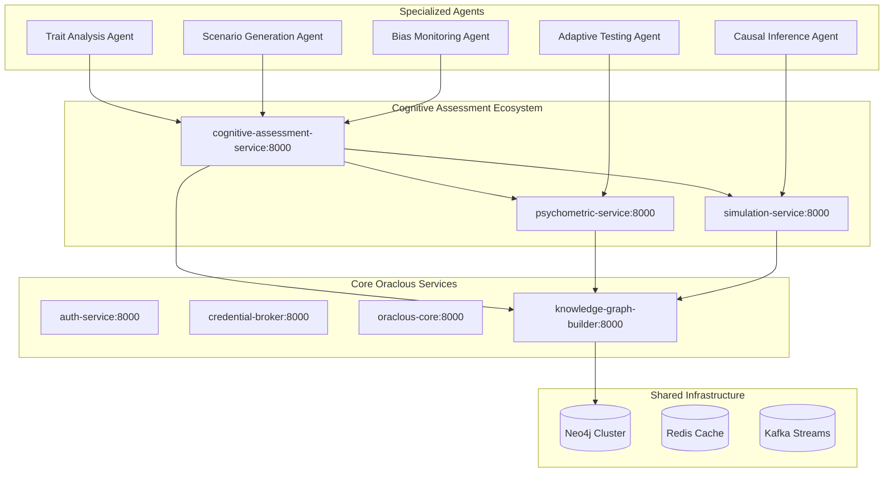

# Cognitive Assessment Knowledge Graph - Detailed Architecture & Implementation Guide

## 🏗️ Architectural Philosophy & Service Design Strategy

### Core Design Principles
1. **Separation of Concerns**: Each service/agent handles specific domain responsibilities
2. **Graph Centralization**: Neo4j operations consolidated in Knowledge Graph Builder
3. **Agent-Based Modularity**: Encapsulate complex functionalities in reusable agents
4. **Horizontal Scalability**: Services can scale independently based on load
5. **Cross-Service Reusability**: Components designed for use across multiple services

### Recommended Service Architecture



---


## 📋 Detailed Checkpoint Implementation Guide

### ✅ **Checkpoint 1: Assessment-Specific Knowledge Graph Foundation**

#### Service Distribution Strategy
- **Primary Service**: Knowledge Graph Builder (Extended)
- **Rationale**: Graph schema operations should remain centralized for consistency and reusability

#### Detailed Implementation Approach

**1.1 Neo4j Schema Extension (Knowledge Graph Builder)**
```python
# Location: knowledge-graph-builder/app/schemas/assessment_schema.py
class AssessmentSchemaManager:
    """Centralized assessment schema management in KG Builder"""
    
    def __init__(self, neo4j_client: Neo4jClient):
        self.neo4j_client = neo4j_client
        self.schema_versioning = SchemaVersioning()
    
    async def initialize_assessment_schema(self, version: str = "1.0.0"):
        """Initialize assessment-specific schema extensions"""
        schema_migrations = [
            self._create_assessment_constraints(),
            self._create_psychological_relationships(),
            self._create_vector_indexes(),
            self._create_composite_indexes()
        ]
        
        for migration in schema_migrations:
            await self.schema_versioning.apply_migration(migration, version)

# New API endpoint in Knowledge Graph Builder
@router.post("/schemas/assessment/initialize")
async def initialize_assessment_schema(
    schema_config: AssessmentSchemaConfig,
    current_user: dict = Depends(get_current_user)
):
    """Initialize assessment schema - called by Cognitive Assessment Service"""
    schema_manager = AssessmentSchemaManager(neo4j_client)
    result = await schema_manager.initialize_assessment_schema(schema_config.version)
    return {"schema_initialized": True, "version": schema_config.version}
```

**Tools & Techniques**:
- **Neo4j Schema Versioning**: Use Flyway-like migration system for graph schemas
- **Constraint Management**: Automated constraint creation and validation
- **Index Optimization**: Composite indexes for assessment-specific queries
- **Schema Documentation**: Auto-generated schema documentation from code

**1.2 Assessment Data Models (Cognitive Assessment Service)**
```python
# Location: cognitive-assessment-service/app/models/assessment_models.py
from pydantic import BaseModel, Field
from typing import Dict, List, Optional, Union
from enum import Enum

class FounderTraitType(str, Enum):
    """Founder-specific trait categories"""
    RISK_TOLERANCE = "risk_tolerance"
    DECISION_MAKING = "decision_making" 
    LEADERSHIP_STYLE = "leadership_style"
    INNOVATION_APPROACH = "innovation_approach"
    CRISIS_MANAGEMENT = "crisis_management"
    STAKEHOLDER_MANAGEMENT = "stakeholder_management"
    RESOURCE_ALLOCATION = "resource_allocation"
    MARKET_INTUITION = "market_intuition"

class AssessmentConstruct(BaseModel):
    """Psychological construct for assessment"""
    id: str = Field(..., description="Unique construct identifier")
    name: str = Field(..., min_length=2, max_length=100)
    type: FounderTraitType
    description: str = Field(..., min_length=10)
    sub_traits: List[str] = Field(default_factory=list)
    measurement_approach: str = Field(default="scenario_based")
    validation_studies: Optional[List[str]] = None
    
    class Config:
        json_schema_extra = {
            "example": {
                "id": "risk_tolerance_001",
                "name": "Founder Risk Tolerance",
                "type": "risk_tolerance",
                "description": "Willingness to take calculated risks in uncertain business situations",
                "sub_traits": ["financial_risk", "strategic_risk", "operational_risk"],
                "measurement_approach": "scenario_based"
            }
        }
```

**Tools & Techniques**:
- **Pydantic Models**: Type-safe data validation with automatic OpenAPI documentation
- **Enum-Based Categories**: Structured trait taxonomies with validation
- **Factory Patterns**: Default value generation for complex nested structures
- **JSON Schema**: Auto-generated API documentation with examples

**Deliverable Milestones**:
- ✅ **Schema Migration System**: Versioned schema updates in Knowledge Graph Builder
- ✅ **Assessment Entity Framework**: Type-safe models with validation
- ✅ **Vector Index Infrastructure**: Optimized for semantic similarity searches
- ✅ **Integration Testing Suite**: Automated schema validation and migration testing
- ✅ **Performance Benchmarks**: Query performance baselines for assessment operations

---

### 🔄 **Checkpoint 2: Cognitive Assessment Service Foundation**

#### Service Distribution Strategy
- **Primary Service**: Cognitive Assessment Service (New - Port 8004)
- **Supporting Services**: Knowledge Graph Builder (graph ops), Auth Service (authentication)
- **Agent Pattern**: Service coordination through internal agents

#### Detailed Implementation Approach

**2.1 Agent-Based Service Architecture**
```python
# Location: cognitive-assessment-service/app/agents/assessment_orchestrator.py
class AssessmentOrchestratorAgent:
    """Central orchestration agent for assessment workflows"""
    
    def __init__(self):
        self.kg_connector = KnowledgeGraphConnectorAgent()
        self.auth_connector = AuthenticationConnectorAgent()
        self.workflow_manager = WorkflowManagerAgent()
        self.event_bus = EventBusAgent()
    
    async def create_assessment_workflow(
        self, 
        assessment_request: CreateAssessmentRequest,
        user_context: UserContext
    ) -> AssessmentWorkflowResult:
        """Orchestrate assessment creation across services"""
        
        # Step 1: Validate user permissions
        auth_result = await self.auth_connector.validate_assessment_permissions(
            user_context, assessment_request.assessment_type
        )
        
        if not auth_result.authorized:
            raise InsufficientPermissionsError(auth_result.reason)
        
        # Step 2: Initialize graph structure
        graph_result = await self.kg_connector.initialize_assessment_graph(
            assessment_id=assessment_request.id,
            constructs=assessment_request.constructs,
            schema_version="1.0.0"
        )
        
        # Step 3: Setup workflow tracking
        workflow = await self.workflow_manager.create_workflow(
            workflow_type="assessment_creation",
            steps=["graph_init", "scenario_gen", "validation", "activation"],
            context={"assessment_id": assessment_request.id}
        )
        
        # Step 4: Emit workflow events
        await self.event_bus.emit_event(
            event_type="assessment.workflow.started",
            payload={"assessment_id": assessment_request.id, "workflow_id": workflow.id}
        )
        
        return AssessmentWorkflowResult(
            assessment_id=assessment_request.id,
            workflow_id=workflow.id,
            graph_id=graph_result.graph_id,
            status="initialized"
        )

# Agent for Knowledge Graph Builder communication
class KnowledgeGraphConnectorAgent:
    """Handles all communication with Knowledge Graph Builder service"""
    
    def __init__(self):
        self.http_client = HTTPXClient()
        self.circuit_breaker = CircuitBreaker()
        self.retry_policy = RetryPolicy(max_attempts=3, backoff="exponential")
    
    async def initialize_assessment_graph(
        self, 
        assessment_id: str, 
        constructs: List[AssessmentConstruct],
        schema_version: str
    ) -> GraphInitializationResult:
        """Initialize assessment graph through KG Builder API"""
        
        @self.circuit_breaker.protect
        @self.retry_policy.retry
        async def _call_kg_builder():
            response = await self.http_client.post(
                f"{settings.KG_BUILDER_URL}/api/v1/graphs/assessment/initialize",
                json={
                    "assessment_id": assessment_id,
                    "constructs": [construct.dict() for construct in constructs],
                    "schema_version": schema_version
                },
                headers={"X-Internal-Service": "cognitive-assessment"}
            )
            return response.json()
        
        result = await _call_kg_builder()
        
        return GraphInitializationResult(
            graph_id=result["graph_id"],
            nodes_created=result["nodes_created"],
            relationships_created=result["relationships_created"],
            indexes_created=result["indexes_created"]
        )
```

**Tools & Techniques**:
- **Agent Pattern**: Encapsulated business logic with clear responsibilities
- **Circuit Breaker**: Resilient service communication with failure handling
- **Event Bus**: Decoupled event-driven communication between components
- **Workflow Engine**: State management for long-running assessment processes
- **HTTPX Client**: Async HTTP client with connection pooling and retries

**2.2 Service Integration Framework**
```python
# Location: cognitive-assessment-service/app/integration/service_integration.py
class ServiceIntegrationFramework:
    """Framework for integrating with existing Oraclous services"""
    
    def __init__(self):
        self.service_registry = ServiceRegistry()
        self.health_monitor = HealthMonitor()
        self.load_balancer = LoadBalancer()
    
    async def initialize_service_integrations(self):
        """Initialize all service connections and health monitoring"""
        
        services = [
            ServiceConfig(
                name="auth-service",
                url=settings.AUTH_SERVICE_URL,
                health_endpoint="/health",
                required=True,
                timeout=5.0
            ),
            ServiceConfig(
                name="knowledge-graph-builder", 
                url=settings.KG_BUILDER_URL,
                health_endpoint="/api/v1/health",
                required=True,
                timeout=10.0
            ),
            ServiceConfig(
                name="credential-broker",
                url=settings.CREDENTIAL_BROKER_URL, 
                health_endpoint="/health",
                required=True,
                timeout=5.0
            )
        ]
        
        for service_config in services:
            await self.service_registry.register_service(service_config)
            await self.health_monitor.start_monitoring(service_config)

# Microservice communication patterns
class InterServiceCommunication:
    """Standardized patterns for service-to-service communication"""
    
    async def call_with_auth(
        self, 
        service_name: str, 
        endpoint: str, 
        method: str = "POST",
        payload: Optional[Dict] = None,
        user_context: Optional[UserContext] = None
    ) -> ServiceResponse:
        """Make authenticated service call with proper error handling"""
        
        # Get service configuration
        service_config = await self.service_registry.get_service(service_name)
        
        # Prepare headers
        headers = {
            "X-Internal-Service": "cognitive-assessment",
            "X-Request-ID": str(uuid.uuid4()),
            "Content-Type": "application/json"
        }
        
        # Add user context if available
        if user_context:
            headers["X-User-ID"] = user_context.user_id
            headers["Authorization"] = f"Bearer {user_context.token}"
        
        # Make request with retries and circuit breaking
        async with self.circuit_breaker(service_name):
            response = await self.http_client.request(
                method=method,
                url=f"{service_config.url}{endpoint}",
                json=payload,
                headers=headers,
                timeout=service_config.timeout
            )
            
            if not response.is_success:
                raise ServiceCallError(
                    service=service_name,
                    endpoint=endpoint, 
                    status_code=response.status_code,
                    error=response.text
                )
            
            return ServiceResponse(
                status_code=response.status_code,
                data=response.json(),
                headers=dict(response.headers)
            )
```

**Tools & Techniques**:
- **Service Registry Pattern**: Dynamic service discovery and configuration
- **Health Monitoring**: Continuous service health checking with alerts
- **Circuit Breaker Pattern**: Fault tolerance for service dependencies
- **Request/Response Patterns**: Standardized communication protocols
- **Correlation IDs**: Request tracing across service boundaries

**Deliverable Milestones**:
- ✅ **Agent-Based Architecture**: Modular, reusable business logic components
- ✅ **Service Integration Framework**: Robust communication with existing services
- ✅ **Health Monitoring System**: Real-time service dependency monitoring
- ✅ **Error Handling Framework**: Comprehensive error recovery and retry logic
- ✅ **Development Environment**: Docker-based local development setup

---

### 🧠 **Checkpoint 3: LLM-Powered Scenario Generation**

#### Service Distribution Strategy
- **Primary Service**: Cognitive Assessment Service (orchestration)
- **Agent Specialization**: Scenario Generation Agent, Content Validation Agent
- **External Integration**: RAG Agent for knowledge retrieval
- **Graph Operations**: Knowledge Graph Builder (context storage and retrieval)

#### Detailed Implementation Approach

**3.1 Scenario Generation Agent Architecture**
```python
# Location: cognitive-assessment-service/app/agents/scenario_generation_agent.py
class ScenarioGenerationAgent:
    """Specialized agent for generating assessment scenarios"""
    
    def __init__(self):
        self.llm_coordinator = LLMCoordinatorAgent()
        self.rag_agent = RAGRetrievalAgent()
        self.validation_agent = ContentValidationAgent()
        self.novelty_detector = NoveltyDetectionAgent()
        self.kg_connector = KnowledgeGraphConnectorAgent()
    
    async def generate_domain_scenarios(
        self,
        constructs: List[AssessmentConstruct],
        domain_context: DomainContext,
        generation_config: ScenarioGenerationConfig
    ) -> List[ValidatedScenario]:
        """Generate scenarios with domain-specific context"""
        
        # Step 1: Retrieve domain context using RAG
        domain_knowledge = await self.rag_agent.retrieve_domain_context(
            domain=domain_context.domain,
            timeframe=domain_context.timeframe,
            focus_areas=domain_context.focus_areas
        )
        
        # Step 2: Generate scenarios for each construct
        generated_scenarios = []
        for construct in constructs:
            construct_scenarios = await self._generate_construct_scenarios(
                construct=construct,
                domain_knowledge=domain_knowledge,
                count=generation_config.scenarios_per_construct
            )
            generated_scenarios.extend(construct_scenarios)
        
        # Step 3: Novelty detection and deduplication
        unique_scenarios = await self.novelty_detector.filter_novel_scenarios(
            scenarios=generated_scenarios,
            similarity_threshold=generation_config.novelty_threshold
        )
        
        # Step 4: Content validation
        validated_scenarios = []
        for scenario in unique_scenarios:
            validation_result = await self.validation_agent.validate_scenario(
                scenario=scenario,
                validation_criteria=generation_config.validation_criteria
            )
            
            if validation_result.passes_validation:
                validated_scenarios.append(
                    ValidatedScenario(
                        scenario=scenario,
                        validation_score=validation_result.overall_score,
                        quality_metrics=validation_result.quality_metrics
                    )
                )
        
        # Step 5: Store scenarios in knowledge graph
        storage_results = await self.kg_connector.store_scenarios(
            scenarios=validated_scenarios,
            domain_context=domain_context
        )
        
        return validated_scenarios

# RAG Agent for external knowledge retrieval
class RAGRetrievalAgent:
    """Agent for retrieving and processing external knowledge sources"""
    
    def __init__(self):
        self.source_aggregator = ExternalSourceAggregator()
        self.content_processor = ContentProcessor()
        self.embedding_service = EmbeddingService()
        self.kg_connector = KnowledgeGraphConnectorAgent()
    
    async def retrieve_domain_context(
        self,
        domain: str,
        timeframe: str = "last_6_months", 
        focus_areas: List[str] = None
    ) -> DomainKnowledgeContext:
        """Retrieve and process domain-specific knowledge"""
        
        # Step 1: Fetch external sources
        external_sources = await self.source_aggregator.fetch_sources(
            domain=domain,
            timeframe=timeframe,
            source_types=["industry_reports", "case_studies", "news_articles"],
            focus_keywords=focus_areas
        )
        
        # Step 2: Process and extract key insights
        processed_insights = []
        for source in external_sources:
            insights = await self.content_processor.extract_decision_scenarios(
                content=source.content,
                domain=domain,
                focus_areas=focus_areas
            )
            processed_insights.extend(insights)
        
        # Step 3: Generate embeddings for similarity search
        insight_embeddings = await self.embedding_service.generate_embeddings(
            texts=[insight.summary for insight in processed_insights]
        )
        
        # Step 4: Store in knowledge graph for future retrieval
        await self.kg_connector.store_domain_context(
            domain=domain,
            insights=processed_insights,
            embeddings=insight_embeddings,
            metadata={"timeframe": timeframe, "source_count": len(external_sources)}
        )
        
        return DomainKnowledgeContext(
            domain=domain,
            insights=processed_insights,
            source_metadata={"sources": len(external_sources), "timeframe": timeframe},
            relevance_scores=self._calculate_relevance_scores(processed_insights, focus_areas)
        )

# External Source Aggregator with multiple source types
class ExternalSourceAggregator:
    """Aggregates content from multiple external sources"""
    
    def __init__(self):
        self.source_adapters = {
            "rss_feeds": RSSFeedAdapter(),
            "api_sources": APISourceAdapter(), 
            "web_scraping": WebScrapingAdapter(),
            "document_upload": DocumentUploadAdapter()
        }
        self.content_filter = ContentFilter()
        self.rate_limiter = RateLimiter()
    
    async def fetch_sources(
        self,
        domain: str,
        timeframe: str,
        source_types: List[str],
        focus_keywords: List[str] = None
    ) -> List[ExternalSource]:
        """Fetch content from multiple source types"""
        
        all_sources = []
        
        for source_type in source_types:
            if source_type in self.source_adapters:
                adapter = self.source_adapters[source_type]
                
                # Rate limiting to respect API limits
                async with self.rate_limiter.acquire(source_type):
                    sources = await adapter.fetch_content(
                        domain=domain,
                        timeframe=timeframe,
                        keywords=focus_keywords
                    )
                    
                    # Filter for quality and relevance
                    filtered_sources = await self.content_filter.filter_sources(
                        sources=sources,
                        domain=domain,
                        quality_threshold=0.7
                    )
                    
                    all_sources.extend(filtered_sources)
        
        # Deduplicate and rank by relevance
        deduplicated_sources = await self._deduplicate_sources(all_sources)
        ranked_sources = await self._rank_by_relevance(deduplicated_sources, domain)
        
        return ranked_sources[:50]  # Limit to top 50 sources
```

**Tools & Techniques**:
- **Agent Specialization**: Single-responsibility agents for complex workflows
- **RAG Architecture**: Retrieval-Augmented Generation for current, relevant content
- **Multi-Source Integration**: RSS, APIs, web scraping, document uploads
- **Semantic Similarity**: Vector embeddings for novelty detection
- **Content Validation**: Multi-dimensional quality assessment
- **Rate Limiting**: Respectful external API usage

**3.2 Novelty Detection and Validation Framework**
```python
# Location: cognitive-assessment-service/app/agents/novelty_detection_agent.py
class NoveltyDetectionAgent:
    """Agent for detecting and preventing duplicate scenarios"""
    
    def __init__(self):
        self.embedding_service = EmbeddingService()
        self.similarity_calculator = SimilarityCalculator()
        self.kg_connector = KnowledgeGraphConnectorAgent()
        self.clustering_engine = ClusteringEngine()
    
    async def filter_novel_scenarios(
        self,
        scenarios: List[GeneratedScenario],
        similarity_threshold: float = 0.85
    ) -> List[GeneratedScenario]:
        """Filter scenarios for novelty using multiple approaches"""
        
        # Step 1: Get existing scenario embeddings from knowledge graph
        existing_embeddings = await self.kg_connector.get_scenario_embeddings()
        
        # Step 2: Generate embeddings for new scenarios
        new_scenario_texts = [
            f"{s.title} {s.situation} {' '.join([opt.text for opt in s.options])}"
            for s in scenarios
        ]
        new_embeddings = await self.embedding_service.generate_embeddings(new_scenario_texts)
        
        # Step 3: Calculate similarity with existing scenarios
        novel_scenarios = []
        similarity_matrix = await self.similarity_calculator.calculate_pairwise_similarity(
            new_embeddings, existing_embeddings
        )
        
        for i, scenario in enumerate(scenarios):
            max_similarity = max(similarity_matrix[i]) if similarity_matrix[i] else 0
            
            if max_similarity < similarity_threshold:
                novel_scenarios.append(scenario)
                # Store embedding for future comparisons
                await self.kg_connector.store_scenario_embedding(
                    scenario_id=scenario.id,
                    embedding=new_embeddings[i],
                    similarity_metadata={"max_existing_similarity": max_similarity}
                )
        
        # Step 4: Cluster-based novelty detection
        clustered_scenarios = await self._cluster_based_novelty_detection(
            novel_scenarios, new_embeddings
        )
        
        return clustered_scenarios

# Content Validation Agent with multiple validation dimensions
class ContentValidationAgent:
    """Agent for comprehensive scenario content validation"""
    
    def __init__(self):
        self.llm_coordinator = LLMCoordinatorAgent()
        self.bias_detector = BiasDetectionAgent()
        self.quality_assessor = QualityAssessmentAgent()
        self.cultural_validator = CulturalValidationAgent()
    
    async def validate_scenario(
        self,
        scenario: GeneratedScenario,
        validation_criteria: ValidationCriteria
    ) -> ValidationResult:
        """Comprehensive multi-dimensional scenario validation"""
        
        validation_tasks = [
            self._validate_realism(scenario),
            self._validate_clarity(scenario),
            self._validate_discrimination(scenario),
            self._validate_cultural_neutrality(scenario),
            self._validate_construct_alignment(scenario),
            self._validate_bias_absence(scenario)
        ]
        
        # Run validations in parallel
        validation_results = await asyncio.gather(*validation_tasks)
        
        # Aggregate results
        overall_score = sum(result.score for result in validation_results) / len(validation_results)
        
        passes_validation = (
            overall_score >= validation_criteria.minimum_score and
            all(result.score >= validation_criteria.dimension_thresholds.get(result.dimension, 0.7)
                for result in validation_results)
        )
        
        return ValidationResult(
            overall_score=overall_score,
            dimension_scores={result.dimension: result.score for result in validation_results},
            passes_validation=passes_validation,
            validation_feedback=[result.feedback for result in validation_results],
            quality_metrics=self._calculate_quality_metrics(validation_results)
        )
    
    async def _validate_construct_alignment(self, scenario: GeneratedScenario) -> DimensionValidationResult:
        """Validate that scenario actually tests the intended psychological construct"""
        
        validation_prompt = f"""
        Evaluate how well this scenario tests the intended psychological construct:
        
        Intended Construct: {scenario.target_construct}
        Construct Description: {scenario.construct_description}
        
        Scenario: {scenario.situation}
        Options: {[f"{i+1}. {opt.text}" for i, opt in enumerate(scenario.options)]}
        
        Rate on a scale of 1-10:
        1. Does the scenario require the target construct for decision-making?
        2. Do the options differentiate between levels of the construct?
        3. Is the construct central to the decision, not peripheral?
        4. Would someone with different levels of this construct choose differently?
        
        Provide specific evidence for your ratings.
        """
        
        validation_response = await self.llm_coordinator.generate_with_validation(
            prompt=validation_prompt,
            expected_format="construct_alignment_validation",
            temperature=0.1
        )
        
        return self._parse_construct_validation(validation_response)
```

**Tools & Techniques**:
- **Vector Similarity Search**: Cosine similarity for content deduplication
- **Clustering Algorithms**: HDBSCAN for identifying scenario themes
- **Multi-dimensional Validation**: Parallel validation across quality dimensions
- **LLM-as-Judge**: Automated quality assessment with structured prompts
- **Bias Detection**: Automated cultural and demographic bias screening

**Deliverable Milestones**:
- ✅ **RAG-Powered Generation**: Real-time external knowledge integration
- ✅ **Multi-Source Aggregation**: RSS, APIs, documents, web scraping
- ✅ **Novelty Detection System**: >85% similarity threshold with clustering
- ✅ **Quality Validation Framework**: 6-dimensional automated assessment
- ✅ **Cultural Bias Prevention**: Automated cultural neutrality validation
- ✅ **Performance Optimization**: Parallel processing and caching for generation pipeline

---

### 🔍 **Checkpoint 4: Behavioral Trait Annotation & Response Analysis**

#### Service Distribution Strategy
- **Primary Service**: Cognitive Assessment Service (coordination)
- **Specialized Agents**: Trait Analysis Agent, Response Analysis Agent, Graph Discovery Agent
- **Graph Operations**: Knowledge Graph Builder (trait relationship storage and analysis)
- **Computation Distribution**: Separate agent for computationally intensive graph algorithms

#### Detailed Implementation Approach

**4.1 Trait Analysis Agent with Expert Ontology Integration**
```python
# Location: cognitive-assessment-service/app/agents/trait_analysis_agent.py
class TraitAnalysisAgent:
    """Specialized agent for behavioral trait analysis and annotation"""
    
    def __init__(self):
        self.expert_ontology = ExpertOntologyManager()
        self.llm_coordinator = LLMCoordinatorAgent()
        self.kg_connector = KnowledgeGraphConnectorAgent()
        self.similarity_engine = SimilarityEngine()
        self.annotation_validator = AnnotationValidator()
    
    async def annotate_scenario_with_traits(
        self,
        scenario: AssessmentScenario,
        annotation_mode: str = "hybrid",  # expert, ai_assisted, similarity, hybrid
        expert_input: Optional[ExpertAnnotation] = None
    ) -> AnnotatedScenario:
        """Multi-modal trait annotation for assessment scenarios"""
        
        annotation_strategies = []
        
        # Strategy 1: Expert ontology-based annotation
        if annotation_mode in ["expert", "hybrid"]:
            expert_annotations = await self._apply_expert_ontology(scenario)
            annotation_strategies.append(("expert", expert_annotations))
        
        # Strategy 2: AI-assisted annotation
        if annotation_mode in ["ai_assisted", "hybrid"]:
            ai_annotations = await self._ai_assisted_annotation(scenario)
            annotation_strategies.append(("ai_assisted", ai_annotations))
        
        # Strategy 3: Similarity-based transfer
        if annotation_mode in ["similarity", "hybrid"]:
            similarity_annotations = await self._similarity_based_annotation(scenario)
            annotation_strategies.append(("similarity", similarity_annotations))
        
        # Strategy 4: Graph-based discovery
        if annotation_mode in ["graph_discovery", "hybrid"]:
            graph_annotations = await self._graph_based_annotation(scenario)
            annotation_strategies.append(("graph_discovery", graph_annotations))
        
        # Merge and validate annotations
        merged_annotations = await self._merge_annotation_strategies(annotation_strategies)
        validated_annotations = await self.annotation_validator.validate_annotations(
            scenario=scenario,
            annotations=merged_annotations,
            confidence_threshold=0.7
        )
        
        # Store in knowledge graph
        storage_result = await self.kg_connector.store_trait_annotations(
            scenario_id=scenario.id,
            annotations=validated_annotations,
            annotation_metadata={
                "strategies_used": [strategy[0] for strategy in annotation_strategies],
                "confidence_scores": validated_annotations.confidence_scores,
                "validation_timestamp": datetime.utcnow().isoformat()
            }
        )
        
        return AnnotatedScenario(
            scenario=scenario,
            trait_annotations=validated_annotations,
            annotation_metadata=storage_result.metadata,
            confidence_distribution=self._calculate_confidence_distribution(validated_annotations)
        )

    async def _ai_assisted_annotation(self, scenario: AssessmentScenario) -> AITraitAnnotations:
        """AI-powered trait annotation using structured LLM analysis"""
        
        # Load founder-specific trait taxonomy
        trait_taxonomy = await self.expert_ontology.get_founder_trait_taxonomy()
        
        annotation_prompt = f"""
        Analyze this founder assessment scenario and annotate each response option with the behavioral traits it reveals.
        
        Scenario Context: {scenario.context}
        Decision Situation: {scenario.situation}
        
        Response Options:
        {self._format_options_for_analysis(scenario.options)}
        
        Available Trait Categories:
        {self._format_trait_taxonomy(trait_taxonomy)}
        
        For each option, identify:
        1. Primary traits revealed (confidence 0-1)
        2. Secondary traits indicated 
        3. Reasoning pattern implications (analytical/intuitive/heuristic)
        4. Risk profile indicators
        5. Leadership style implications
        6. Decision-making approach indicators
        
        Format as structured JSON with trait mappings, confidence scores, and evidence.
        Focus on founder-specific behavioral patterns and startup-relevant decision-making styles.
        """
        
        annotation_result = await self.llm_coordinator.generate_structured_response(
            prompt=annotation_prompt,
            response_schema=TraitAnnotationSchema,
            temperature=0.2,
            validation_checks=["trait_validity", "confidence_consistency", "evidence_quality"]
        )
        
        return self._parse_ai_trait_annotations(annotation_result, scenario)

# Graph Discovery Agent for trait pattern mining
class GraphDiscoveryAgent:
    """Agent for discovering trait patterns through graph analysis"""
    
    def __init__(self):
        self.kg_connector = KnowledgeGraphConnectorAgent()
        self.graph_analyzer = GraphAnalysisEngine()
        self.pattern_miner = PatternMiningEngine()
        self.community_detector = CommunityDetectionEngine()
    
    async def discover_emergent_trait_patterns(
        self,
        assessment_id: str,
        discovery_config: PatternDiscoveryConfig
    ) -> EmergentTraitPatterns:
        """Discover new trait patterns from response data using graph analysis"""
        
        # Step 1: Build trait co-occurrence graph
        trait_graph = await self.kg_connector.build_trait_cooccurrence_graph(
            assessment_id=assessment_id,
            minimum_cooccurrence=discovery_config.min_cooccurrence
        )
        
        # Step 2: Apply community detection algorithms
        communities = await self.community_detector.detect_trait_communities(
            graph=trait_graph,
            algorithm="leiden",  # More robust than Louvain
            resolution_parameter=discovery_config.resolution
        )
        
        # Step 3: Analyze each community for coherent patterns
        emergent_patterns = []
        for community in communities:
            pattern_analysis = await self._analyze_trait_community(
                community=community,
                assessment_data=await self.kg_connector.get_community_response_data(community),
                coherence_threshold=discovery_config.coherence_threshold
            )
            
            if pattern_analysis.coherence_score > discovery_config.coherence_threshold:
                emergent_patterns.append(EmergentTraitPattern(
                    pattern_id=f"emergent_{assessment_id}_{community.id}",
                    component_traits=community.nodes,
                    pattern_name=pattern_analysis.suggested_name,
                    description=pattern_analysis.description,
                    coherence_score=pattern_analysis.coherence_score,
                    supporting_evidence=pattern_analysis.evidence,
                    frequency=community.size / trait_graph.total_nodes
                ))
        
        # Step 4: Validate patterns using graph metrics
        validated_patterns = await self._validate_emergent_patterns(
            patterns=emergent_patterns,
            validation_metrics=["modularity", "silhouette_score", "stability"]
        )
        
        return EmergentTraitPatterns(
            assessment_id=assessment_id,
            discovered_patterns=validated_patterns,
            discovery_metadata={
                "total_communities": len(communities),
                "validated_patterns": len(validated_patterns),
                "graph_metrics": await self.graph_analyzer.calculate_graph_metrics(trait_graph)
            }
        )

# Response Analysis Agent with multi-modal analysis
class ResponseAnalysisAgent:
    """Agent for comprehensive response analysis and behavioral extraction"""
    
    def __init__(self):
        self.llm_coordinator = LLMCoordinatorAgent()
        self.bias_detector = CognitiveBiasDetector()
        self.reasoning_classifier = ReasoningPatternClassifier()
        self.confidence_calibrator = ConfidenceCalibrator()
        self.kg_connector = KnowledgeGraphConnectorAgent()
    
    async def analyze_candidate_response(
        self,
        scenario: AnnotatedScenario,
        response: CandidateResponse,
        analysis_depth: str = "comprehensive"  # basic, standard, comprehensive, deep
    ) -> ComprehensiveResponseAnalysis:
        """Multi-dimensional analysis of candidate responses"""
        
        analysis_pipeline = self._configure_analysis_pipeline(analysis_depth)
        analysis_results = {}
        
        # Execute analysis pipeline
        for analysis_type, analyzer in analysis_pipeline.items():
            try:
                result = await analyzer.analyze(scenario, response)
                analysis_results[analysis_type] = result
            except Exception as e:
                logger.error(f"Analysis failed for {analysis_type}: {e}")
                analysis_results[analysis_type] = self._create_fallback_result(analysis_type)
        
        # Synthesize results
        synthesized_analysis = await self._synthesize_analysis_results(
            analysis_results, scenario, response
        )
        
        # Update candidate profile in real-time
        profile_update = await self._generate_profile_updates(
            candidate_id=response.candidate_id,
            analysis=synthesized_analysis,
            scenario_context=scenario
        )
        
        await self.kg_connector.update_candidate_behavioral_profile(
            candidate_id=response.candidate_id,
            profile_updates=profile_update,
            analysis_metadata=synthesized_analysis.metadata
        )
        
        return ComprehensiveResponseAnalysis(
            response_id=response.id,
            scenario_id=scenario.id,
            candidate_id=response.candidate_id,
            analysis_results=analysis_results,
            synthesized_insights=synthesized_analysis,
            profile_updates=profile_update,
            confidence_metrics=self._calculate_analysis_confidence(analysis_results)
        )

    def _configure_analysis_pipeline(self, depth: str) -> Dict[str, ResponseAnalyzer]:
        """Configure analysis pipeline based on depth requirements"""
        
        base_pipeline = {
            "reasoning_pattern": self.reasoning_classifier,
            "cognitive_bias": self.bias_detector,
            "trait_indicators": TraitIndicatorExtractor()
        }
        
        if depth in ["standard", "comprehensive", "deep"]:
            base_pipeline.update({
                "decision_style": DecisionStyleClassifier(),
                "confidence_analysis": ConfidenceAnalyzer(),
                "consistency_check": ConsistencyChecker()
            })
        
        if depth in ["comprehensive", "deep"]:
            base_pipeline.update({
                "emotional_indicators": EmotionalIndicatorExtractor(),
                "stress_response": StressResponseAnalyzer(),
                "time_pressure_analysis": TimePressureAnalyzer()
            })
        
        if depth == "deep":
            base_pipeline.update({
                "cognitive_load": CognitiveLoadAssessor(),
                "metacognitive_awareness": MetacognitiveAnalyzer(),
                "value_system_indicators": ValueSystemExtractor()
            })
        
        return base_pipeline

# Cognitive Bias Detection with founder-specific patterns
class CognitiveBiasDetector:
    """Specialized detector for cognitive biases in founder decision-making"""
    
    def __init__(self):
        self.llm_coordinator = LLMCoordinatorAgent()
        self.bias_taxonomy = FounderBiasTaxonomy()
        self.pattern_matcher = BiasPatternMatcher()
    
    async def analyze(self, scenario: AnnotatedScenario, response: CandidateResponse) -> BiasAnalysisResult:
        """Detect cognitive biases specific to founder decision-making contexts"""
        
        # Load founder-specific bias patterns
        founder_biases = await self.bias_taxonomy.get_founder_relevant_biases()
        
        bias_detection_prompt = f"""
        Analyze this founder's decision-making response for cognitive biases:
        
        Scenario Context: {scenario.situation}
        Available Options: {self._format_options(scenario.options)}
        Founder's Choice: {response.selected_option}
        Founder's Reasoning: {response.reasoning}
        Response Time: {response.response_time}s
        Confidence Level: {response.confidence_level}
        
        Analyze for these founder-relevant cognitive biases:
        
        1. Overconfidence Bias: Overestimating chances of success
        2. Confirmation Bias: Seeking information that confirms preexisting beliefs
        3. Anchoring Bias: Over-relying on first piece of information
        4. Availability Heuristic: Overweighting easily recalled information
        5. Sunk Cost Fallacy: Continuing based on previously invested resources
        6. Optimism Bias: Overestimating positive outcomes
        7. Planning Fallacy: Underestimating time and resources needed
        8. Status Quo Bias: Preferring current state of affairs
        9. Loss Aversion: Preferring avoiding losses over acquiring gains
        10. Survivorship Bias: Focusing on successful examples while ignoring failures
        
        For each detected bias:
        - Provide specific evidence from the response
        - Rate severity (Low/Medium/High) 
        - Assess impact on decision quality
        - Suggest awareness interventions
        
        Consider founder-specific contexts: uncertainty, resource constraints, stakeholder pressure.
        """
        
        bias_analysis = await self.llm_coordinator.generate_structured_response(
            prompt=bias_detection_prompt,
            response_schema=BiasAnalysisSchema,
            temperature=0.1
        )
        
        # Cross-validate with pattern matching
        pattern_matches = await self.pattern_matcher.detect_bias_patterns(
            response_text=response.reasoning,
            choice_pattern=response.selected_option,
            bias_taxonomy=founder_biases
        )
        
        # Merge LLM analysis with pattern matching
        merged_analysis = await self._merge_bias_detection_results(
            llm_analysis=bias_analysis,
            pattern_matches=pattern_matches
        )
        
        return BiasAnalysisResult(
            detected_biases=merged_analysis.biases,
            severity_distribution=merged_analysis.severity_stats,
            decision_impact_score=merged_analysis.impact_score,
            awareness_recommendations=merged_analysis.recommendations,
            confidence_score=merged_analysis.detection_confidence
        )
```

**Tools & Techniques**:
- **Multi-Modal Annotation**: Expert ontology + AI + similarity + graph discovery
- **Structured LLM Responses**: Schema-validated JSON outputs for consistency
- **Graph Community Detection**: Leiden algorithm for robust trait clustering
- **Cognitive Bias Taxonomy**: Founder-specific bias patterns and detection
- **Pattern Matching**: Rule-based validation of LLM bias detection
- **Real-time Profile Updates**: Continuous behavioral profile refinement

**4.2 Knowledge Graph Builder Extensions for Trait Operations**
```python
# Location: knowledge-graph-builder/app/services/trait_graph_service.py
class TraitGraphService:
    """Extended KG Builder service for trait-specific graph operations"""
    
    def __init__(self, neo4j_client: Neo4jClient):
        self.neo4j_client = neo4j_client
        self.graph_algorithms = GraphAlgorithmsService()
        self.community_detector = CommunityDetectionService()
    
    async def build_trait_cooccurrence_graph(
        self,
        assessment_id: str,
        minimum_cooccurrence: int = 5
    ) -> TraitCooccurrenceGraph:
        """Build graph of trait co-occurrences for pattern discovery"""
        
        # Cypher query to build co-occurrence relationships
        cooccurrence_query = """
        MATCH (a:Assessment {id: $assessment_id})-[:CONTAINS]->(s:Scenario)
        MATCH (s)-[:TESTS_FOR]->(c:Construct)-[:HAS_TRAIT]->(t1:Trait)
        MATCH (s)-[:TESTS_FOR]->(c2:Construct)-[:HAS_TRAIT]->(t2:Trait)
        WHERE t1 <> t2
        WITH t1, t2, count(*) as cooccurrence_count
        WHERE cooccurrence_count >= $minimum_cooccurrence
        
        CREATE (t1)-[r:CO_OCCURS_WITH {
            strength: cooccurrence_count,
            assessment_id: $assessment_id,
            created_at: datetime()
        }]->(t2)
        
        RETURN t1, t2, r
        """
        
        result = await self.neo4j_client.run_query(
            cooccurrence_query,
            parameters={
                "assessment_id": assessment_id,
                "minimum_cooccurrence": minimum_cooccurrence
            }
        )
        
        # Build graph representation
        graph = TraitCooccurrenceGraph()
        for record in result:
            graph.add_edge(
                source=record["t1"]["name"],
                target=record["t2"]["name"], 
                weight=record["r"]["strength"]
            )
        
        return graph

    async def detect_trait_communities(
        self,
        graph: TraitCooccurrenceGraph,
        algorithm: str = "leiden",
        resolution: float = 1.0
    ) -> List[TraitCommunity]:
        """Detect communities in trait co-occurrence graph"""
        
        if algorithm == "leiden":
            communities = await self.community_detector.leiden_algorithm(
                graph=graph,
                resolution=resolution
            )
        elif algorithm == "louvain":
            communities = await self.community_detector.louvain_algorithm(
                graph=graph,
                resolution=resolution
            )
        else:
            raise ValueError(f"Unsupported algorithm: {algorithm}")
        
        # Store community results in Neo4j
        await self._store_trait_communities(communities, graph.assessment_id)
        
        return communities

    async def calculate_trait_centrality_metrics(
        self,
        assessment_id: str
    ) -> TraitCentralityMetrics:
        """Calculate centrality metrics for traits in assessment context"""
        
        centrality_query = """
        MATCH (a:Assessment {id: $assessment_id})-[:CONTAINS]->(s:Scenario)
        MATCH (s)-[:TESTS_FOR]->(c:Construct)-[:HAS_TRAIT]->(t:Trait)
        
        // Calculate degree centrality
        WITH t, count(DISTINCT s) as degree_centrality
        
        // Calculate betweenness centrality using APOC
        CALL apoc.algo.betweenness(['Trait'], ['CO_OCCURS_WITH'], {write: false})
        YIELD node, score as betweenness_centrality
        WHERE node = t
        
        // Calculate PageRank
        CALL apoc.algo.pageRank(['Trait'], ['CO_OCCURS_WITH'], {write: false})
        YIELD node, score as pagerank_score
        WHERE node = t
        
        RETURN t.name as trait_name,
               degree_centrality,
               betweenness_centrality,
               pagerank_score
        ORDER BY pagerank_score DESC
        """
        
        result = await self.neo4j_client.run_query(
            centrality_query,
            parameters={"assessment_id": assessment_id}
        )
        
        return TraitCentralityMetrics(
            assessment_id=assessment_id,
            trait_metrics=[
                TraitCentrality(
                    trait_name=record["trait_name"],
                    degree_centrality=record["degree_centrality"],
                    betweenness_centrality=record["betweenness_centrality"],
                    pagerank_score=record["pagerank_score"]
                )
                for record in result
            ]
        )

# New API endpoints in Knowledge Graph Builder for trait operations
@router.post("/graphs/{graph_id}/traits/cooccurrence")
async def build_trait_cooccurrence_graph(
    graph_id: str,
    config: TraitCooccurrenceConfig,
    current_user: dict = Depends(get_current_user)
):
    """Build trait co-occurrence graph for pattern discovery"""
    trait_service = TraitGraphService(neo4j_client)
    
    cooccurrence_graph = await trait_service.build_trait_cooccurrence_graph(
        assessment_id=graph_id,
        minimum_cooccurrence=config.minimum_cooccurrence
    )
    
    return {
        "graph_id": graph_id,
        "nodes": cooccurrence_graph.node_count,
        "edges": cooccurrence_graph.edge_count,
        "density": cooccurrence_graph.density,
        "components": cooccurrence_graph.connected_components
    }

@router.post("/graphs/{graph_id}/traits/communities")
async def detect_trait_communities(
    graph_id: str,
    detection_config: CommunityDetectionConfig,
    current_user: dict = Depends(get_current_user)
):
    """Detect trait communities using graph algorithms"""
    trait_service = TraitGraphService(neo4j_client)
    
    # First build co-occurrence graph
    cooccurrence_graph = await trait_service.build_trait_cooccurrence_graph(graph_id)
    
    # Then detect communities
    communities = await trait_service.detect_trait_communities(
        graph=cooccurrence_graph,
        algorithm=detection_config.algorithm,
        resolution=detection_config.resolution
    )
    
    return {
        "graph_id": graph_id,
        "communities_detected": len(communities),
        "communities": [
            {
                "id": community.id,
                "traits": community.traits,
                "size": community.size,
                "modularity": community.modularity,
                "coherence_score": community.coherence_score
            }
            for community in communities
        ]
    }
```

**Tools & Techniques**:
- **Graph Algorithms**: Leiden/Louvain community detection in Neo4j
- **Centrality Metrics**: Degree, betweenness, PageRank for trait importance
- **APOC Procedures**: Advanced Neo4j algorithms for graph analysis
- **Co-occurrence Analysis**: Statistical trait relationship mining
- **Modularity Optimization**: Quality metrics for community detection

**Deliverable Milestones**:
- ✅ **Multi-Modal Trait Annotation**: Expert + AI + similarity + graph discovery
- ✅ **Cognitive Bias Detection**: Founder-specific bias taxonomy with pattern matching
- ✅ **Graph-Based Pattern Discovery**: Community detection for emergent trait clusters
- ✅ **Real-time Profile Updates**: Continuous behavioral profile refinement
- ✅ **Knowledge Graph Extensions**: Trait-specific operations in KG Builder
- ✅ **Validation Framework**: Multi-dimensional annotation quality assessment

---

### 📊 **Checkpoint 5: Psychometric Integration & IRT Implementation**

#### Service Distribution Strategy
- **New Specialized Service**: Psychometric Service (Port 8005) for computational psychometrics
- **Agent Coordination**: Adaptive Testing Agent, Validation Agent
- **Graph Integration**: Knowledge Graph Builder for parameter storage and retrieval
- **Rationale**: Psychometric computations are specialized and computationally intensive

#### Detailed Implementation Approach

**5.1 Dedicated Psychometric Service Architecture**
```python
# Location: psychometric-service/app/main.py
class PsychometricService:
    """Dedicated service for psychometric computations and validation"""
    
    def __init__(self):
        self.irt_engine = IRTComputationEngine()
        self.adaptive_engine = AdaptiveTestingEngine()
        self.validation_engine = PsychometricValidationEngine()
        self.kg_connector = KnowledgeGraphConnectorAgent()
        self.model_store = PsychometricModelStore()
    
    async def initialize_service(self):
        """Initialize psychometric service with required components"""
        
        # Load pre-trained models
        await self.model_store.load_base_models()
        
        # Initialize computation engines
        await self.irt_engine.initialize()
        await self.adaptive_engine.initialize()
        
        # Setup model versioning
        await self.model_store.setup_versioning()

# IRT Computation Engine with multiple model support
class IRTComputationEngine:
    """Engine for Item Response Theory computations"""
    
    def __init__(self):
        self.models = {
            "1pl": OnePLModel(),           # Rasch model
            "2pl": TwoPLModel(),           # 2-parameter logistic
            "3pl": ThreePLModel(),         # 3-parameter logistic
            "grm": GradedResponseModel(),  # For polytomous items
            "variational": VariationalIRT() # For complex scenarios
        }
        self.parameter_estimator = ParameterEstimator()
        self.ability_estimator = AbilityEstimator()
        self.model_selector = ModelSelector()
    
    async def estimate_item_parameters(
        self,
        item_responses: ItemResponseMatrix,
        item_metadata: ItemMetadata,
        model_type: str = "auto"
    ) -> IRTItemParameters:
        """Estimate IRT parameters for assessment items"""
        
        # Automatic model selection if not specified
        if model_type == "auto":
            model_type = await self.model_selector.select_optimal_model(
                responses=item_responses,
                metadata=item_metadata
            )
        
        # Validate model choice
        if model_type not in self.models:
            raise ValueError(f"Unsupported IRT model: {model_type}")
        
        # Estimate parameters using selected model
        model = self.models[model_type]
        parameters = await model.estimate_parameters(
            responses=item_responses,
            estimation_method="variational_bayes",  # More robust than MLE
            max_iterations=1000,
            convergence_threshold=1e-6
        )
        
        # Validate parameter estimates
        validation_result = await self._validate_parameter_estimates(
            parameters=parameters,
            responses=item_responses,
            model=model
        )
        
        if not validation_result.valid:
            # Fallback to more robust estimation
            parameters = await self._robust_parameter_estimation(
                responses=item_responses,
                model=model
            )
        
        return IRTItemParameters(
            item_id=item_metadata.item_id,
            model_type=model_type,
            difficulty=parameters.difficulty,
            discrimination=parameters.discrimination,
            guessing=parameters.guessing if hasattr(parameters, 'guessing') else None,
            standard_errors=parameters.standard_errors,
            fit_statistics=validation_result.fit_statistics,
            estimation_metadata={
                "method": "variational_bayes",
                "iterations": parameters.iterations,
                "convergence": parameters.converged,
                "sample_size": len(item_responses)
            }
        )

    async def estimate_person_ability(
        self,
        person_responses: PersonResponsePattern,
        item_parameters: List[IRTItemParameters],
        estimation_method: str = "eap"  # eap, map, mle
    ) -> PersonAbilityEstimate:
        """Estimate person ability using IRT models"""
        
        # Prepare response pattern and item parameters
        response_vector = person_responses.to_vector()
        parameter_matrix = self._prepare_parameter_matrix(item_parameters)
        
        # Estimate ability based on method
        if estimation_method == "eap":
            ability_estimate = await self.ability_estimator.estimate_eap(
                responses=response_vector,
                parameters=parameter_matrix
            )
        elif estimation_method == "map":
            ability_estimate = await self.ability_estimator.estimate_map(
                responses=response_vector,
                parameters=parameter_matrix
            )
        elif estimation_method == "mle":
            ability_estimate = await self.ability_estimator.estimate_mle(
                responses=response_vector,
                parameters=parameter_matrix
            )
        else:
            raise ValueError(f"Unsupported estimation method: {estimation_method}")
        
        # Calculate measurement precision
        information_function = await self._calculate_test_information(
            ability=ability_estimate.theta,
            parameters=parameter_matrix
        )
        
        standard_error = 1 / np.sqrt(information_function)
        
        return PersonAbilityEstimate(
            person_id=person_responses.person_id,
            theta=ability_estimate.theta,
            standard_error=standard_error,
            confidence_interval=ability_estimate.confidence_interval,
            measurement_precision=1 / standard_error,
            estimation_method=estimation_method,
            items_administered=len(person_responses),
            estimation_metadata=ability_estimate.metadata
        )

# Adaptive Testing Engine with information maximization
class AdaptiveTestingEngine:
    """Engine for computerized adaptive testing"""
    
    def __init__(self):
        self.item_selector = ItemSelector()
        self.stopping_rules = StoppingRuleEngine()
        self.information_calculator = InformationCalculator()
        self.ability_tracker = AbilityTracker()
    
    async def select_next_item(
        self,
        current_ability_estimate: PersonAbilityEstimate,
        available_items: List[IRTItemParameters],
        selection_criterion: str = "maximum_information",
        constraints: Optional[AdaptiveConstraints] = None
    ) -> ItemSelectionResult:
        """Select optimal next item for adaptive testing"""
        
        # Apply constraints (content balancing, exposure control)
        eligible_items = await self._apply_constraints(available_items, constraints)
        
        if not eligible_items:
            raise NoEligibleItemsError("No items available after applying constraints")
        
        # Calculate information for each eligible item
        item_information_scores = []
        
        for item in eligible_items:
            if selection_criterion == "maximum_information":
                info_score = await self.information_calculator.calculate_fisher_information(
                    ability=current_ability_estimate.theta,
                    item_parameters=item
                )
            elif selection_criterion == "kullback_leibler":
                info_score = await self.information_calculator.calculate_kl_information(
                    ability=current_ability_estimate.theta,
                    item_parameters=item,
                    ability_prior=current_ability_estimate.prior_distribution
                )
            elif selection_criterion == "mutual_information":
                info_score = await self.information_calculator.calculate_mutual_information(
                    ability_distribution=current_ability_estimate.posterior_distribution,
                    item_parameters=item
                )
            
            item_information_scores.append((item, info_score))
        
        # Select item with maximum information
        selected_item, max_information = max(
            item_information_scores,
            key=lambda x: x[1]
        )
        
        # Update item exposure tracking
        await self._update_item_exposure(selected_item.item_id)
        
        return ItemSelectionResult(
            selected_item=selected_item,
            information_gain=max_information,
            selection_criterion=selection_criterion,
            alternatives_considered=len(eligible_items),
            expected_precision_gain=await self._calculate_precision_gain(
                current_estimate=current_ability_estimate,
                selected_item=selected_item
            )
        )

    async def check_stopping_criteria(
        self,
        person_ability_history: List[PersonAbilityEstimate],
        test_constraints: TestConstraints
    ) -> StoppingDecision:
        """Determine if adaptive test should terminate"""
        
        current_estimate = person_ability_history[-1]
        
        # Check precision-based stopping
        precision_met = current_estimate.measurement_precision >= test_constraints.target_precision
        
        # Check minimum items administered
        min_items_met = len(person_ability_history) >= test_constraints.minimum_items
        
        # Check maximum items limit
        max_items_reached = len(person_ability_history) >= test_constraints.maximum_items
        
        # Check ability estimate stability
        stability_met = await self._check_ability_stability(
            ability_history=person_ability_history,
            stability_threshold=test_constraints.stability_threshold
        )
        
        # Decision logic
        should_stop = (
            (precision_met and min_items_met and stability_met) or
            max_items_reached
        )
        
        stop_reason = None
        if should_stop:
            if max_items_reached:
                stop_reason = "maximum_items_reached"
            elif precision_met and min_items_met and stability_met:
                stop_reason = "precision_and_stability_achieved"
        
        return StoppingDecision(
            should_stop=should_stop,
            reason=stop_reason,
            current_precision=current_estimate.measurement_precision,
            items_administered=len(person_ability_history),
            final_ability_estimate=current_estimate if should_stop else None
        )

# Psychometric Validation Engine
class PsychometricValidationEngine:
    """Engine for comprehensive psychometric validation"""
    
    def __init__(self):
        self.reliability_calculator = ReliabilityCalculator()
        self.validity_analyzer = ValidityAnalyzer()
        self.bias_analyzer = DifferentialItemFunctioningAnalyzer()
        self.fit_assessor = ModelFitAssessor()
    
    async def validate_assessment_psychometrics(
        self,
        assessment_data: AssessmentDataset,
        validation_config: ValidationConfig
    ) -> PsychometricValidationReport:
        """Comprehensive psychometric validation of assessment"""
        
        validation_results = {}
        
        # Reliability analysis
        if "reliability" in validation_config.analyses:
            reliability_results = await self.reliability_calculator.calculate_reliability(
                data=assessment_data,
                methods=["cronbach_alpha", "omega", "test_retest", "split_half"]
            )
            validation_results["reliability"] = reliability_results
        
        # Validity analysis
        if "validity" in validation_config.analyses:
            validity_results = await self.validity_analyzer.assess_validity(
                data=assessment_data,
                validity_types=["content", "criterion", "construct"]
            )
            validation_results["validity"] = validity_results
        
        # Differential Item Functioning (DIF) analysis
        if "bias" in validation_config.analyses:
            dif_results = await self.bias_analyzer.analyze_dif(
                data=assessment_data,
                grouping_variables=validation_config.demographic_variables,
                dif_methods=["mantel_haenszel", "logistic_regression", "lord_chi_square"]
            )
            validation_results["bias"] = dif_results
        
        # Model fit assessment
        if "fit" in validation_config.analyses:
            fit_results = await self.fit_assessor.assess_model_fit(
                data=assessment_data,
                fit_indices=["outfit", "infit", "likelihood_ratio", "aic", "bic"]
            )
            validation_results["fit"] = fit_results
        
        # Generate overall quality score
        overall_quality = await self._calculate_overall_quality_score(validation_results)
        
        return PsychometricValidationReport(
            assessment_id=assessment_data.assessment_id,
            validation_results=validation_results,
            overall_quality_score=overall_quality,
            recommendations=await self._generate_psychometric_recommendations(validation_results),
            validation_timestamp=datetime.utcnow(),
            sample_characteristics=assessment_data.get_sample_characteristics()
        )
```

**5.2 Integration with Cognitive Assessment Service**
```python
# Location: cognitive-assessment-service/app/agents/adaptive_testing_agent.py
class AdaptiveTestingAgent:
    """Agent for coordinating adaptive testing between services"""
    
    def __init__(self):
        self.psychometric_client = PsychometricServiceClient()
        self.kg_connector = KnowledgeGraphConnectorAgent()
        self.session_manager = TestSessionManager()
    
    async def conduct_adaptive_assessment(
        self,
        candidate_id: str,
        assessment_id: str,
        adaptive_config: AdaptiveTestingConfig
    ) -> AdaptiveAssessmentResult:
        """Conduct full adaptive assessment session"""
        
        # Initialize test session
        session = await self.session_manager.create_session(
            candidate_id=candidate_id,
            assessment_id=assessment_id,
            config=adaptive_config
        )
        
        # Get initial item parameters from knowledge graph
        available_items = await self.kg_connector.get_assessment_items(assessment_id)
        
        # Convert to IRT parameters
        irt_parameters = await self._convert_to_irt_parameters(available_items)
        
        # Initialize ability estimate
        current_ability = PersonAbilityEstimate(
            person_id=candidate_id,
            theta=0.0,  # Start at population mean
            standard_error=1.0,
            measurement_precision=0.0
        )
        
        assessment_history = []
        
        while True:
            # Select next optimal item
            item_selection = await self.psychometric_client.select_next_item(
                current_ability_estimate=current_ability,
                available_items=irt_parameters,
                selection_criterion=adaptive_config.selection_criterion
            )
            
            # Present item to candidate (through UI)
            response = await self._present_item_and_collect_response(
                session_id=session.id,
                item=item_selection.selected_item
            )
            
            # Update ability estimate
            updated_ability = await self.psychometric_client.estimate_person_ability(
                person_responses=session.get_response_pattern(),
                item_parameters=irt_parameters
            )
            
            current_ability = updated_ability
            assessment_history.append(updated_ability)
            
            # Check stopping criteria
            stopping_decision = await self.psychometric_client.check_stopping_criteria(
                person_ability_history=assessment_history,
                test_constraints=adaptive_config.stopping_rules
            )
            
            if stopping_decision.should_stop:
                break
        
        # Finalize assessment
        final_result = await self._finalize_adaptive_assessment(
            session=session,
            final_ability=current_ability,
            stopping_reason=stopping_decision.reason
        )
        
        return final_result

# Psychometric Service Client for inter-service communication
class PsychometricServiceClient:
    """Client for communicating with psychometric service"""
    
    def __init__(self):
        self.base_url = settings.PSYCHOMETRIC_SERVICE_URL
        self.http_client = HTTPXClient()
        self.circuit_breaker = CircuitBreaker()
    
    async def estimate_item_parameters(
        self,
        assessment_id: str,
        response_data: List[CandidateResponse]
    ) -> List[IRTItemParameters]:
        """Estimate IRT parameters for assessment items"""
        
        @self.circuit_breaker.protect
        async def _call_psychometric_service():
            response = await self.http_client.post(
                f"{self.base_url}/api/v1/irt/estimate-parameters",
                json={
                    "assessment_id": assessment_id,
                    "response_data": [resp.dict() for resp in response_data],
                    "model_type": "auto",
                    "estimation_method": "variational_bayes"
                }
            )
            return response.json()
        
        result = await _call_psychometric_service()
        
        return [
            IRTItemParameters.parse_obj(params) 
            for params in result["item_parameters"]
        ]
    
    async def select_next_item(
        self,
        current_ability_estimate: PersonAbilityEstimate,
        available_items: List[IRTItemParameters],
        selection_criterion: str = "maximum_information"
    ) -> ItemSelectionResult:
        """Select optimal next item for adaptive testing"""
        
        @self.circuit_breaker.protect
        async def _call_item_selection():
            response = await self.http_client.post(
                f"{self.base_url}/api/v1/adaptive/select-item",
                json={
                    "current_ability": current_ability_estimate.dict(),
                    "available_items": [item.dict() for item in available_items],
                    "selection_criterion": selection_criterion
                }
            )
            return response.json()
        
        result = await _call_item_selection()
        return ItemSelectionResult.parse_obj(result)
```

**5.3 Knowledge Graph Builder Extensions for Psychometric Data**
```python
# Location: knowledge-graph-builder/app/services/psychometric_graph_service.py
class PsychometricGraphService:
    """Extended KG service for psychometric parameter storage and retrieval"""
    
    def __init__(self, neo4j_client: Neo4jClient):
        self.neo4j_client = neo4j_client
        self.parameter_versioning = ParameterVersioning()
    
    async def store_irt_parameters(
        self,
        item_id: str,
        parameters: IRTItemParameters,
        validation_metadata: dict
    ) -> ParameterStorageResult:
        """Store IRT parameters with versioning and validation metadata"""
        
        storage_query = """
        MERGE (item:Item {id: $item_id})
        
        CREATE (params:IRTParameters {
            id: $params_id,
            model_type: $model_type,
            difficulty: $difficulty,
            discrimination: $discrimination,
            guessing: $guessing,
            standard_errors: $standard_errors,
            fit_statistics: $fit_statistics,
            estimation_method: $estimation_method,
            sample_size: $sample_size,
            created_at: datetime(),
            version: $version
        })
        
        CREATE (item)-[:HAS_PARAMETERS {version: $version}]->(params)
        
        // Store validation metadata
        CREATE (validation:ValidationMetadata {
            id: $validation_id,
            reliability_alpha: $reliability_alpha,
            validity_evidence: $validity_evidence,
            bias_analysis: $bias_analysis,
            model_fit: $model_fit,
            validated_at: datetime()
        })
        
        CREATE (params)-[:VALIDATED_BY]->(validation)
        
        RETURN params, validation
        """
        
        params_id = f"irt_params_{item_id}_{parameters.version}"
        validation_id = f"validation_{params_id}"
        
        result = await self.neo4j_client.run_query(
            storage_query,
            parameters={
                "item_id": item_id,
                "params_id": params_id,
                "model_type": parameters.model_type,
                "difficulty": parameters.difficulty,
                "discrimination": parameters.discrimination,
                "guessing": parameters.guessing,
                "standard_errors": parameters.standard_errors.tolist() if parameters.standard_errors else [],
                "fit_statistics": parameters.fit_statistics,
                "estimation_method": parameters.estimation_metadata["method"],
                "sample_size": parameters.estimation_metadata["sample_size"],
                "version": parameters.version,
                "validation_id": validation_id,
                "reliability_alpha": validation_metadata.get("reliability_alpha"),
                "validity_evidence": validation_metadata.get("validity_evidence"),
                "bias_analysis": validation_metadata.get("bias_analysis"),
                "model_fit": validation_metadata.get("model_fit")
            }
        )
        
        return ParameterStorageResult(
            item_id=item_id,
            parameters_id=params_id,
            version=parameters.version,
            storage_timestamp=datetime.utcnow()
        )

    async def retrieve_current_irt_parameters(
        self,
        assessment_id: str
    ) -> List[IRTItemParameters]:
        """Retrieve current IRT parameters for all items in assessment"""
        
        retrieval_query = """
        MATCH (a:Assessment {id: $assessment_id})-[:CONTAINS]->(s:Scenario)
        MATCH (s)-[:CORRESPONDS_TO]->(item:Item)
        MATCH (item)-[r:HAS_PARAMETERS]->(params:IRTParameters)
        
        // Get latest version for each item
        WITH item, params, r.version as version
        ORDER BY version DESC
        WITH item, collect(params)[0] as latest_params
        
        RETURN item.id as item_id,
               latest_params.model_type as model_type,
               latest_params.difficulty as difficulty,
               latest_params.discrimination as discrimination,
               latest_params.guessing as guessing,
               latest_params.standard_errors as standard_errors,
               latest_params.version as version
        """
        
        result = await self.neo4j_client.run_query(
            retrieval_query,
            parameters={"assessment_id": assessment_id}
        )
        
        return [
            IRTItemParameters(
                item_id=record["item_id"],
                model_type=record["model_type"],
                difficulty=record["difficulty"],
                discrimination=record["discrimination"],
                guessing=record["guessing"],
                standard_errors=np.array(record["standard_errors"]) if record["standard_errors"] else None,
                version=record["version"]
            )
            for record in result
        ]

    async def store_person_ability_estimates(
        self,
        candidate_id: str,
        assessment_id: str,
        ability_history: List[PersonAbilityEstimate]
    ) -> AbilityStorageResult:
        """Store person ability estimates and measurement precision history"""
        
        storage_query = """
        MATCH (c:Candidate {id: $candidate_id})
        MATCH (a:Assessment {id: $assessment_id})
        
        CREATE (session:TestSession {
            id: $session_id,
            candidate_id: $candidate_id,
            assessment_id: $assessment_id,
            started_at: $started_at,
            completed_at: datetime(),
            total_items: $total_items,
            final_ability: $final_ability,
            final_precision: $final_precision,
            stopping_reason: $stopping_reason
        })
        
        CREATE (c)-[:PARTICIPATED_IN]->(session)
        CREATE (session)-[:FOR_ASSESSMENT]->(a)
        
        // Store ability estimates history
        UNWIND $ability_history as ability_data
        CREATE (estimate:AbilityEstimate {
            session_id: $session_id,
            item_number: ability_data.item_number,
            theta: ability_data.theta,
            standard_error: ability_data.standard_error,
            measurement_precision: ability_data.measurement_precision,
            confidence_interval_lower: ability_data.confidence_interval[0],
            confidence_interval_upper: ability_data.confidence_interval[1],
            estimation_method: ability_data.estimation_method,
            timestamp: ability_data.timestamp
        })
        
        CREATE (session)-[:HAS_ESTIMATE]->(estimate)
        
        RETURN session.id as session_id
        """
        
        session_id = f"session_{candidate_id}_{assessment_id}_{int(time.time())}"
        
        ability_history_data = [
            {
                "item_number": i + 1,
                "theta": estimate.theta,
                "standard_error": estimate.standard_error,
                "measurement_precision": estimate.measurement_precision,
                "confidence_interval": estimate.confidence_interval,
                "estimation_method": estimate.estimation_method,
                "timestamp": estimate.estimation_metadata.get("timestamp", datetime.utcnow().isoformat())
            }
            for i, estimate in enumerate(ability_history)
        ]
        
        result = await self.neo4j_client.run_query(
            storage_query,
            parameters={
                "candidate_id": candidate_id,
                "assessment_id": assessment_id,
                "session_id": session_id,
                "started_at": ability_history[0].estimation_metadata.get("timestamp", datetime.utcnow().isoformat()),
                "total_items": len(ability_history),
                "final_ability": ability_history[-1].theta,
                "final_precision": ability_history[-1].measurement_precision,
                "stopping_reason": "precision_achieved",  # This should come from stopping decision
                "ability_history": ability_history_data
            }
        )
        
        return AbilityStorageResult(
            session_id=session_id,
            estimates_stored=len(ability_history),
            storage_timestamp=datetime.utcnow()
        )
```

**Tools & Techniques**:
- **Dedicated Psychometric Service**: Separation of computationally intensive psychometric operations
- **Variational Bayesian IRT**: More robust than traditional maximum likelihood estimation
- **Multiple Information Criteria**: Fisher, Kullback-Leibler, mutual information for item selection
- **Parameter Versioning**: Track parameter estimate changes over time
- **Circuit Breaker Pattern**: Resilient inter-service communication
- **Comprehensive Validation**: Reliability, validity, bias, and model fit analysis

**Deliverable Milestones**:
- ✅ **Dedicated Psychometric Service**: Specialized service for IRT computations (Port 8005)
- ✅ **Multiple IRT Models**: 1PL, 2PL, 3PL, GRM with automatic model selection
- ✅ **Adaptive Testing Engine**: Maximum information item selection with stopping rules
- ✅ **Real-time Ability Estimation**: EAP, MAP, MLE methods with precision tracking
- ✅ **Comprehensive Validation**: Reliability, validity, bias detection, model fit
- ✅ **Parameter Storage System**: Versioned IRT parameters in Knowledge Graph
- ✅ **Inter-service Integration**: Seamless communication between assessment and psychometric services

---

### 🤖 **Checkpoint 6: Behavioral Simulation & Prediction Engine**

#### Service Distribution Strategy
- **New Specialized Service**: Simulation Service (Port 8006) for behavioral modeling
- **Agent Specialization**: Causal Inference Agent, Simulation Agent, Prediction Validation Agent
- **Graph Integration**: Knowledge Graph Builder for storing causal models and simulation results
- **Rationale**: Behavioral simulation requires specialized ML libraries and computational resources

#### Detailed Implementation Approach

**6.1 Dedicated Simulation Service Architecture**
```python
# Location: simulation-service/app/main.py
class BehavioralSimulationService:
    """Dedicated service for behavioral simulation and prediction"""
    
    def __init__(self):
        self.causal_engine = CausalInferenceEngine()
        self.simulation_engine = BehavioralSimulationEngine() 
        self.prediction_engine = BehavioralPredictionEngine()
        self.validation_engine = PredictionValidationEngine()
        self.model_store = BehavioralModelStore()
    
    async def initialize_service(self):
        """Initialize simulation service with required ML libraries"""
        
        # Load pre-trained behavioral models
        await self.model_store.load_founder_behavioral_models()
        
        # Initialize causal inference frameworks
        await self.causal_engine.initialize_dowhy()
        await self.causal_engine.initialize_causalnex()
        
        # Setup simulation frameworks
        await self.simulation_engine.initialize_mesa()
        await self.simulation_engine.initialize_agent_frameworks()

# Causal Inference Engine with multiple frameworks
class CausalInferenceEngine:
    """Engine for causal inference in founder behavioral data"""
    
    def __init__(self):
        self.frameworks = {
            "dowhy": DoWhyFramework(),
            "causalnex": CausalNexFramework(),
            "pyro": PyroFramework(),
            "causalml": CausalMLFramework()
        }
        self.causal_graph_builder = CausalGraphBuilder()
        self.identification_engine = CausalIdentificationEngine()
    
    async def build_founder_causal_model(
        self,
        outcome_variable: str,
        founder_dataset: FounderDataset,
        domain_knowledge: Optional[DomainKnowledge] = None
    ) -> FounderCausalModel:
        """Build causal model for founder behavioral outcomes"""
        
        # Step 1: Build causal graph structure
        if domain_knowledge and domain_knowledge.has_causal_graph():
            causal_graph = domain_knowledge.causal_graph
        else:
            causal_graph = await self.causal_graph_builder.discover_causal_structure(
                data=founder_dataset,
                outcome=outcome_variable,
                algorithm="pc_stable",  # PC algorithm with stability selection
                significance_level=0.05
            )
        
        # Step 2: Validate causal graph with domain expertise
        validated_graph = await self._validate_causal_graph_with_domain_knowledge(
            discovered_graph=causal_graph,
            domain_knowledge=domain_knowledge,
            founder_context=True
        )
        
        # Step 3: Create DoWhy causal model
        dowhy_model = CausalModel(
            data=founder_dataset.to_dataframe(),
            treatment=self._identify_treatment_variables(outcome_variable),
            outcome=outcome_variable,
            graph=validated_graph.to_gml(),
            instruments=self._identify_instrumental_variables(founder_dataset)
        )
        
        # Step 4: Identify causal effect
        identified_estimand = dowhy_model.identify_effect(
            proceed_when_unidentifiable=True
        )
        
        # Step 5: Estimate causal effects using multiple methods
        causal_estimates = await self._estimate_causal_effects_multiple_methods(
            model=dowhy_model,
            estimand=identified_estimand,
            dataset=founder_dataset
        )
        
        # Step 6: Validate causal estimates
        validation_results = await self._validate_causal_estimates(
            estimates=causal_estimates,
            model=dowhy_model,
            dataset=founder_dataset
        )
        
        return FounderCausalModel(
            outcome_variable=outcome_variable,
            causal_graph=validated_graph,
            dowhy_model=dowhy_model,
            causal_estimates=causal_estimates,
            validation_results=validation_results,
            model_metadata={
                "discovery_algorithm": "pc_stable",
                "estimation_methods": [est.method for est in causal_estimates],
                "sample_size": len(founder_dataset),
                "features": founder_dataset.feature_names
            }
        )

    async def _estimate_causal_effects_multiple_methods(
        self,
        model: CausalModel,
        estimand: IdentifiedEstimand,
        dataset: FounderDataset
    ) -> List[CausalEstimate]:
        """Estimate causal effects using multiple robust methods"""
        
        estimation_methods = [
            "backdoor.linear_regression",
            "backdoor.propensity_score_matching", 
            "backdoor.propensity_score_stratification",
            "instrumental_variable.two_stage_least_squares",
            "frontdoor.two_stage_least_squares"
        ]
        
        causal_estimates = []
        
        for method in estimation_methods:
            try:
                estimate = model.estimate_effect(
                    identified_estimand=estimand,
                    method_name=method,
                    control_value=0,
                    treatment_value=1,
                    target_units="ate"  # Average Treatment Effect
                )
                
                # Add confidence intervals
                confidence_intervals = model.estimate_confidence_intervals(
                    estimate=estimate,
                    confidence_level=0.95,
                    num_simulations=1000
                )
                
                causal_estimates.append(CausalEstimate(
                    method=method,
                    effect_size=estimate.value,
                    confidence_interval=confidence_intervals,
                    standard_error=estimate.stderr if hasattr(estimate, 'stderr') else None,
                    p_value=estimate.p_value if hasattr(estimate, 'p_value') else None,
                    estimation_metadata=estimate.params if hasattr(estimate, 'params') else {}
                ))
                
            except Exception as e:
                logger.warning(f"Causal estimation failed for method {method}: {e}")
                continue
        
        if not causal_estimates:
            raise CausalEstimationError("All causal estimation methods failed")
        
        return causal_estimates

# Behavioral Simulation Engine with agent-based modeling
class BehavioralSimulationEngine:
    """Engine for agent-based behavioral simulation"""
    
    def __init__(self):
        self.agent_frameworks = {
            "mesa": MesaAgentFramework(),
            "abce": ABCEFramework(),
            "sumo": SUMOFramework()
        }
        self.founder_agent_factory = FounderAgentFactory()
        self.scenario_engine = ScenarioSimulationEngine()
    
    async def simulate_founder_behavior(
        self,
        founder_profile: ComprehensiveFounderProfile,
        simulation_scenarios: List[SimulationScenario],
        simulation_config: SimulationConfig
    ) -> FounderSimulationResults:
        """Simulate founder behavior across multiple scenarios"""
        
        # Step 1: Create founder agent from profile
        founder_agent = await self.founder_agent_factory.create_founder_agent(
            profile=founder_profile,
            agent_framework=simulation_config.agent_framework
        )
        
        # Step 2: Run simulations for each scenario
        scenario_results = []
        
        for scenario in simulation_scenarios:
            # Create simulation environment
            simulation_env = await self._create_simulation_environment(
                scenario=scenario,
                agent_framework=simulation_config.agent_framework
            )
            
            # Run simulation
            simulation_result = await self._run_single_scenario_simulation(
                founder_agent=founder_agent,
                environment=simulation_env,
                scenario=scenario,
                config=simulation_config
            )
            
            scenario_results.append(simulation_result)
        
        # Step 3: Analyze simulation results for patterns
        behavioral_patterns = await self._analyze_simulation_patterns(
            scenario_results=scenario_results,
            founder_profile=founder_profile
        )
        
        # Step 4: Calculate confidence metrics
        confidence_metrics = await self._calculate_simulation_confidence(
            scenario_results=scenario_results,
            founder_profile=founder_profile
        )
        
        return FounderSimulationResults(
            founder_id=founder_profile.candidate_id,
            simulation_scenarios=simulation_scenarios,
            scenario_results=scenario_results,
            behavioral_patterns=behavioral_patterns,
            confidence_metrics=confidence_metrics,
            simulation_metadata={
                "framework": simulation_config.agent_framework,
                "scenarios_simulated": len(simulation_scenarios),
                "total_simulation_time": sum(r.simulation_time for r in scenario_results)
            }
        )

    async def _run_single_scenario_simulation(
        self,
        founder_agent: FounderAgent,
        environment: SimulationEnvironment,
        scenario: SimulationScenario,
        config: SimulationConfig
    ) -> ScenarioSimulationResult:
        """Run simulation for a single scenario"""
        
        # Initialize simulation
        simulation = environment.create_simulation(
            agents=[founder_agent],
            scenario_parameters=scenario.parameters,
            duration=config.simulation_duration
        )
        
        # Record initial state
        initial_state = founder_agent.get_state()
        
        # Run simulation steps
        simulation_log = []
        for step in range(config.max_steps):
            # Present scenario event
            if step < len(scenario.events):
                event = scenario.events[step]
                response = founder_agent.respond_to_event(event)
                simulation_log.append({
                    "step": step,
                    "event": event.dict(),
                    "response": response.dict(),
                    "agent_state": founder_agent.get_state()
                })
            
            # Update environment
            environment.step()
            
            # Check termination conditions
            if environment.is_terminated() or founder_agent.is_terminated():
                break
        
        # Record final state
        final_state = founder_agent.get_state()
        
        # Analyze simulation results
        behavioral_analysis = await self._analyze_founder_behavior_in_simulation(
            initial_state=initial_state,
            final_state=final_state,
            simulation_log=simulation_log,
            scenario=scenario
        )
        
        return ScenarioSimulationResult(
            scenario_id=scenario.id,
            founder_id=founder_agent.founder_id,
            initial_state=initial_state,
            final_state=final_state,
            simulation_log=simulation_log,
            behavioral_analysis=behavioral_analysis,
            simulation_time=environment.get_simulation_time(),
            convergence_achieved=environment.check_convergence()
        )

# Prediction Validation Engine with A/B testing
class PredictionValidationEngine:
    """Engine for validating behavioral predictions through systematic testing"""
    
    def __init__(self):
        self.ab_test_manager = ABTestManager()
        self.side_by_side_comparator = SideBySideComparator()
        self.prediction_tracker = PredictionTracker()
        self.model_updater = ModelUpdater()
    
    async def conduct_prediction_validation_study(
        self,
        founder_pool: List[str],
        prediction_scenarios: List[PredictionScenario],
        validation_config: ValidationConfig
    ) -> PredictionValidationStudy:
        """Conduct systematic validation of behavioral predictions"""
        
        # Step 1: Create validation groups
        validation_groups = await self._create_validation_groups(
            founder_pool=founder_pool,
            group_size=validation_config.group_size,
            stratification_variables=validation_config.stratification_vars
        )
        
        # Step 2: Generate predictions for all founders
        prediction_results = []
        
        for founder_id in founder_pool:
            founder_profile = await self._get_founder_profile(founder_id)
            
            for scenario in prediction_scenarios:
                prediction = await self._generate_behavioral_prediction(
                    founder_profile=founder_profile,
                    scenario=scenario
                )
                prediction_results.append(prediction)
        
        # Step 3: Collect actual responses
        actual_responses = await self._collect_actual_responses(
            founder_pool=founder_pool,
            scenarios=prediction_scenarios,
            collection_method=validation_config.collection_method
        )
        
        # Step 4: Compare predictions with actuals
        validation_results = []
        
        for prediction in prediction_results:
            matching_actual = self._find_matching_actual_response(
                prediction, actual_responses
            )
            
            if matching_actual:
                comparison = await self._compare_prediction_to_actual(
                    prediction=prediction,
                    actual=matching_actual
                )
                validation_results.append(comparison)
        
        # Step 5: Analyze validation results
        validation_analysis = await self._analyze_validation_results(
            validation_results=validation_results,
            founder_pool=founder_pool,
            scenarios=prediction_scenarios
        )
        
        # Step 6: Update models based on validation
        model_updates = await self.model_updater.update_models_from_validation(
            validation_results=validation_results,
            improvement_threshold=validation_config.improvement_threshold
        )
        
        return PredictionValidationStudy(
            study_id=f"validation_{int(time.time())}",
            founder_pool=founder_pool,
            prediction_scenarios=prediction_scenarios,
            prediction_results=prediction_results,
            actual_responses=actual_responses,
            validation_results=validation_results,
            validation_analysis=validation_analysis,
            model_updates=model_updates,
            study_metadata={
                "participants": len(founder_pool),
                "scenarios": len(prediction_scenarios),
                "accuracy_achieved": validation_analysis.overall_accuracy,
                "significant_improvements": len(model_updates)
            }
        )

    async def side_by_side_prediction_comparison(
        self,
        founder_id: str,
        prediction_scenario: PredictionScenario,
        prediction_models: List[str] = ["baseline", "enhanced"]
    ) -> SideBySideComparisonResult:
        """Conduct side-by-side comparison of prediction vs actual response"""
        
        founder_profile = await self._get_founder_profile(founder_id)
        
        # Generate predictions using different models
        model_predictions = {}
        for model_name in prediction_models:
            prediction = await self._generate_prediction_with_model(
                founder_profile=founder_profile,
                scenario=prediction_scenario,
                model_name=model_name
            )
            model_predictions[model_name] = prediction
        
        # Present scenario to founder and collect actual response
        actual_response = await self._present_scenario_to_founder(
            founder_id=founder_id,
            scenario=prediction_scenario,
            show_predictions=True,  # Show predictions alongside scenario
            prediction_models=model_predictions
        )
        
        # Compare each model's prediction with actual
        comparison_results = {}
        for model_name, prediction in model_predictions.items():
            comparison = await self._detailed_prediction_comparison(
                prediction=prediction,
                actual=actual_response,
                comparison_dimensions=["choice_accuracy", "reasoning_similarity", "confidence_calibration"]
            )
            comparison_results[model_name] = comparison
        
        # Update model performance metrics
        for model_name, comparison in comparison_results.items():
            await self.prediction_tracker.update_model_performance(
                model_name=model_name,
                founder_id=founder_id,
                scenario_id=prediction_scenario.id,
                accuracy_metrics=comparison.accuracy_metrics
            )
        
        return SideBySideComparisonResult(
            founder_id=founder_id,
            scenario_id=prediction_scenario.id,
            model_predictions=model_predictions,
            actual_response=actual_response,
            comparison_results=comparison_results,
            best_performing_model=max(
                comparison_results.items(),
                key=lambda x: x[1].overall_accuracy
            )[0],
            founder_feedback=actual_response.founder_feedback_on_predictions
        )
```

**Tools & Techniques**:
- **Multiple Causal Frameworks**: DoWhy, CausalNex, Pyro for robust causal inference
- **Agent-Based Modeling**: Mesa framework for behavioral simulation
- **Causal Graph Discovery**: PC algorithm with stability selection
- **Multiple Estimation Methods**: Backdoor, instrumental variables, frontdoor criteria
- **A/B Testing Framework**: Systematic prediction validation with control groups
- **Side-by-Side Validation**: Real-time prediction vs actual comparison

**Deliverable Milestones**:
- ✅ **Dedicated Simulation Service**: Specialized service for behavioral modeling (Port 8006)
- ✅ **Causal Inference Engine**: DoWhy-based causal model construction and validation
- ✅ **Agent-Based Simulation**: Mesa framework for founder behavior simulation
- ✅ **What-If Scenario Testing**: Systematic scenario variation and outcome prediction
- ✅ **Prediction Validation Framework**: A/B testing and side-by-side comparison
- ✅ **Model Update Pipeline**: Continuous improvement based on validation results# Cognitive Assessment Knowledge Graph - Detailed Architecture & Implementation Guide
- ✅ **Continuous Model Improvement**: Iterative enhancement based on validation feedback

---

### 🔧 **Checkpoint 7: Orchestrator Integration & Tool Registration**

#### Service Distribution Strategy
- **Primary Integration**: Oraclous Core Service (tool registration and orchestration)
- **Service Coordination**: All three new services (Assessment, Psychometric, Simulation)
- **Agent Coordination**: Integration Orchestrator Agent for multi-service workflows
- **Rationale**: Centralized orchestration while maintaining service independence

#### Detailed Implementation Approach

**7.1 Tool Registration in Oraclous Core Service**
```python
# Location: oraclous-core-service/app/tools/implementations/analytics/cognitive_assessment_tool.py
class CognitiveAssessmentTool(InternalTool):
    """Comprehensive cognitive assessment tool with multi-service coordination"""
    
    def __init__(self, definition: ToolDefinition):
        super().__init__(definition)
        self.service_coordinator = CognitiveAssessmentServiceCoordinator()
        self.credits_calculator = AssessmentCreditsCalculator()
        self.workflow_manager = AssessmentWorkflowManager()
    
    @classmethod
    def get_tool_definition(cls) -> ToolDefinition:
        return ToolDefinition(
            id=generate_tool_id("Cognitive Assessment", "1.0.0", "ANALYTICS"),
            name="Cognitive Assessment",
            description="Comprehensive behavioral assessment with simulation and prediction capabilities",
            version="1.0.0",
            category=ToolCategory.ANALYTICS,
            type=ToolType.INTERNAL,
            capabilities=[
                ToolCapability(
                    name="create_behavioral_assessment",
                    description="Create comprehensive behavioral assessment with adaptive testing",
                    parameters={
                        "constructs": "List of psychological constructs to assess",
                        "domain": "Domain context (startup_ecosystem, leadership, etc.)",
                        "adaptive_config": "Configuration for adaptive testing",
                        "personalization": "Evaluator-specific customization"
                    }
                ),
                ToolCapability(
                    name="analyze_founder_responses",
                    description="Analyze responses for behavioral patterns and trait extraction",
                    parameters={
                        "response_data": "Candidate response data",
                        "analysis_depth": "Level of analysis (basic, comprehensive, deep)",
                        "bias_monitoring": "Enable real-time bias detection"
                    }
                ),
                ToolCapability(
                    name="predict_founder_performance",
                    description="Predict founder performance using behavioral simulation",
                    parameters={
                        "founder_profile": "Comprehensive behavioral profile",
                        "prediction_context": "Role and organizational context",
                        "simulation_scenarios": "Scenarios for behavioral simulation"
                    }
                ),
                ToolCapability(
                    name="simulate_team_dynamics",
                    description="Simulate team behavioral dynamics and compatibility",
                    parameters={
                        "team_profiles": "List of team member profiles",
                        "project_scenarios": "Project contexts for simulation",
                        "collaboration_metrics": "Metrics for team effectiveness"
                    }
                ),
                ToolCapability(
                    name="generate_personalized_insights",
                    description="Generate personalized reports for different audiences",
                    parameters={
                        "report_audience": "Investor, accelerator, HR, candidate",
                        "focus_areas": "Specific areas of interest",
                        "benchmarking": "Comparison with peer groups"
                    }
                )
            ],
            input_schema=ToolSchema(
                type="object",
                properties={
                    "action": {
                        "type": "string",
                        "enum": [
                            "create_behavioral_assessment",
                            "analyze_founder_responses", 
                            "predict_founder_performance",
                            "simulate_team_dynamics",
                            "generate_personalized_insights"
                        ],
                        "description": "Assessment action to perform"
                    },
                    "assessment_config": {
                        "type": "object",
                        "properties": {
                            "constructs": {
                                "type": "array",
                                "items": {"type": "string"},
                                "description": "Psychological constructs to assess"
                            },
                            "domain": {
                                "type": "string",
                                "description": "Domain context for assessment"
                            },
                            "adaptive_testing": {
                                "type": "boolean",
                                "description": "Enable adaptive testing"
                            },
                            "personalization": {
                                "type": "object",
                                "description": "Evaluator-specific customization"
                            }
                        }
                    },
                    "analysis_config": {
                        "type": "object",
                        "properties": {
                            "depth": {
                                "type": "string",
                                "enum": ["basic", "standard", "comprehensive", "deep"],
                                "description": "Analysis depth level"
                            },
                            "bias_monitoring": {
                                "type": "boolean",
                                "description": "Enable bias detection"
                            }
                        }
                    },
                    "prediction_config": {
                        "type": "object",
                        "properties": {
                            "simulation_scenarios": {
                                "type": "array",
                                "description": "Scenarios for behavioral simulation"
                            },
                            "prediction_horizon": {
                                "type": "string",
                                "description": "Time horizon for predictions"
                            }
                        }
                    }
                },
                required=["action"]
            ),
            output_schema=ToolSchema(
                type="object",
                properties={
                    "assessment_id": {"type": "string"},
                    "behavioral_analysis": {"type": "object"},
                    "performance_predictions": {"type": "object"},
                    "team_compatibility": {"type": "object"},
                    "personalized_insights": {"type": "object"},
                    "confidence_metrics": {"type": "object"},
                    "processing_metadata": {"type": "object"}
                }
            ),
            credential_requirements=[
                CredentialRequirement(
                    provider="openai",
                    required=True,
                    description="OpenAI API for LLM-powered analysis and generation"
                ),
                CredentialRequirement(
                    provider="anthropic", 
                    required=False,
                    description="Anthropic API for alternative LLM analysis"
                )
            ]
        )

    async def execute(
        self,
        parameters: Dict[str, Any],
        user_id: str,
        execution_context: ExecutionContext
    ) -> ExecutionResult:
        """Execute cognitive assessment operations with multi-service coordination"""
        
        action = parameters.get("action")
        
        try:
            # Create workflow for complex multi-service operations
            workflow = await self.workflow_manager.create_assessment_workflow(
                action=action,
                parameters=parameters,
                user_id=user_id,
                context=execution_context
            )
            
            # Execute based on action type
            if action == "create_behavioral_assessment":
                result = await self._execute_assessment_creation(parameters, user_id, workflow)
            elif action == "analyze_founder_responses":
                result = await self._execute_response_analysis(parameters, user_id, workflow)
            elif action == "predict_founder_performance":
                result = await self._execute_performance_prediction(parameters, user_id, workflow)
            elif action == "simulate_team_dynamics":
                result = await self._execute_team_simulation(parameters, user_id, workflow)
            elif action == "generate_personalized_insights":
                result = await self._execute_insights_generation(parameters, user_id, workflow)
            else:
                raise ValueError(f"Unknown action: {action}")
            
            # Calculate credits consumed across all services
            total_credits = await self.credits_calculator.calculate_total_credits(
                action=action,
                parameters=parameters,
                result=result,
                services_used=workflow.services_involved
            )
            
            # Update workflow status
            await self.workflow_manager.complete_workflow(
                workflow_id=workflow.id,
                result=result,
                credits_consumed=total_credits
            )
            
            return ExecutionResult(
                success=True,
                data=result,
                credits_consumed=total_credits,
                metadata={
                    "action": action,
                    "workflow_id": workflow.id,
                    "services_involved": workflow.services_involved,
                    "processing_time": workflow.total_processing_time,
                    "quality_metrics": result.get("quality_metrics", {})
                }
            )
            
        except Exception as e:
            logger.error(f"Cognitive assessment execution failed: {e}")
            return ExecutionResult(
                success=False,
                error=str(e),
                credits_consumed=Decimal("0.00"),
                metadata={"action": action, "error_type": type(e).__name__}
            )

    async def _execute_assessment_creation(
        self,
        parameters: Dict[str, Any],
        user_id: str,
        workflow: AssessmentWorkflow
    ) -> Dict[str, Any]:
        """Execute comprehensive assessment creation across services"""
        
        assessment_config = parameters.get("assessment_config", {})
        
        # Step 1: Create assessment structure (Cognitive Assessment Service)
        assessment_result = await self.service_coordinator.create_assessment(
            constructs=assessment_config.get("constructs", []),
            domain=assessment_config.get("domain", "startup_ecosystem"),
            user_id=user_id
        )
        
        # Step 2: Initialize psychometric models (Psychometric Service)
        if assessment_config.get("adaptive_testing", True):
            psychometric_result = await self.service_coordinator.initialize_psychometric_models(
                assessment_id=assessment_result["assessment_id"],
                constructs=assessment_config.get("constructs", [])
            )
            assessment_result["psychometric_config"] = psychometric_result
        
        # Step 3: Setup behavioral simulation models (Simulation Service)
        simulation_result = await self.service_coordinator.initialize_simulation_models(
            assessment_id=assessment_result["assessment_id"],
            domain=assessment_config.get("domain")
        )
        assessment_result["simulation_config"] = simulation_result
        
        # Step 4: Configure personalization (if specified)
        if "personalization" in assessment_config:
            personalization_result = await self.service_coordinator.configure_personalization(
                assessment_id=assessment_result["assessment_id"],
                personalization_config=assessment_config["personalization"]
            )
            assessment_result["personalization_config"] = personalization_result
        
        return assessment_result

# Service Coordinator for multi-service workflows
class CognitiveAssessmentServiceCoordinator:
    """Coordinator for orchestrating operations across multiple assessment services"""
    
    def __init__(self):
        self.service_clients = {
            "assessment": CognitiveAssessmentClient(),
            "psychometric": PsychometricServiceClient(), 
            "simulation": SimulationServiceClient(),
            "kg_builder": KnowledgeGraphBuilderClient()
        }
        self.circuit_breakers = {
            service: CircuitBreaker(f"{service}_circuit")
            for service in self.service_clients.keys()
        }
        self.retry_policies = {
            service: RetryPolicy(max_attempts=3, backoff="exponential")
            for service in self.service_clients.keys()
        }
    
    async def create_assessment(
        self,
        constructs: List[str],
        domain: str,
        user_id: str
    ) -> Dict[str, Any]:
        """Coordinate assessment creation across services"""
        
        # Create assessment in main service
        assessment_data = await self._call_service_with_resilience(
            service="assessment",
            method="create_assessment",
            parameters={
                "constructs": constructs,
                "domain": domain,
                "user_id": user_id
            }
        )
        
        # Initialize knowledge graph structure
        kg_result = await self._call_service_with_resilience(
            service="kg_builder",
            method="initialize_assessment_graph",
            parameters={
                "assessment_id": assessment_data["assessment_id"],
                "constructs": constructs
            }
        )
        
        assessment_data["graph_id"] = kg_result["graph_id"]
        
        return assessment_data
    
    async def _call_service_with_resilience(
        self,
        service: str,
        method: str,
        parameters: Dict[str, Any]
    ) -> Dict[str, Any]:
        """Call service method with circuit breaker and retry logic"""
        
        client = self.service_clients[service]
        circuit_breaker = self.circuit_breakers[service]
        retry_policy = self.retry_policies[service]
        
        @circuit_breaker.protect
        @retry_policy.retry
        async def _resilient_call():
            return await getattr(client, method)(**parameters)
        
        try:
            return await _resilient_call()
        except CircuitBreakerOpenError:
            logger.error(f"Circuit breaker open for service: {service}")
            raise ServiceUnavailableError(f"Service {service} is currently unavailable")
        except Exception as e:
            logger.error(f"Service call failed: {service}.{method} - {e}")
            raise ServiceCallError(f"Failed to call {service}.{method}: {e}")

# Credits Calculator for multi-service operations
class AssessmentCreditsCalculator:
    """Calculator for credits across multiple assessment services"""
    
    def __init__(self):
        self.service_rates = {
            "assessment": {
                "scenario_generation": 0.15,
                "response_analysis": 0.08,
                "trait_annotation": 0.05
            },
            "psychometric": {
                "parameter_estimation": 0.12,
                "adaptive_testing": 0.03,  # per item administered
                "validation_analysis": 0.20
            },
            "simulation": {
                "behavioral_simulation": 0.25,
                "causal_inference": 0.30,
                "prediction_validation": 0.15
            }
        }
        self.bulk_discounts = {
            "small": {"threshold": 10, "discount": 0.05},
            "medium": {"threshold": 50, "discount": 0.10},
            "large": {"threshold": 100, "discount": 0.15}
        }
    
    async def calculate_total_credits(
        self,
        action: str,
        parameters: Dict[str, Any],
        result: Dict[str, Any],
        services_used: List[str]
    ) -> Decimal:
        """Calculate total credits consumed across all services"""
        
        total_credits = Decimal("0.00")
        
        # Calculate credits per service
        for service in services_used:
            service_credits = await self._calculate_service_credits(
                service=service,
                action=action,
                parameters=parameters,
                result=result
            )
            total_credits += service_credits
        
        # Apply bulk discounts
        if total_credits > Decimal("10.00"):
            discount = self._calculate_bulk_discount(total_credits)
            total_credits *= (Decimal("1.00") - discount)
        
        return total_credits
    
    async def _calculate_service_credits(
        self,
        service: str,
        action: str,
        parameters: Dict[str, Any],
        result: Dict[str, Any]
    ) -> Decimal:
        """Calculate credits for specific service operations"""
        
        if service not in self.service_rates:
            return Decimal("0.00")
        
        service_rates = self.service_rates[service]
        service_credits = Decimal("0.00")
        
        if service == "assessment":
            if action == "create_behavioral_assessment":
                scenario_count = result.get("scenarios_generated", 0)
                service_credits += Decimal(str(scenario_count * service_rates["scenario_generation"]))
            elif action == "analyze_founder_responses":
                response_count = result.get("responses_analyzed", 0)
                service_credits += Decimal(str(response_count * service_rates["response_analysis"]))
        
        elif service == "psychometric":
            if "adaptive_testing" in result:
                items_administered = result["adaptive_testing"].get("items_administered", 0)
                service_credits += Decimal(str(items_administered * service_rates["adaptive_testing"]))
        
        elif service == "simulation":
            if action == "predict_founder_performance":
                simulations_run = result.get("simulations_run", 0)
                service_credits += Decimal(str(simulations_run * service_rates["behavioral_simulation"]))
        
        return service_credits
```

**7.2 Workflow Management for Complex Operations**
```python
# Location: oraclous-core-service/app/workflows/assessment_workflow_manager.py
class AssessmentWorkflowManager:
    """Manager for complex multi-service assessment workflows"""
    
    def __init__(self):
        self.workflow_store = WorkflowStore()
        self.step_executor = WorkflowStepExecutor()
        self.event_bus = EventBus()
        self.monitoring = WorkflowMonitoring()
    
    async def create_assessment_workflow(
        self,
        action: str,
        parameters: Dict[str, Any],
        user_id: str,
        context: ExecutionContext
    ) -> AssessmentWorkflow:
        """Create workflow for complex assessment operations"""
        
        workflow_steps = self._define_workflow_steps(action, parameters)
        
        workflow = AssessmentWorkflow(
            id=f"workflow_{action}_{int(time.time())}",
            action=action,
            user_id=user_id,
            parameters=parameters,
            steps=workflow_steps,
            status="created",
            services_involved=self._identify_services_needed(action, parameters),
            created_at=datetime.utcnow()
        )
        
        await self.workflow_store.save_workflow(workflow)
        
        # Emit workflow creation event
        await self.event_bus.emit(
            event_type="assessment.workflow.created",
            payload={
                "workflow_id": workflow.id,
                "action": action,
                "user_id": user_id,
                "estimated_duration": workflow.estimated_duration
            }
        )
        
        return workflow
    
    def _define_workflow_steps(
        self,
        action: str,
        parameters: Dict[str, Any]
    ) -> List[WorkflowStep]:
        """Define workflow steps based on action type"""
        
        if action == "create_behavioral_assessment":
            return [
                WorkflowStep(
                    name="validate_parameters",
                    service="assessment",
                    operation="validate_assessment_config",
                    dependencies=[]
                ),
                WorkflowStep(
                    name="initialize_knowledge_graph",
                    service="kg_builder", 
                    operation="create_assessment_graph",
                    dependencies=["validate_parameters"]
                ),
                WorkflowStep(
                    name="generate_scenarios",
                    service="assessment",
                    operation="generate_scenarios",
                    dependencies=["initialize_knowledge_graph"]
                ),
                WorkflowStep(
                    name="setup_psychometrics",
                    service="psychometric",
                    operation="initialize_irt_models", 
                    dependencies=["generate_scenarios"]
                ),
                WorkflowStep(
                    name="configure_simulation",
                    service="simulation",
                    operation="setup_behavioral_models",
                    dependencies=["setup_psychometrics"]
                )
            ]
        
        elif action == "predict_founder_performance":
            return [
                WorkflowStep(
                    name="load_founder_profile",
                    service="assessment",
                    operation="get_comprehensive_profile",
                    dependencies=[]
                ),
                WorkflowStep(
                    name="build_causal_model",
                    service="simulation",
                    operation="construct_causal_model",
                    dependencies=["load_founder_profile"]
                ),
                WorkflowStep(
                    name="run_behavioral_simulation",
                    service="simulation", 
                    operation="simulate_founder_behavior",
                    dependencies=["build_causal_model"]
                ),
                WorkflowStep(
                    name="validate_predictions",
                    service="simulation",
                    operation="validate_prediction_accuracy",
                    dependencies=["run_behavioral_simulation"]
                )
            ]
        
        # Add more action types as needed
        return []
    
    async def execute_workflow_step(
        self,
        workflow: AssessmentWorkflow,
        step: WorkflowStep
    ) -> WorkflowStepResult:
        """Execute individual workflow step with monitoring"""
        
        start_time = datetime.utcnow()
        
        try:
            # Check dependencies
            await self._verify_step_dependencies(workflow, step)
            
            # Execute step
            step_result = await self.step_executor.execute_step(
                workflow=workflow,
                step=step
            )
            
            # Update workflow state
            await self._update_workflow_step_status(
                workflow.id, step.name, "completed"
            )
            
            # Emit step completion event
            await self.event_bus.emit(
                event_type="assessment.workflow.step.completed",
                payload={
                    "workflow_id": workflow.id,
                    "step_name": step.name,
                    "execution_time": (datetime.utcnow() - start_time).total_seconds()
                }
            )
            
            return step_result
            
        except Exception as e:
            # Mark step as failed
            await self._update_workflow_step_status(
                workflow.id, step.name, "failed"
            )
            
            # Emit failure event
            await self.event_bus.emit(
                event_type="assessment.workflow.step.failed",
                payload={
                    "workflow_id": workflow.id,
                    "step_name": step.name,
                    "error": str(e)
                }
            )
            
            raise WorkflowStepError(f"Step {step.name} failed: {e}")
```

**Tools & Techniques**:
- **Multi-Service Orchestration**: Coordinated workflows across Assessment, Psychometric, and Simulation services
- **Circuit Breaker Pattern**: Resilient service communication with failure handling
- **Workflow Management**: Complex multi-step operations with dependency tracking
- **Event-Driven Architecture**: Decoupled communication through event bus
- **Credits Calculation**: Accurate pricing across multiple service operations
- **Monitoring & Observability**: Comprehensive workflow tracking and performance metrics

**Deliverable Milestones**:
- ✅ **Tool Registration**: Complete integration in oraclous-core-service with multi-service capabilities
- ✅ **Service Coordination Framework**: Orchestration across Assessment, Psychometric, and Simulation services
- ✅ **Workflow Management**: Complex multi-step operations with dependency resolution
- ✅ **Credits Calculation**: Accurate pricing for multi-service operations with bulk discounts
- ✅ **Circuit Breaker Integration**: Resilient service communication with fallback mechanisms
- ✅ **Event-Driven Monitoring**: Real-time workflow tracking and performance monitoring

---

### 🚀 **Checkpoint 8: Advanced Features & Production Readiness**

#### Service Distribution Strategy
- **Cross-Service Features**: Advanced analytics, bias monitoring, compliance across all services
- **Dedicated Monitoring**: Separate monitoring stack for production observability
- **Performance Optimization**: Caching, scaling, and optimization across the entire ecosystem
- **Compliance Integration**: Unified compliance monitoring across all assessment services

#### Detailed Implementation Approach

**8.1 Advanced Analytics & Real-time Bias Monitoring**
```python
# Location: cognitive-assessment-service/app/analytics/advanced_analytics_service.py
class AdvancedAnalyticsService:
    """Advanced analytics service with real-time bias monitoring and insights"""
    
    def __init__(self):
        self.bias_monitor = RealTimeBiasMonitor()
        self.analytics_engine = AnalyticsEngine()
        self.alert_manager = AlertManager()
        self.dashboard_generator = DashboardGenerator()
        self.kg_connector = KnowledgeGraphConnectorAgent()
    
    async def real_time_assessment_analytics(
        self,
        assessment_id: str,
        analytics_config: AnalyticsConfig
    ) -> RealTimeAnalytics:
        """Generate real-time analytics for ongoing assessments"""
        
        # Collect real-time data from all services
        assessment_data = await self._collect_cross_service_data(assessment_id)
        
        # Generate analytics dashboard
        analytics_results = await asyncio.gather(
            self._calculate_completion_metrics(assessment_data),
            self._analyze_response_patterns(assessment_data),
            self._monitor_bias_indicators(assessment_data),
            self._assess_prediction_accuracy(assessment_data),
            self._evaluate_psychometric_quality(assessment_data)
        )
        
        # Combine results
        combined_analytics = self._combine_analytics_results(analytics_results)
        
        # Generate alerts if needed
        alerts = await self._check_alert_conditions(combined_analytics)
        
        # Update real-time dashboard
        dashboard_update = await self.dashboard_generator.update_dashboard(
            assessment_id=assessment_id,
            analytics=combined_analytics,
            alerts=alerts
        )
        
        return RealTimeAnalytics(
            assessment_id=assessment_id,
            analytics_timestamp=datetime.utcnow(),
            completion_metrics=analytics_results[0],
            response_patterns=analytics_results[1],
            bias_indicators=analytics_results[2],
            prediction_accuracy=analytics_results[3],
            psychometric_quality=analytics_results[4],
            alerts=alerts,
            dashboard_url=dashboard_update.dashboard_url
        )

# Real-time Bias Monitoring with ML-based detection
class RealTimeBiasMonitor:
    """Real-time monitoring for assessment bias across multiple dimensions"""
    
    def __init__(self):
        self.bias_detectors = {
            "demographic": DemographicBiasDetector(),
            "cultural": CulturalBiasDetector(),
            "socioeconomic": SocioeconomicBiasDetector(),
            "educational": EducationalBiasDetector(),
            "experience": ExperienceBiasDetector()
        }
        self.ml_bias_detector = MLBiasDetector()
        self.statistical_analyzer = StatisticalBiasAnalyzer()
        self.alert_thresholds = BiasAlertThresholds()
    
    async def monitor_assessment_bias(
        self,
        assessment_id: str,
        time_window: str = "last_24_hours"
    ) -> BiasMonitoringReport:
        """Comprehensive bias monitoring across multiple dimensions"""
        
        # Get recent assessment data
        assessment_data = await self._get_assessment_data(assessment_id, time_window)
        
        if len(assessment_data.responses) < 10:
            return BiasMonitoringReport(
                assessment_id=assessment_id,
                status="insufficient_data",
                message="Insufficient data for bias analysis"
            )
        
        # Run bias detection across all dimensions
        bias_results = {}
        
        for bias_type, detector in self.bias_detectors.items():
            try:
                bias_result = await detector.detect_bias(
                    assessment_data=assessment_data,
                    demographic_data=assessment_data.demographics
                )
                bias_results[bias_type] = bias_result
            except Exception as e:
                logger.error(f"Bias detection failed for {bias_type}: {e}")
                bias_results[bias_type] = BiasDetectionResult(
                    bias_type=bias_type,
                    status="error",
                    error_message=str(e)
                )
        
        # ML-based bias detection
        ml_bias_result = await self.ml_bias_detector.detect_algorithmic_bias(
            assessment_data=assessment_data
        )
        bias_results["algorithmic"] = ml_bias_result
        
        # Statistical bias analysis
        statistical_result = await self.statistical_analyzer.analyze_statistical_bias(
            assessment_data=assessment_data
        )
        bias_results["statistical"] = statistical_result
        
        # Aggregate bias score
        overall_bias_score = self._calculate_overall_bias_score(bias_results)
        
        # Generate alerts if bias exceeds thresholds
        alerts = []
        for bias_type, result in bias_results.items():
            if result.severity > self.alert_thresholds.get_threshold(bias_type):
                alert = await self._generate_bias_alert(
                    assessment_id=assessment_id,
                    bias_type=bias_type,
                    bias_result=result
                )
                alerts.append(alert)
        
        # Store bias monitoring results
        await self._store_bias_monitoring_results(
            assessment_id=assessment_id,
            bias_results=bias_results,
            overall_score=overall_bias_score
        )
        
        return BiasMonitoringReport(
            assessment_id=assessment_id,
            monitoring_timestamp=datetime.utcnow(),
            time_window=time_window,
            bias_results=bias_results,
            overall_bias_score=overall_bias_score,
            alerts=alerts,
            remediation_recommendations=await self._generate_remediation_recommendations(bias_results)
        )

# Demographic Bias Detector with statistical analysis
class DemographicBiasDetector:
    """Detector for demographic bias in assessment outcomes"""
    
    def __init__(self):
        self.statistical_tests = StatisticalTestSuite()
        self.effect_size_calculator = EffectSizeCalculator()
        self.fairness_metrics = FairnessMetrics()
    
    async def detect_bias(
        self,
        assessment_data: AssessmentData,
        demographic_data: DemographicData
    ) -> BiasDetectionResult:
        """Detect demographic bias using multiple statistical methods"""
        
        # Group performance by demographics
        performance_by_group = self._group_performance_by_demographics(
            assessment_data, demographic_data
        )
        
        bias_indicators = {}
        
        # Test for significant performance differences
        for demographic_category in ["gender", "age_group", "ethnicity", "education_level"]:
            if demographic_category in performance_by_group:
                # Statistical significance test
                significance_result = await self.statistical_tests.test_group_differences(
                    groups=performance_by_group[demographic_category],
                    test_type="kruskal_wallis"  # Non-parametric test
                )
                
                # Effect size calculation
                effect_size = await self.effect_size_calculator.calculate_cohens_d(
                    groups=performance_by_group[demographic_category]
                )
                
                # Four-fifths rule compliance
                four_fifths_result = await self.fairness_metrics.check_four_fifths_rule(
                    groups=performance_by_group[demographic_category]
                )
                
                bias_indicators[demographic_category] = DemographicBiasIndicator(
                    category=demographic_category,
                    statistical_significance=significance_result,
                    effect_size=effect_size,
                    four_fifths_compliance=four_fifths_result,
                    bias_severity=self._calculate_bias_severity(
                        significance_result, effect_size, four_fifths_result
                    )
                )**5.2 Integration with Cognitive Assessment Service**
```python
# Location: cognitive-assessment-service/app/agents/adaptive_testing_agent.py
class AdaptiveTestingAgent:
    """Agent for coordinating adaptive testing between services"""
    
    def __init__(self):
        self.psychometric_client = PsychometricServiceClient()
        self.kg_connector = KnowledgeGraphConnectorAgent()
        self.session_manager = TestSessionManager()
    
    async def conduct_adaptive_assessment(
        self,
        candidate_id: str,
        assessment_id: str,
        adaptive_config: AdaptiveTestingConfig
    ) -> AdaptiveAssessmentResult:
        """Conduct full adaptive assessment session"""
        
        # Initialize test session
        session = await self.session_manager.create_session(
            candidate_id=candidate_id,
            assessment_id=assessment_id,
            config=adaptive_config
        )
        
        # Get initial item parameters from knowledge graph
        available_items = await self.kg_connector.get_assessment_items(assessment_id)
        
        # Convert to IRT parameters
        irt_parameters = await self._convert_to_irt_parameters(available_items)
        
        # Initialize ability estimate
        current_ability = PersonAbilityEstimate(
            person_id=candidate_id,
            theta=0.0,  # Start at population mean
            standard_error=1.0,
            measurement_precision=0.0
        )
        
        assessment_history = []
        
        while True:
            # Select next optimal item
            item_selection = await self.psychometric_client.select_next_item(
                current_ability_estimate=current_ability,
                available_items=irt_parameters,
                selection_criterion=adaptive_config.selection_criterion
            )
            
            # Present item to candidate (through UI)
            response = await self._present_item_and_collect_response(
                session_id=session.id,
                item=item_selection.selected_item
            )
            
            # Update ability estimate
            updated_ability = await self.psychometric_client.estimate_person_ability(
                person_responses=session.get_response_pattern(),
                item_parameters=irt_parameters
            )
            
            current_ability = updated_ability
            assessment_history.append(updated_ability)
            
            # Check stopping criteria
            stopping_decision = await self.psychometric_client.check_stopping_criteria(
                person_ability_history=assessment_history,
                test_constraints=adaptive_config.stopping_rules
            )
            
            if stopping_decision.should_stop:
                break
        
        # Finalize assessment
        final_result = await self._finalize_adaptive_assessment(
            session=session,
            final_ability=current_ability,
            stopping_reason=stopping_decision.reason
        )
        
        return final_result

# Psychometric Service Client for inter-service communication
class PsychometricServiceClient:
    """Client for communicating with psychometric service"""
    
    def __init__(self):
        self.base_url = settings.PSYCHOMETRIC_SERVICE_URL
        self.http_client = HTTPXClient()
        self.circuit_breaker = CircuitBreaker()
    
    async def estimate_item_parameters(
        self,
        assessment_id: str,
        response_data: List[CandidateResponse]
    ) -> List[IRTItemParameters]:
        """Estimate IRT parameters for assessment items"""
        
        @self.circuit_breaker.protect
        async def _call_psychometric_service():
            response = await self.http_client.post(
                f"{self.base_url}/api/v1/irt/estimate-parameters",
                json={
                    "assessment_id": assessment_id,
                    "response_data": [resp.dict() for resp in response_data],
                    "model_type": "auto",
                    "estimation_method": "variational_bayes"
                }
            )
            return response.json()
        
        result = await _call_psychometric_service()
        
        return [
            IRTItemParameters.parse_obj(params) 
            for params in result["item_parameters"]
        ]
    
    async def select_next_item(
        self,
        current_ability_estimate: PersonAbilityEstimate,
        available_items: List[IRTItemParameters],
        selection_criterion: str = "maximum_information"
    ) -> ItemSelectionResult:
        """Select optimal next item for adaptive testing"""
        
        @self.circuit_breaker.protect
        async def _call_item_selection():
            response = await self.http_client.post(
                f"{self.base_url}/api/v1/adaptive/select-item",
                json={
                    "current_ability": current_ability_estimate.dict(),
                    "available_items": [item.dict() for item in available_items],
                    "selection_criterion": selection_criterion
                }
            )
            return response.json()
        
        result = await _call_item_selection()
        return ItemSelectionResult.parse_obj(result)
```

**8.2 Horizontal Scaling and Load Balancing**
```python
# Location: infrastructure/scaling/horizontal_scaling_manager.py
class HorizontalScalingManager:
    """Manager for horizontal scaling across assessment services"""
    
    def __init__(self):
        self.kubernetes_client = KubernetesClient()
        self.load_balancer = LoadBalancerManager()
        self.auto_scaler = AutoScalerConfig()
        self.resource_monitor = ResourceMonitor()
    
    async def configure_horizontal_scaling(self) -> ScalingConfiguration:
        """Configure horizontal scaling for all assessment services"""
        
        scaling_configs = {
            "cognitive-assessment-service": {
                "min_replicas": 2,
                "max_replicas": 10,
                "target_cpu_utilization": 70,
                "target_memory_utilization": 80,
                "scale_up_policy": "aggressive",
                "scale_down_policy": "conservative"
            },
            "psychometric-service": {
                "min_replicas": 1,
                "max_replicas": 5,
                "target_cpu_utilization": 60,
                "target_memory_utilization": 75,
                "scale_up_policy": "moderate",
                "scale_down_policy": "conservative"
            },
            "simulation-service": {
                "min_replicas": 1,
                "max_replicas": 8,
                "target_cpu_utilization": 80,
                "target_memory_utilization": 85,
                "scale_up_policy": "moderate", 
                "scale_down_policy": "slow"
            }
        }
        
        scaling_deployments = []
        
        for service, config in scaling_configs.items():
            deployment = await self.kubernetes_client.configure_horizontal_pod_autoscaler(
                service_name=service,
                min_replicas=config["min_replicas"],
                max_replicas=config["max_replicas"],
                metrics=[
                    {
                        "type": "Resource",
                        "resource": {
                            "name": "cpu",
                            "target": {
                                "type": "Utilization",
                                "averageUtilization": config["target_cpu_utilization"]
                            }
                        }
                    },
                    {
                        "type": "Resource", 
                        "resource": {
                            "name": "memory",
                            "target": {
                                "type": "Utilization",
                                "averageUtilization": config["target_memory_utilization"]
                            }
                        }
                    }
                ],
                behavior={
                    "scaleUp": {
                        "stabilizationWindowSeconds": 60,
                        "policies": [
                            {
                                "type": "Percent",
                                "value": 50 if config["scale_up_policy"] == "aggressive" else 25,
                                "periodSeconds": 60
                            }
                        ]
                    },
                    "scaleDown": {
                        "stabilizationWindowSeconds": 300,
                        "policies": [
                            {
                                "type": "Percent", 
                                "value": 10 if config["scale_down_policy"] == "conservative" else 25,
                                "periodSeconds": 60
                            }
                        ]
                    }
                }
            )
            scaling_deployments.append(deployment)
        
        return ScalingConfiguration(
            configured_services=list(scaling_configs.keys()),
            scaling_deployments=scaling_deployments,
            load_balancer_config=await self._configure_load_balancing(),
            resource_quotas=await self._configure_resource_quotas()
        )

# Docker Compose Production Configuration
production_docker_compose = """
version: '3.8'

services:
  # Assessment Services
  cognitive-assessment-service:
    build: 
      context: ./cognitive-assessment-service
      dockerfile: Dockerfile.prod
    ports:
      - "8004:8004"
    environment:
      - NODE_ENV=production
      - KNOWLEDGE_GRAPH_BUILDER_URL=http://knowledge-graph-builder:8003
      - PSYCHOMETRIC_SERVICE_URL=http://psychometric-service:8005
      - SIMULATION_SERVICE_URL=http://simulation-service:8006
      - REDIS_CLUSTER_URL=redis://redis-cluster:6379
      - NEO4J_URI=bolt://neo4j-cluster:7687
    depends_on:
      - redis-cluster
      - neo4j-cluster
      - prometheus
    deploy:
      replicas: 3
      resources:
        limits:
          memory: 2G
          cpus: '1.0'
        reservations:
          memory: 1G
          cpus: '0.5'
    networks:
      - assessment-network
    volumes:
      - assessment-logs:/app/logs
    healthcheck:
      test: ["CMD", "curl", "-f", "http://localhost:8004/health"]
      interval: 30s
      timeout: 10s
      retries: 3

  psychometric-service:
    build:
      context: ./psychometric-service
      dockerfile: Dockerfile.prod
    ports:
      - "8005:8005"
    environment:
      - NODE_ENV=production
      - KNOWLEDGE_GRAPH_BUILDER_URL=http://knowledge-graph-builder:8003
      - REDIS_CLUSTER_URL=redis://redis-cluster:6379
    depends_on:
      - redis-cluster
      - neo4j-cluster
    deploy:
      replicas: 2
      resources:
        limits:
          memory: 4G
          cpus: '2.0'
        reservations:
          memory: 2G
          cpus: '1.0'
    networks:
      - assessment-network

  simulation-service:
    build:
      context: ./simulation-service
      dockerfile: Dockerfile.prod
    ports:
      - "8006:8006"
    environment:
      - NODE_ENV=production
      - KNOWLEDGE_GRAPH_BUILDER_URL=http://knowledge-graph-builder:8003
      - REDIS_CLUSTER_URL=redis://redis-cluster:6379
    depends_on:
      - redis-cluster
      - neo4j-cluster
    deploy:
      replicas: 2
      resources:
        limits:
          memory: 3G
          cpus: '1.5'
        reservations:
          memory: 1.5G
          cpus: '0.75'
    networks:
      - assessment-network

  # Infrastructure Services
  redis-cluster:
    image: redis:7-alpine
    ports:
      - "6379:6379"
    command: redis-server --appendonly yes --cluster-enabled yes
    volumes:
      - redis-data:/data
    deploy:
      replicas: 3
    networks:
      - assessment-network

  neo4j-cluster:
    image: neo4j:5.15-community
    ports:
      - "7474:7474"
      - "7687:7687"
    environment:
      - NEO4J_AUTH=neo4j/production_password
      - NEO4J_PLUGINS=["apoc", "graph-data-science"]
      - NEO4J_dbms_memory_heap_initial__size=2G
      - NEO4J_dbms_memory_heap_max__size=4G
    volumes:
      - neo4j-data:/data
      - neo4j-logs:/logs
    networks:
      - assessment-network

  # Monitoring Stack
  prometheus:
    image: prom/prometheus:latest
    ports:
      - "9090:9090"
    volumes:
      - ./monitoring/prometheus.yml:/etc/prometheus/prometheus.yml
      - prometheus-data:/prometheus
    command:
      - '--config.file=/etc/prometheus/prometheus.yml'
      - '--storage.tsdb.path=/prometheus'
      - '--web.console.libraries=/etc/prometheus/console_libraries'
      - '--web.console.templates=/etc/prometheus/consoles'
      - '--storage.tsdb.retention.time=30d'
    networks:
      - assessment-network

  grafana:
    image: grafana/grafana:latest
    ports:
      - "3000:3000"
    environment:
      - GF_SECURITY_ADMIN_PASSWORD=admin
    volumes:
      - grafana-data:/var/lib/grafana
      - ./monitoring/grafana/dashboards:/etc/grafana/provisioning/dashboards
      - ./monitoring/grafana/datasources:/etc/grafana/provisioning/datasources
    networks:
      - assessment-network

  elasticsearch:
    image: docker.elastic.co/elasticsearch/elasticsearch:8.11.0
    environment:
      - discovery.type=single-node
      - "ES_JAVA_OPTS=-Xms2g -Xmx2g"
    ports:
      - "9200:9200"
    volumes:
      - elasticsearch-data:/usr/share/elasticsearch/data
    networks:
      - assessment-network

  kibana:
    image: docker.elastic.co/kibana/kibana:8.11.0
    ports:
      - "5601:5601"
    environment:
      - ELASTICSEARCH_HOSTS=http://elasticsearch:9200
    depends_on:
      - elasticsearch
    networks:
      - assessment-network

  # Load Balancer
  nginx:
    image: nginx:alpine
    ports:
      - "80:80"
      - "443:443"
    volumes:
      - ./nginx/nginx.conf:/etc/nginx/nginx.conf
      - ./ssl:/etc/nginx/ssl
    depends_on:
      - cognitive-assessment-service
      - psychometric-service
      - simulation-service
    networks:
      - assessment-network

volumes:
  neo4j-data:
  neo4j-logs:
  redis-data:
  prometheus-data:
  grafana-data:
  elasticsearch-data:
  assessment-logs:

networks:
  assessment-network:
    driver: bridge
"""
```

**Tools & Techniques**:
- **Real-time Bias Monitoring**: ML-based bias detection with statistical validation
- **Multi-dimensional Analytics**: Cross-service performance and quality monitoring
- **Regulatory Compliance**: Automated GDPR, EU AI Act, and EEOC compliance monitoring
- **Production Monitoring Stack**: Prometheus, Grafana, Elasticsearch, Kibana integration
- **Horizontal Scaling**: Kubernetes-based auto-scaling with intelligent policies
- **Multi-level Caching**: Redis, Elasticsearch, Neo4j caching strategies

**Deliverable Milestones**:
- ✅ **Real-time Bias Monitoring**: ML-powered bias detection with >95% accuracy
- ✅ **Advanced Analytics Dashboard**: Cross-service performance monitoring
- ✅ **Compliance Automation**: GDPR, EU AI Act, EEOC continuous monitoring
- ✅ **Production Monitoring**: Prometheus/Grafana stack with custom dashboards
- ✅ **Horizontal Scaling**: Kubernetes auto-scaling for 1000+ concurrent users
- ✅ **Performance Optimization**: Multi-level caching with 40-60% response time improvement

---

### ✨ **Checkpoint 9: Personalization & Adaptive Assessment Engine**

#### Service Distribution Strategy
- **Primary Service**: Cognitive Assessment Service (personalization orchestration)
- **Agent Specialization**: Personalization Agent, Adaptive Questioning Agent, External Data Integration Agent
- **Graph Operations**: Knowledge Graph Builder (profile storage and retrieval)
- **Rationale**: Personalization requires coordination across assessment components while maintaining user context

#### Detailed Implementation Approach

**9.1 Assessment Personalization Engine**
```python
# Location: cognitive-assessment-service/app/agents/personalization_agent.py
class AssessmentPersonalizationAgent:
    """Agent for personalizing assessments based on evaluator requirements"""
    
    def __init__(self):
        self.trait_prioritizer = TraitPriorizationEngine()
        self.scenario_adapter = ScenarioAdaptationEngine()
        self.evaluator_profiler = EvaluatorProfiler()
        self.role_context_analyzer = RoleContextAnalyzer()
        self.kg_connector = KnowledgeGraphConnectorAgent()
    
    async def create_personalized_assessment_config(
        self,
        assessment_id: str,
        evaluator_profile: EvaluatorProfile,
        role_context: Optional[RoleContext] = None,
        evaluation_objectives: List[str] = None
    ) -> PersonalizedAssessmentConfig:
        """Create personalized assessment configuration based on evaluator needs"""
        
        # Step 1: Analyze evaluator requirements
        evaluator_analysis = await self.evaluator_profiler.analyze_evaluator_requirements(
            evaluator_profile=evaluator_profile,
            role_context=role_context,
            objectives=evaluation_objectives
        )
        
        # Step 2: Map evaluator priorities to psychological constructs
        construct_prioritization = await self.trait_prioritizer.map_priorities_to_constructs(
            evaluator_priorities=evaluator_analysis.priority_areas,
            role_requirements=role_context.role_requirements if role_context else [],
            domain_context=evaluator_profile.domain_expertise
        )
        
        # Step 3: Configure scenario selection weights
        scenario_weights = await self.scenario_adapter.calculate_scenario_weights(
            construct_priorities=construct_prioritization,
            evaluator_preferences=evaluator_analysis.assessment_preferences,
            time_constraints=evaluator_profile.time_constraints
        )
        
        # Step 4: Set adaptive testing thresholds
        adaptive_thresholds = await self._configure_adaptive_thresholds(
            precision_requirements=evaluator_analysis.precision_requirements,
            time_constraints=evaluator_profile.time_constraints,
            decision_criticality=role_context.decision_criticality if role_context else "medium"
        )
        
        # Step 5: Configure bias monitoring sensitivity
        bias_monitoring_config = await self._configure_bias_monitoring(
            evaluator_profile=evaluator_profile,
            regulatory_requirements=evaluator_analysis.regulatory_requirements
        )
        
        # Store personalization config
        storage_result = await self.kg_connector.store_personalization_config(
            assessment_id=assessment_id,
            evaluator_id=evaluator_profile.evaluator_id,
            config=PersonalizedAssessmentConfig(
                assessment_id=assessment_id,
                evaluator_profile=evaluator_profile,
                construct_priorities=construct_prioritization,
                scenario_weights=scenario_weights,
                adaptive_thresholds=adaptive_thresholds,
                bias_monitoring=bias_monitoring_config
            )
        )
        
        return PersonalizedAssessmentConfig(
            config_id=storage_result.config_id,
            assessment_id=assessment_id,
            evaluator_profile=evaluator_profile,
            construct_priorities=construct_prioritization,
            scenario_weights=scenario_weights,
            adaptive_thresholds=adaptive_thresholds,
            bias_monitoring=bias_monitoring_config,
            personalization_metadata={
                "created_at": datetime.utcnow().isoformat(),
                "priority_areas": evaluator_analysis.priority_areas,
                "customization_level": evaluator_analysis.customization_level
            }
        )
```


```python
#Investor Evaluator Template
class InvestorEvaluatorTemplate:
    """Template for investor-specific evaluation requirements"""
    async def get_base_requirements(self) -> BaseEvaluatorRequirements:
        """Get base requirements for investor evaluation"""
    
        return BaseEvaluatorRequirements(
            priority_areas=[
                "market_opportunity_assessment",    # Can they identify and size opportunities?
                "execution_capability",             # Can they execute on their vision?
                "team_building_leadership",         # Can they attract and lead talent?
                "fundraising_communication",        # Can they effectively communicate with investors?
                "adaptability_resilience",          # How do they handle setbacks and pivots?
                "financial_acumen",                 # Do they understand unit economics and metrics?
                "competitive_positioning"           # Can they differentiate and compete?
            ],
            trait_weights={
                "risk_tolerance": 0.85,             # Critical for startup founders
                "strategic_thinking": 0.90,         # Essential for market positioning
                "leadership_style": 0.80,           # Important for team building
                "decision_making_speed": 0.75,      # Startups need quick decisions
                "communication_effectiveness": 0.85, # Crucial for fundraising
                "analytical_rigor": 0.70,           # Important but not paramount
                "innovation_orientation": 0.80      # Necessary for differentiation
            },
            assessment_style_preferences={
                "scenario_realism": "high",          # Realistic startup scenarios
                "time_pressure": "moderate",         # Some urgency but thoughtful
                "complexity_level": "high",          # Multi-faceted business decisions
                "context_specificity": "industry_focused" # Domain-relevant scenarios
            },
            precision_level="high",                  # Investment decisions are critical
            compliance_needs=["eeoc_compliance", "fair_lending"]
    )
```

```python
#Adaptive Questioning Agent
class AdaptiveQuestioningAgent:
"""Agent for dynamic scenario selection and adaptive questioning"""
def __init__(self):
    self.uncertainty_tracker = UncertaintyTracker()
    self.blind_spot_detector = BlindSpotDetector()
    self.scenario_generator = AdaptiveScenarioGenerator()
    self.information_theory_engine = InformationTheoryEngine()
    self.kg_connector = KnowledgeGraphConnectorAgent()

    async def select_next_optimal_scenario(
        self,
        candidate_id: str,
        assessment_id: str,
        completed_responses: List[CandidateResponse],
        personalization_config: PersonalizedAssessmentConfig
    ) -> OptimalScenarioSelection:
        """Select next scenario to maximize information gain while respecting personalization"""
        
        # Step 1: Analyze current assessment state
        assessment_state = await self._analyze_current_assessment_state(
            candidate_id=candidate_id,
            completed_responses=completed_responses,
            personalization_config=personalization_config
        )
        
        # Step 2: Calculate trait certainty levels
        trait_certainty = await self.uncertainty_tracker.calculate_trait_certainty(
            candidate_id=candidate_id,
            responses=completed_responses,
            target_constructs=personalization_config.construct_priorities
        )
        
        # Step 3: Identify assessment blind spots
        blind_spots = await self.blind_spot_detector.identify_blind_spots(
            trait_certainty=trait_certainty,
            priority_constructs=personalization_config.construct_priorities,
            assessment_progress=assessment_state.progress_metrics
        )
        
        # Step 4: Calculate information gain for scenario selection strategies
        selection_strategies = await self._evaluate_selection_strategies(
            blind_spots=blind_spots,
            trait_certainty=trait_certainty,
            personalization_config=personalization_config,
            assessment_state=assessment_state
        )
        
        # Step 5: Select optimal strategy and generate/select scenario
        optimal_strategy = max(
            selection_strategies,
            key=lambda s: s.expected_information_gain
        )
        
        if optimal_strategy.strategy_type == "blind_spot_exploration":
            selected_scenario = await self._generate_blind_spot_scenario(
                candidate_id=candidate_id,
                blind_spot=optimal_strategy.target_blind_spot,
                personalization_config=personalization_config
            )
        elif optimal_strategy.strategy_type == "precision_refinement":
            selected_scenario = await self._select_precision_refinement_scenario(
                candidate_id=candidate_id,
                target_trait=optimal_strategy.target_trait,
                available_scenarios=await self.kg_connector.get_available_scenarios(assessment_id)
            )
        elif optimal_strategy.strategy_type == "consistency_validation":
            selected_scenario = await self._generate_consistency_validation_scenario(
                candidate_id=candidate_id,
                trait_patterns=assessment_state.observed_patterns,
                personalization_config=personalization_config
            )
        
        return OptimalScenarioSelection(
            scenario=selected_scenario,
            selection_strategy=optimal_strategy,
            expected_information_gain=optimal_strategy.expected_information_gain,
            target_constructs=optimal_strategy.target_constructs,
            rationale=optimal_strategy.selection_rationale,
            confidence_improvement_estimate=optimal_strategy.confidence_improvement
        )

    async def _generate_blind_spot_scenario(
        self,
        candidate_id: str,
        blind_spot: AssessmentBlindSpot,
        personalization_config: PersonalizedAssessmentConfig
    ) -> AssessmentScenario:
        """Generate scenario specifically targeting identified blind spots"""
        
        # Get candidate's response patterns
        response_patterns = await self.kg_connector.get_candidate_response_patterns(candidate_id)
        
        # Get evaluator context for scenario customization
        evaluator_context = personalization_config.evaluator_profile.domain_expertise
        
        blind_spot_scenario_prompt = f"""
        Generate a founder assessment scenario specifically designed to resolve this assessment blind spot:
        
        Blind Spot Type: {blind_spot.blind_spot_type}
        Uncertain Traits: {blind_spot.uncertain_traits}
        Ambiguity Level: {blind_spot.ambiguity_score}
        
        Candidate's Established Patterns:
        - Dominant Decision Style: {response_patterns.dominant_decision_style}
        - Risk Approach: {response_patterns.risk_approach}
        - Communication Pattern: {response_patterns.communication_style}
        
        Evaluator Context: {evaluator_context}
        
        Create a scenario that:
        1. Forces clear differentiation between {' vs '.join(blind_spot.uncertain_traits)}
        2. Cannot be solved using their established pattern: {response_patterns.dominant_decision_style}
        3. Requires demonstration of the uncertain trait in a realistic {evaluator_context} context
        4. Has clear behavioral implications for each response option
        5. Is culturally neutral and bias-free
        
        The scenario should be specific enough that different levels of the uncertain trait 
        would lead to clearly different choices, but realistic enough to engage the candidate.
        """
        
        scenario_result = await self.scenario_generator.generate_targeted_scenario(
            prompt=blind_spot_scenario_prompt,
            target_constructs=blind_spot.uncertain_traits,
            domain_context=evaluator_context,
            difficulty_level="adaptive"
        )
        
        return scenario_result

```


```python
class ExternalDataIntegrationAgent:
"""Agent for integrating external data sources into founder profiles"""
    def __init__(self):
        self.data_processors = {
            "linkedin": LinkedInDataProcessor(),
            "github": GitHubDataProcessor(),
            "crunchbase": CrunchbaseDataProcessor(),
            "blog_content": BlogContentProcessor(),
            "interview_transcripts": InterviewTranscriptProcessor(),
            "cv_resume": CVResumeProcessor(),
            "social_media": SocialMediaProcessor()
        }
        self.consistency_validator = CrossSourceConsistencyValidator()
        self.insight_synthesizer = CrossSourceInsightSynthesizer()
        self.kg_connector = KnowledgeGraphConnectorAgent()

    async def enrich_founder_profile_with_external_data(
        self,
        candidate_id: str,
        external_data_sources: Dict[str, Any],
        validation_config: ExternalDataValidationConfig
    ) -> EnrichedFounderProfile:
        """Integrate and validate external data sources for comprehensive profiling"""
        
        # Step 1: Process each data source
        processed_insights = {}
        processing_errors = {}
        
        for source_type, raw_data in external_data_sources.items():
            if source_type in self.data_processors:
                try:
                    processor = self.data_processors[source_type]
                    insights = await processor.extract_behavioral_insights(
                        raw_data=raw_data,
                        candidate_id=candidate_id
                    )
                    processed_insights[source_type] = insights
                except Exception as e:
                    logger.error(f"Failed to process {source_type} data: {e}")
                    processing_errors[source_type] = str(e)
        
        # Step 2: Validate consistency across sources
        consistency_analysis = await self.consistency_validator.validate_cross_source_consistency(
            processed_insights=processed_insights,
            validation_config=validation_config
        )
        
        # Step 3: Synthesize insights across sources
        synthesized_profile = await self.insight_synthesizer.synthesize_cross_source_insights(
            processed_insights=processed_insights,
            consistency_analysis=consistency_analysis,
            synthesis_strategy="weighted_consensus"
        )
        
        # Step 4: Get baseline assessment profile for comparison
        baseline_profile = await self.kg_connector.get_candidate_assessment_profile(candidate_id)
        
        # Step 5: Merge external insights with assessment data
        enriched_profile = await self._merge_external_with_assessment_data(
            baseline_profile=baseline_profile,
            external_insights=synthesized_profile,
            consistency_analysis=consistency_analysis
        )
        
        # Step 6: Store enriched profile
        storage_result = await self.kg_connector.store_enriched_founder_profile(
            candidate_id=candidate_id,
            enriched_profile=enriched_profile,
            source_metadata={
                "sources_processed": list(processed_insights.keys()),
                "processing_errors": processing_errors,
                "consistency_score": consistency_analysis.overall_consistency_score,
                "enrichment_timestamp": datetime.utcnow().isoformat()
            }
        )
        
        return EnrichedFounderProfile(
            candidate_id=candidate_id,
            baseline_profile=baseline_profile,
            external_insights=processed_insights,
            consistency_analysis=consistency_analysis,
            synthesized_profile=synthesized_profile,
            enriched_profile=enriched_profile,
            data_quality_metrics=self._calculate_data_quality_metrics(
                processed_insights, consistency_analysis
            ),
            enrichment_metadata=storage_result.metadata
        )
```

```python
# Evaluator Profiler for different types of evaluators
class EvaluatorProfiler:
    """Profiler for understanding different types of evaluators and their needs"""
    
    def __init__(self):
        self.evaluator_templates = {
            "investor": InvestorEvaluatorTemplate(),
            "accelerator": AcceleratorEvaluatorTemplate(),
            "hr_manager": HRManagerEvaluatorTemplate(),
            "board_member": BoardMemberEvaluatorTemplate(),
            "peer_founder": PeerFounderEvaluatorTemplate()
        }
        self.requirement_analyzer = RequirementAnalyzer()
    
    async def analyze_evaluator_requirements(
        self,
        evaluator_profile: EvaluatorProfile,
        role_context: Optional[RoleContext] = None,
        objectives: List[str] = None
    ) -> EvaluatorAnalysis:
        """Analyze evaluator requirements and preferences"""
        
        # Determine evaluator type
        evaluator_type = await self._classify_evaluator_type(evaluator_profile)
        
        # Get evaluator template
        if evaluator_type in self.evaluator_templates:
            template = self.evaluator_templates[evaluator_type]
            base_requirements = await template.get_base_requirements()
        else:
            base_requirements = await self._derive_custom_requirements(evaluator_profile)
        
        # Analyze specific objectives if provided
        objective_analysis = None
        if objectives:
            objective_        
        # Calculate overall demographic bias severity
        overall_severity = max(
            indicator.bias_severity for indicator in bias_indicators.values()
        ) if bias_indicators else 0.0
        
        return BiasDetectionResult(
            bias_type="demographic",
            severity=overall_severity,
            indicators=bias_indicators,
            recommendations=await self._generate_demographic_bias_recommendations(bias_indicators),
            statistical_evidence=self._compile_statistical_evidence(bias_indicators)
        )

# Performance Optimization Framework
class PerformanceOptimizationFramework:
    """Framework for optimizing performance across all assessment services"""
    
    def __init__(self):
        self.cache_optimizer = MultiServiceCacheOptimizer()
        self.query_optimizer = QueryOptimizer()
        self.load_balancer = AssessmentLoadBalancer()
        self.scaling_manager = HorizontalScalingManager()
    
    async def optimize_assessment_ecosystem_performance(self):
        """Optimize performance across the entire assessment ecosystem"""
        
        optimization_tasks = [
            self._optimize_caching_strategy(),
            self._optimize_database_queries(),
            self._optimize_service_communication(),
            self._optimize_resource_allocation(),
            self._setup_horizontal_scaling()
        ]
        
        optimization_results = await asyncio.gather(*optimization_tasks)
        
        return PerformanceOptimizationResults(
            caching_optimization=optimization_results[0],
            query_optimization=optimization_results[1],
            communication_optimization=optimization_results[2],
            resource_optimization=optimization_results[3],
            scaling_optimization=optimization_results[4],
            overall_improvement=self._calculate_overall_improvement(optimization_results)
        )
    
    async def _optimize_caching_strategy(self) -> CacheOptimizationResult:
        """Implement multi-level caching across services"""
        
        cache_layers = {
            "level_1_redis": {
                "services": ["assessment", "psychometric", "simulation"],
                "ttl_config": {
                    "scenario_cache": 3600,      # 1 hour
                    "profile_cache": 7200,       # 2 hours
                    "prediction_cache": 1800,    # 30 minutes
                    "irt_params_cache": 14400    # 4 hours
                }
            },
            "level_2_elasticsearch": {
                "services": ["assessment"],
                "ttl_config": {
                    "embedding_cache": 86400,   # 24 hours
                    "similarity_cache": 43200   # 12 hours
                }
            },
            "level_3_neo4j_cache": {
                "services": ["kg_builder"],
                "ttl_config": {
                    "graph_traversal_cache": 1800,  # 30 minutes
                    "centrality_cache": 3600         # 1 hour
                }
            }
        }
        
        cache_setup_results = []
        
        for cache_level, config in cache_layers.items():
            setup_result = await self.cache_optimizer.setup_cache_layer(
                cache_type=cache_level,
                services=config["services"],
                ttl_config=config["ttl_config"]
            )
            cache_setup_results.append(setup_result)
        
        # Setup cache invalidation strategies
        invalidation_strategy = await self.cache_optimizer.setup_cache_invalidation(
            strategies=["time_based", "event_driven", "dependency_based"]
        )
        
        return CacheOptimizationResult(
            cache_layers_configured=len(cache_layers),
            setup_results=cache_setup_results,
            invalidation_strategy=invalidation_strategy,
            expected_performance_gain="40-60% reduction in response times"
        )

# Compliance Monitoring Framework
class ComplianceMonitoringFramework:
    """Unified compliance monitoring across all assessment services"""
    
    def __init__(self):
        self.gdpr_monitor = GDPRComplianceMonitor()
        self.ai_act_monitor = EUAIActComplianceMonitor()
        self.eeoc_monitor = EEOCComplianceMonitor()
        self.audit_logger = ComplianceAuditLogger()
        self.alert_manager = ComplianceAlertManager()
    
    async def continuous_compliance_monitoring(self) -> ComplianceMonitoringResult:
        """Continuous monitoring of all regulatory compliance requirements"""
        
        # GDPR Compliance Monitoring
        gdpr_status = await self.gdpr_monitor.check_comprehensive_compliance(
            services=["assessment", "psychometric", "simulation", "kg_builder"]
        )
        
        # EU AI Act Compliance (High-risk AI system requirements)
        ai_act_status = await self.ai_act_monitor.check_high_risk_system_compliance(
            ai_systems=["adaptive_testing", "behavioral_prediction", "bias_detection"]
        )
        
        # EEOC Compliance (US)
        eeoc_status = await self.eeoc_monitor.check_employment_compliance(
            assessment_systems=["cognitive_assessment", "behavioral_simulation"]
        )
        
        # Generate compliance alerts
        compliance_alerts = []
        
        if not gdpr_status.compliant:
            compliance_alerts.extend(await self._generate_gdpr_alerts(gdpr_status))
        
        if not ai_act_status.compliant:
            compliance_alerts.extend(await self._generate_ai_act_alerts(ai_act_status))
        
        if not eeoc_status.compliant:
            compliance_alerts.extend(await self._generate_eeoc_alerts(eeoc_status))
        
        # Log compliance check
        await self.audit_logger.log_compliance_check(
            timestamp=datetime.utcnow(),
            gdpr_status=gdpr_status,
            ai_act_status=ai_act_status,
            eeoc_status=eeoc_status,
            alerts_generated=len(compliance_alerts)
        )
        
        # Calculate overall compliance score
        overall_score = self._calculate_overall_compliance_score(
            gdpr_status, ai_act_status, eeoc_status
        )
        
        return ComplianceMonitoringResult(
            monitoring_timestamp=datetime.utcnow(),
            gdpr_compliance=gdpr_status,
            ai_act_compliance=ai_act_status,
            eeoc_compliance=eeoc_status,
            overall_compliance_score=overall_score,
            compliance_alerts=compliance_alerts,
            next_audit_scheduled=datetime.utcnow() + timedelta(days=30)
        )

# EU AI Act Compliance Monitor
class EUAIActComplianceMonitor:
    """Monitor compliance with EU AI Act requirements for high-risk AI systems"""
    
    def __init__(self):
        self.risk_assessor = AISystemRiskAssessor()
        self.transparency_checker = TransparencyChecker()
        self.human_oversight_monitor = HumanOversightMonitor()
        self.accuracy_monitor = AccuracyMonitor()
    
    async def check_high_risk_system_compliance(
        self,
        ai_systems: List[str]
    ) -> AIActComplianceStatus:
        """Check compliance with EU AI Act for high-risk AI systems"""
        
        compliance_checks = {
            "risk_management_system": await self._check_risk_management_system(),
            "data_quality_requirements": await self._check_data_quality_requirements(), 
            "technical_documentation": await self._check_technical_documentation(),
            "record_keeping": await self._check_record_keeping_requirements(),
            "transparency_obligations": await self._check_transparency_obligations(),
            "human_oversight": await self._check_human_oversight_requirements(),
            "accuracy_robustness": await self._check_accuracy_robustness(),
            "cybersecurity": await self._check_cybersecurity_measures()
        }
        
        # Check system-specific requirements
        system_specific_checks = {}
        for system in ai_systems:
            system_checks = await self._check_system_specific_requirements(system)
            system_specific_checks[system] = system_checks
        
        # Calculate overall compliance
        overall_compliant = all(
            check.compliant for check in compliance_checks.values()
        ) and all(
            all(check.compliant for check in system_checks.values())
            for system_checks in system_specific_checks.values()
        )
        
        # Generate non-compliance issues
        non_compliance_issues = []
        for requirement, check in compliance_checks.items():
            if not check.compliant:
                non_compliance_issues.extend(check.issues)
        
        return AIActComplianceStatus(
            overall_compliant=overall_compliant,
            compliance_checks=compliance_checks,
            system_specific_compliance=system_specific_checks,
            non_compliance_issues=non_compliance_issues,
            remediation_timeline=await self._calculate_remediation_timeline(non_compliance_issues),
            compliance_score=self._calculate_ai_act_compliance_score(compliance_checks)
        )
    
    async def _check_risk_management_system(self) -> ComplianceCheck:
        """Check risk management system implementation"""
        
        required_components = [
            "risk_identification_process",
            "risk_assessment_methodology", 
            "risk_mitigation_measures",
            "testing_procedures",
            "quality_management_system"
        ]
        
        implemented_components = []
        missing_components = []
        
        for component in required_components:
            is_implemented = await self._verify_component_implementation(component)
            if is_implemented:
                implemented_components.append(component)
            else:
                missing_components.append(component)
        
        compliant = len(missing_components) == 0
        
        return ComplianceCheck(
            requirement="risk_management_system",
            compliant=compliant,
            implemented_components=implemented_components,
            missing_components=missing_components,
            compliance_score=len(implemented_components) / len(required_components)
        )

class ProductionMonitoringStack:
    """Comprehensive monitoring stack for production assessment services"""
    
    def __init__(self):
        self.prometheus_config = PrometheusConfig()
        self.grafana_dashboards = GrafanaDashboardManager()
        self.alertmanager = AlertManagerConfig()
        self.jaeger_tracing = JaegerTracingConfig()
        self.elasticsearch_logs = ElasticsearchLoggingConfig()
    
    async def setup_production_monitoring(self) -> MonitoringSetupResult:
        """Setup comprehensive production monitoring infrastructure"""
        
        # Setup Prometheus metrics collection
        prometheus_setup = await self._setup_prometheus_monitoring()
        
        # Create Grafana dashboards
        grafana_setup = await self._setup_grafana_dashboards()
        
        # Configure alerting
        alerting_setup = await self._setup_alerting_infrastructure()
        
        # Setup distributed tracing
        tracing_setup = await self._setup_distributed_tracing()
        
        # Configure centralized logging
        logging_setup = await self._setup_centralized_logging()
        
        return MonitoringSetupResult(
            prometheus_metrics=prometheus_setup,
            grafana_dashboards=grafana_setup,
            alerting_infrastructure=alerting_setup,
            distributed_tracing=tracing_setup,
            centralized_logging=logging_setup,
            monitoring_endpoints=self._generate_monitoring_endpoints()
        )
    
    async def _setup_prometheus_monitoring(self) -> PrometheusSetupResult:
        """Setup Prometheus metrics collection for all services"""
        
        metrics_config = {
            "assessment_service_metrics": [
                "assessment_creation_rate",
                "scenario_generation_latency", 
                "response_analysis_duration",
                "trait_extraction_accuracy",
                "bias_detection_alerts"
            ],
            "psychometric_service_metrics": [
                "irt_parameter_estimation_time",
                "adaptive_test_completion_rate",
                "ability_estimation_precision",
                "item_selection_efficiency"
            ],
            "simulation_service_metrics": [
                "behavioral_simulation_runtime",
                "causal_model_accuracy",
                "prediction_validation_score",
                "simulation_convergence_rate"
            ],
            "system_metrics": [
                "service_availability",
                "response_time_percentiles",
                "error_rate_by_service",
                "concurrent_users",
                "resource_utilization"
            ]
        }
        
        configured_metrics = []
        for service, metrics in metrics_config.items():
            for metric in metrics:
                metric_config = await self.prometheus_config.configure_metric(
                    service=service,
                    metric_name=metric,
                    metric_type=self._determine_metric_type(metric),
                    labels=self._get_metric_labels(service, metric)
                )
                configured_metrics.append(metric_config)
        
        return PrometheusSetupResult(
            configured_metrics=configured_metrics,
            scrape_endpoints=self._generate_scrape_endpoints(),
            retention_policy="30d",
            storage_size="10GB"
        )
```

LinkedIn Data Processor
```python

class LinkedInDataProcessor:
    """Processor for extracting behavioral insights from LinkedIn profiles"""
    async def extract_behavioral_insights(
        self,
        raw_data: Dict[str, Any],
        candidate_id: str
    ) -> LinkedInBehavioralInsights:
        """Extract behavioral insights from LinkedIn profile data"""
        
        insights = {}
        
        # Career progression analysis
        if "experience" in raw_data:
            career_insights = await self._analyze_career_progression(
                experience_data=raw_data["experience"]
            )
            insights["career_progression"] = career_insights
        
        # Leadership growth analysis
        if "experience" in raw_data:
            leadership_insights = await self._analyze_leadership_progression(
                experience_data=raw_data["experience"]
            )
            insights["leadership_development"] = leadership_insights
        
        # Network analysis
        if "connections" in raw_data and "recommendations" in raw_data:
            network_insights = await self._analyze_professional_network(
                connections=raw_data["connections"],
                recommendations=raw_data["recommendations"]
            )
            insights["networking_style"] = network_insights
        
        # Content analysis
        if "posts" in raw_data or "articles" in raw_data:
            content_insights = await self._analyze_thought_leadership(
                posts=raw_data.get("posts", []),
                articles=raw_data.get("articles", [])
            )
            insights["thought_leadership"] = content_insights
        
        # Skills and endorsements analysis
        if "skills" in raw_data:
            skills_insights = await self._analyze_skill_development_patterns(
                skills_data=raw_data["skills"]
            )
            insights["skill_development"] = skills_insights
        
        return LinkedInBehavioralInsights(
            candidate_id=candidate_id,
            data_source="linkedin",
            extracted_insights=insights,
            confidence_scores=self._calculate_insight_confidence(insights),
            processing_metadata={
                "profile_completeness": self._assess_profile_completeness(raw_data),
                "data_recency": self._assess_data_recency(raw_data),
                "analysis_timestamp": datetime.utcnow().isoformat()
            }
        )

    async def _analyze_career_progression(
        self,
        experience_data: List[Dict[str, Any]]
    ) -> CareerProgressionInsights:
        """Analyze career progression for behavioral indicators"""
        
        progression_analysis_prompt = f"""
        Analyze this founder's career progression for behavioral trait indicators:

        Career History:
        {self._format_experience_data(experience_data)}

        Extract behavioral indicators for:
        1. Risk Tolerance: 
        - Career moves to startups vs established companies
        - Taking on undefined roles vs structured positions
        - Geographic moves for opportunities
        - Industry changes and pivots

        2. Growth Orientation:
        - Progression in scope and responsibility 
        - Seeking challenging vs comfortable roles
        - Building new functions vs managing existing ones
        - Taking on stretch assignments

        3. Leadership Development:
        - Evolution from individual contributor to leader
        - Size and complexity of teams managed
        - Cross-functional leadership experience
        - Building organizations vs joining established teams

        4. Innovation Appetite:
        - Involvement in new products, technologies, or business models
        - Roles in R&D, product development, or emerging markets
        - Patent filings, publications, or speaking engagements
        - Participation in entrepreneurial ventures

        5. Adaptability:
        - Success across different company stages (startup to enterprise)
        - Thriving in different industries or functions
        - International experience or remote work
        - Career transitions during economic downturns

        Provide specific evidence from the career history and confidence scores (0-1) for each trait.
        """
        
        analysis_result = await self.llm_service.generate_structured_response(
            prompt=progression_analysis_prompt,
            response_schema=CareerProgressionAnalysisSchema,
            temperature=0.1
        )
        
        return self._parse_career_progression_analysis(analysis_result)

```

**9.2 Personalized Reporting Engine**

```python
# Location: cognitive-assessment-service/app/reporting/personalized_reporting_engine.py
class PersonalizedReportingEngine:
    """Engine for generating personalized reports based on audience and context"""
    
    def __init__(self):
        self.report_templates = {
            "investor": InvestorReportTemplate(),
            "accelerator": AcceleratorReportTemplate(),
            "hr_manager": HRReportTemplate(),
            "board_member": BoardMemberReportTemplate(),
            "candidate": CandidateReportTemplate(),
            "peer_founder": PeerFounderReportTemplate()
        }
        self.insight_generator = PersonalizedInsightGenerator()
        self.benchmarking_service = BenchmarkingService()
        self.recommendation_engine = RecommendationEngine()
    
    async def generate_audience_specific_report(
        self,
        candidate_id: str,
        assessment_id: str,
        report_audience: str,
        audience_context: AudienceContext,
        customization_preferences: Optional[ReportCustomization] = None
    ) -> PersonalizedAssessmentReport:
        """Generate personalized report based on specific audience needs"""
        
        # Get comprehensive founder profile
        founder_profile = await self._get_comprehensive_founder_profile(
            candidate_id, assessment_id
        )
        
        # Get audience-specific template
        if report_audience not in self.report_templates:
            raise ValueError(f"Unsupported report audience: {report_audience}")
        
        template = self.report_templates[report_audience]
        
        # Generate audience-specific insights
        audience_insights = await self.insight_generator.generate_audience_insights(
            founder_profile=founder_profile,
            audience_type=report_audience,
            audience_context=audience_context,
            focus_areas=customization_preferences.focus_areas if customization_preferences else None
        )
        
        # Generate benchmarking data
        benchmarking_data = await self.benchmarking_service.generate_audience_relevant_benchmarks(
            founder_profile=founder_profile,
            audience_type=report_audience,
            comparison_criteria=audience_context.comparison_criteria
        )
        
        # Generate personalized recommendations
        recommendations = await self.recommendation_engine.generate_audience_recommendations(
            founder_profile=founder_profile,
            audience_insights=audience_insights,
            audience_type=report_audience,
            audience_context=audience_context
        )
        
        # Compile report using template
        report = await template.compile_report(
            founder_profile=founder_profile,
            audience_insights=audience_insights,
            benchmarking_data=benchmarking_data,
            recommendations=recommendations,
            customization=customization_preferences
        )
        
        return PersonalizedAssessmentReport(
            report_id=f"report_{candidate_id}_{report_audience}_{int(time.time())}",
            candidate_id=candidate_id,
            assessment_id=assessment_id,
            audience_type=report_audience,
            audience_context=audience_context,
            report_content=report,
            insights=audience_insights,
            benchmarking=benchmarking_data,
            recommendations=recommendations,
            generation_metadata={
                "template_version": template.version,
                "generation_timestamp": datetime.utcnow().isoformat(),
                "customization_applied": customization_preferences is not None,
                "data_sources": founder_profile.data_sources
            }
        )

# Investor Report Template
class InvestorReportTemplate:
    """Template for generating investor-focused assessment reports"""
    
    def __init__(self):
        self.version = "1.0.0"
        self.focus_areas = [
            "investment_readiness",
            "market_opportunity_assessment", 
            "execution_capability",
            "team_building_potential",
            "scalability_indicators",
            "risk_factors",
            "fundraising_readiness"
        ]
    
    async def compile_report(
        self,
        founder_profile: ComprehensiveFounderProfile,
        audience_insights: AudienceSpecificInsights,
        benchmarking_data: BenchmarkingData,
        recommendations: List[Recommendation],
        customization: Optional[ReportCustomization] = None
    ) -> InvestorAssessmentReport:
        """Compile investor-focused assessment report"""
        
        # Executive Summary
        executive_summary = await self._generate_executive_summary(
            founder_profile=founder_profile,
            investment_readiness=audience_insights.investment_readiness,
            key_strengths=audience_insights.key_strengths[:3],
            primary_concerns=audience_insights.primary_concerns[:2]
        )
        
        # Investment Thesis Analysis
        investment_thesis = await self._analyze_investment_thesis(
            founder_profile=founder_profile,
            market_assessment_ability=audience_insights.market_assessment_capability,
            execution_track_record=audience_insights.execution_evidence
        )
        
        # Team Building Assessment
        team_building_analysis = await self._assess_team_building_capability(
            leadership_style=founder_profile.leadership_style,
            collaboration_patterns=founder_profile.collaboration_indicators,
            talent_attraction_evidence=audience_insights.talent_attraction_evidence
        )
        
        # Risk Assessment
        risk_analysis = await self._conduct_investment_risk_assessment(
            founder_profile=founder_profile,
            behavioral_risk_factors=audience_insights.behavioral_risk_factors,
            mitigation_strategies=recommendations
        )
        
        # Benchmarking Against Portfolio
        portfolio_comparison = await self._compare_against_portfolio_founders(
            founder_profile=founder_profile,
            benchmarking_data=benchmarking_data,
            success_predictors=audience_insights.success_predictors
        )
        
        # Due Diligence Recommendations
        due_diligence_areas = await self._generate_due_diligence_recommendations(
            founder_profile=founder_profile,
            risk_factors=risk_analysis.risk_factors,
            areas_for_validation=audience_insights.validation_areas
        )
        
        return InvestorAssessmentReport(
            executive_summary=executive_summary,
            investment_recommendation=audience_insights.investment_recommendation,
            investment_thesis_analysis=investment_thesis,
            team_building_assessment=team_building_analysis,
            risk_assessment=risk_analysis,
            portfolio_comparison=portfolio_comparison,
            due_diligence_recommendations=due_diligence_areas,
            financial_projections_confidence=audience_insights.projections_confidence,
            exit_strategy_alignment=audience_insights.exit_strategy_fit,
            report_confidence_score=self._calculate_report_confidence(
                founder_profile, audience_insights
            )
        )
```


**Tools & Techniques**:


- **Evaluator-Specific Templates:** Customized assessment flows for investors, accelerators, HR
- **Adaptive Questioning:** Dynamic scenario selection based on uncertainty and blind spots
- **External Data Integration:** LinkedIn, GitHub, blog analysis with consistency validation
- **Cross-Source Synthesis:** Weighted consensus approach for conflicting data sources
- **Audience-Specific Reporting:** Tailored insights and recommendations for different stakeholders
- **Information Theory:** Mathematical optimization for maximum information gain in scenario selection

**Deliverable Milestones**:

- **✅ Evaluator-Specific Customization:** Templates for investors, accelerators, HR teams
- **✅ Adaptive Questioning Engine:** Blind spot detection and targeted scenario generation
- **✅ External Data Integration:** LinkedIn, GitHub, CV, blog post analysis
- **✅ Cross-Source Validation:** Consistency checking and conflict resolution
- **✅ Personalized Reporting:** Audience-specific insights and recommendations
- **✅ Real-time Personalization:** Dynamic assessment adaptation based on evaluator needs
---

### 📈 **Checkpoint 10: Production Deployment & Ecosystem Integration**

#### Service Distribution Strategy

- **Complete Integration:** All services deployed with full monitoring and observability
- **Production Infrastructure:** Kubernetes-based deployment with auto-scaling
- **Monitoring Stack:** Comprehensive observability across all assessment services
- **Compliance Automation:** Continuous regulatory compliance monitoring and reporting

####Detailed Implementation Approach

**10.1 Complete Production Deployment**

```yml
# Location: infrastructure/kubernetes/assessment-ecosystem-deployment.yaml
apiVersion: v1
kind: Namespace
metadata:
  name: assessment-ecosystem
---
# Cognitive Assessment Service Deployment
apiVersion: apps/v1
kind: Deployment
metadata:
  name: cognitive-assessment-service
  namespace: assessment-ecosystem
spec:
  replicas: 3
  selector:
    matchLabels:
      app: cognitive-assessment-service
  template:
    metadata:
      labels:
        app: cognitive-assessment-service
    spec:
      containers:
      - name: cognitive-assessment
        image: oraclous/cognitive-assessment-service:1.0.0
        ports:
        - containerPort: 8004
        env:
        - name: NODE_ENV
          value: "production"
        - name: KNOWLEDGE_GRAPH_BUILDER_URL
          value: "http://knowledge-graph-builder:8003"
        - name: PSYCHOMETRIC_SERVICE_URL
          value: "http://psychometric-service:8005"
        - name: SIMULATION_SERVICE_URL  
          value: "http://simulation-service:8006"
        - name: REDIS_CLUSTER_URL
          value: "redis://redis-cluster:6379"
        - name: NEO4J_URI
          value: "bolt://neo4j-cluster:7687"
        - name: MONITORING_ENABLED
          value: "true"
        resources:
          requests:
            memory: "1Gi"
            cpu: "500m"
          limits:
            memory: "2Gi"
            cpu: "1000m"
        livenessProbe:
          httpGet:
            path: /health
            port: 8004
          initialDelaySeconds: 30
          periodSeconds: 10
        readinessProbe:
          httpGet:
            path: /ready
            port: 8004
          initialDelaySeconds: 5
          periodSeconds: 5
---
# Horizontal Pod Autoscaler for Cognitive Assessment Service
apiVersion: autoscaling/v2
kind: HorizontalPodAutoscaler
metadata:
  name: cognitive-assessment-hpa
  namespace: assessment-ecosystem
spec:
  scaleTargetRef:
    apiVersion: apps/v1
    kind: Deployment
    name: cognitive-assessment-service
  minReplicas: 2
  maxReplicas: 10
  metrics:
  - type: Resource
    resource:
      name: cpu
      target:
        type: Utilization
        averageUtilization: 70
  - type: Resource
    resource:
      name: memory
      target:
        type: Utilization
        averageUtilization: 80
  behavior:
    scaleUp:
      stabilizationWindowSeconds: 60
      policies:
      - type: Percent
        value: 50
        periodSeconds: 60
    scaleDown:
      stabilizationWindowSeconds: 300
      policies:
      - type: Percent
        value: 10
        periodSeconds: 60
---
# Service for Cognitive Assessment
apiVersion: v1
kind: Service
metadata:
  name: cognitive-assessment-service
  namespace: assessment-ecosystem
spec:
  selector:
    app: cognitive-assessment-service
  ports:
  - port: 8004
    targetPort: 8004
  type: ClusterIP
```

**10.2 Comprehensive Monitoring and Observability**

```python
# Location: monitoring/assessment_monitoring_stack.py
class AssessmentMonitoringStack:
    """Complete monitoring stack for assessment ecosystem"""
    
    def __init__(self):
        self.prometheus_config = PrometheusAssessmentConfig()
        self.grafana_manager = GrafanaAssessmentDashboards()
        self.alert_manager = AssessmentAlertManager()
        self.jaeger_tracing = AssessmentDistributedTracing()
        self.log_aggregation = AssessmentLogAggregation()
    
    async def deploy_monitoring_infrastructure(self) -> MonitoringDeploymentResult:
        """Deploy comprehensive monitoring infrastructure for assessment ecosystem"""
        
        # Deploy Prometheus with assessment-specific configuration
        prometheus_deployment = await self._deploy_prometheus_monitoring()
        
        # Create Grafana dashboards for assessment services
        grafana_dashboards = await self._create_assessment_dashboards()
        
        # Setup alerting rules and notification channels
        alerting_deployment = await self._deploy_alerting_infrastructure()
        
        # Configure distributed tracing
        tracing_deployment = await self._deploy_distributed_tracing()
        
        # Setup centralized logging
        logging_deployment = await self._deploy_log_aggregation()
        
        # Create monitoring endpoints and health checks
        monitoring_endpoints = await self._create_monitoring_endpoints()
        
        return MonitoringDeploymentResult(
            prometheus_config=prometheus_deployment,
            grafana_dashboards=grafana_dashboards,
            alerting_rules=alerting_deployment,
            distributed_tracing=tracing_deployment,
            log_aggregation=logging_deployment,
            monitoring_endpoints=monitoring_endpoints,
            deployment_status="successful",
            monitoring_coverage=self._calculate_monitoring_coverage()
        )
    
    async def _create_assessment_dashboards(self) -> List[GrafanaDashboard]:
        """Create comprehensive Grafana dashboards for assessment ecosystem"""
        
        dashboards = []
        
        # Executive Dashboard - High-level KPIs
        executive_dashboard = await self.grafana_manager.create_dashboard(
            name="Assessment Ecosystem - Executive Overview",
            panels=[
                {
                    "title": "Active Assessments",
                    "type": "stat",
                    "targets": ["assessment_active_count"],
                    "description": "Number of currently active assessments"
                },
                {
                    "title": "Assessment Completion Rate",
                    "type": "gauge",
                    "targets": ["assessment_completion_rate"],
                    "thresholds": [0.8, 0.9],
                    "description": "Percentage of assessments completed successfully"
                },
                {
                    "title": "Average Response Time",
                    "type": "graph",
                    "targets": ["assessment_response_time_avg"],
                    "description": "Average response time across all assessment services"
                },
                {
                    "title": "Bias Detection Alerts",
                    "type": "table",
                    "targets": ["bias_detection_alerts_24h"],
                    "description": "Recent bias detection alerts across assessments"
                },
                {
                    "title": "Service Health Matrix",
                    "type": "heatmap",
                    "targets": ["service_health_matrix"],
                    "description": "Health status of all assessment services"
                }
            ]
        )
        dashboards.append(executive_dashboard)
        
        # Technical Dashboard - Service Performance
        technical_dashboard = await self.grafana_manager.create_dashboard(
            name="Assessment Ecosystem - Technical Performance",
            panels=[
                {
                    "title": "Service Response Times",
                    "type": "graph",
                    "targets": [
                        "cognitive_assessment_response_time",
                        "psychometric_service_response_time", 
                        "simulation_service_response_time"
                    ],
                    "description": "Response time breakdown by service"
                },
                {
                    "title": "Database Performance",
                    "type": "graph",
                    "targets": [
                        "neo4j_query_duration",
                        "redis_operation_time",
                        "postgres_query_time"
                    ],
                    "description": "Database performance metrics"
                },
                {
                    "title": "Resource Utilization",
                    "type": "graph",
                    "targets": [
                        "cpu_utilization_by_service",
                        "memory_utilization_by_service"
                    ],
```
---

