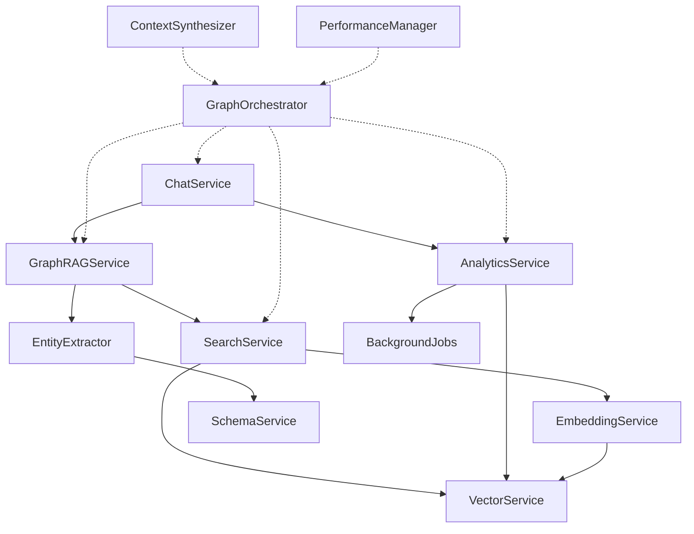

# Services Architecture & Integration Layer Strategy

## 🏗️ **Current Service Ecosystem Overview**

### **Core Service Responsibilities**

| Service | Primary Function | Current Performance | Integration Points | Keep/Replace |
|---------|------------------|--------------------|--------------------|--------------|
| **GraphRAGService** | End-to-end retrieval pipeline | Fast (200-500ms) | Chat, API endpoints | **🔄 Enhance** |
| **AnalyticsService** | Deep graph analysis & communities | Slow (2-10s) | Background jobs, reports | **✅ Keep** |  
| **SearchService** | Vector & keyword search | Fast (100-300ms) | GraphRAG, Entity extraction | **🔄 Enhance** |
| **ChatService** | Conversation management | Medium (1-3s) | Frontend, WebSocket | **🔄 Major upgrade** |
| **EntityExtractor** | NLP entity extraction & schema | Medium (500ms-2s) | GraphRAG pipeline | **✅ Keep** |
| **EmbeddingService** | Vector operations & storage | Fast (50-200ms) | Search, Analytics | **🔄 Enhance** |
| **VectorService** | Neo4j vector operations | Fast (50-200ms) | Embedding, Search | **🔄 Enhance** |
| **BackgroundJobs** | Async processing & optimization | N/A (async) | Analytics, Communities | **✅ Keep** |

### **Service Dependency Map**



## 🎯 **Integration Strategy: The Orchestration Layer**

### **Problem: Service Coordination Complexity**

**Current Challenge:**
```python
# ChatService currently does this (complex coordination):
class ChatService:
    async def chat(self, message: str, graph_id: UUID):
        # Step 1: Basic search
        search_results = await self.search_service.search(message)
        
        # Step 2: Decide if we need analytics (how?)
        if self._is_complex_query(message):  # ❌ Hard to determine
            analytics = await self.analytics_service.comprehensive_graph_analysis(...)
        
        # Step 3: Merge results somehow (how?)
        context = self._merge_results(search_results, analytics)  # ❌ No clear strategy
        
        # Step 4: Generate response
        return await self.llm_service.generate(message, context)
```

**Problems with Current Approach:**
- ❌ **Complex decision logic** scattered across services
- ❌ **No performance guarantees** - unpredictable response times  
- ❌ **Difficult to test** - many interdependencies
- ❌ **Hard to optimize** - no unified performance strategy
- ❌ **No graceful degradation** - if analytics fails, everything fails

### **Solution: GraphOrchestrator as Integration Layer**

**New Architecture:**
```python
# Clean separation of concerns
class ChatService:
    def __init__(self, graph_orchestrator: GraphOrchestrator):
        self.orchestrator = graph_orchestrator  # Single dependency!
        
    async def chat(self, message: str, graph_id: UUID, response_mode: str = "auto"):
        # Single call handles all complexity
        search_results = await self.orchestrator.search(
            query=message,
            graph_id=graph_id,
            mode=SearchMode.from_string(response_mode),
            max_response_time=5.0  # User expectation
        )
        
        # Focus on conversation, not search coordination
        return await self._generate_conversational_response(
            message, search_results
        )
```

## 🚀 **GraphOrchestrator: The Integration Hub**

### **Core Responsibilities**

```python
class GraphOrchestrator:
    """
    Single integration point for all graph operations.
    Handles complexity so other services stay focused.
    """
    
    def __init__(self):
        # Service coordination (not tight coupling!)
        self.services = ServiceRegistry()
        self.performance_manager = PerformanceManager()
        self.context_synthesizer = ContextSynthesizer()
        
    async def search(
        self, 
        query: str, 
        graph_id: UUID,
        mode: SearchMode = SearchMode.AUTO,
        max_response_time: float = 5.0,
        user_context: Dict[str, Any] = None
    ) -> OrchestrationResult:
        """
        Unified search interface that coordinates all services
        based on performance requirements and query complexity.
        """
        
        # 1. Intelligent mode selection
        if mode == SearchMode.AUTO:
            mode = await self._select_optimal_mode(
                query, max_response_time, graph_id, user_context
            )
        
        # 2. Execute search strategy
        return await self._execute_search_strategy(query, graph_id, mode)
        
    async def _execute_search_strategy(
        self, 
        query: str, 
        graph_id: UUID, 
        mode: SearchMode
    ) -> OrchestrationResult:
        """Execute coordinated search across services"""
        
        match mode:
            case SearchMode.FAST:
                # Neo4j vector search only - guaranteed fast
                return await self._fast_search_strategy(query, graph_id)
                
            case SearchMode.BALANCED:
                # Neo4j + light analytics - balanced performance
                return await self._balanced_search_strategy(query, graph_id)
                
            case SearchMode.COMPREHENSIVE:
                # Full service coordination - best quality
                return await self._comprehensive_search_strategy(query, graph_id)
                
            case SearchMode.COMMUNITY_FOCUSED:
                # Microsoft community detection patterns
                return await self._community_search_strategy(query, graph_id)
```

### **Search Strategy Implementation**

```python
class SearchStrategies:
    """Encapsulates different search coordination patterns"""
    
    async def _fast_search_strategy(
        self, query: str, graph_id: UUID
    ) -> FastSearchResult:
        """
        Fast strategy: Neo4j vector search only
        Target: <500ms response time
        """
        
        # Single service call - no coordination overhead
        results = await self.services.neo4j_graphrag.vector_search(
            query=query,
            graph_id=graph_id,
            top_k=5
        )
        
        # Quick answer generation
        answer = await self.services.llm.generate_concise_answer(
            query, results, max_tokens=200
        )
        
        return FastSearchResult(
            results=results,
            answer=answer,
            response_time=await self.performance_manager.get_elapsed(),
            strategy="neo4j_vector_only"
        )
    
    async def _balanced_search_strategy(
        self, query: str, graph_id: UUID
    ) -> BalancedSearchResult:
        """
        Balanced strategy: Neo4j + light analytics
        Target: <2s response time
        """
        
        # Parallel execution with timeout protection
        async with asyncio.timeout(1.8):  # Leave buffer for response generation
            neo4j_task = asyncio.create_task(
                self.services.neo4j_graphrag.hybrid_search(query, graph_id)
            )
            
            analytics_task = asyncio.create_task(
                self.services.analytics.quick_entity_analysis(query, graph_id)
            )
            
            # Wait for both, with graceful degradation
            neo4j_results, analytics_results = await asyncio.gather(
                neo4j_task, 
                analytics_task, 
                return_exceptions=True
            )
        
        # Merge results (handle partial failures)
        merged_context = await self.context_synthesizer.merge_with_fallback(
            neo4j_results, analytics_results
        )
        
        answer = await self.services.llm.generate_balanced_answer(
            query, merged_context
        )
        
        return BalancedSearchResult(
            neo4j_results=neo4j_results if not isinstance(neo4j_results, Exception) else None,
            analytics_results=analytics_results if not isinstance(analytics_results, Exception) else None,
            merged_context=merged_context,
            answer=answer,
            strategy="neo4j_plus_light_analytics"
        )
    
    async def _comprehensive_search_strategy(
        self, query: str, graph_id: UUID
    ) -> ComprehensiveSearchResult:
        """
        Comprehensive strategy: Full service coordination
        Target: <5s response time, maximum quality
        """
        
        # Phase 1: Parallel foundation search
        async with asyncio.timeout(2.0):
            foundation_tasks = {
                'neo4j': self.services.neo4j_graphrag.hybrid_search(query, graph_id),
                'vector_search': self.services.search.semantic_search(query, graph_id),
                'entity_extraction': self.services.entity_extractor.extract_from_query(query)
            }
            
            foundation_results = await asyncio.gather(
                *[asyncio.create_task(task) for task in foundation_tasks.values()],
                return_exceptions=True
            )
            
            foundation_dict = dict(zip(foundation_tasks.keys(), foundation_results))
        
        # Phase 2: Analytics enhancement based on foundation results
        if not isinstance(foundation_dict['entity_extraction'], Exception):
            extracted_entities = foundation_dict['entity_extraction']
            
            async with asyncio.timeout(2.5):  # Remaining time budget
                analytics_result = await self.services.analytics.comprehensive_graph_analysis(
                    entities=extracted_entities,
                    graph_id=graph_id
                )
        else:
            analytics_result = None
        
        # Phase 3: Advanced synthesis
        comprehensive_context = await self.context_synthesizer.comprehensive_merge(
            foundation_results=foundation_dict,
            analytics_result=analytics_result,
            query=query
        )
        
        # Phase 4: Expert-level answer generation
        expert_answer = await self.services.llm.generate_expert_answer(
            query, comprehensive_context
        )
        
        return ComprehensiveSearchResult(
            foundation_results=foundation_dict,
            analytics_result=analytics_result,
            comprehensive_context=comprehensive_context,
            expert_answer=expert_answer,
            strategy="full_service_coordination"
        )
```

## 🔄 **Service Integration Patterns**

### **Pattern 1: Chat Service Integration**

```python
class EnhancedChatService:
    """
    Chat service redesigned around GraphOrchestrator.
    Much simpler, more focused on conversation management.
    """
    
    def __init__(self, orchestrator: GraphOrchestrator):
        self.orchestrator = orchestrator
        self.conversation_manager = ConversationManager()
        
    async def chat(
        self, 
        message: str, 
        graph_id: UUID,
        conversation_id: UUID,
        user_preferences: UserPreferences = None
    ) -> ChatResponse:
        
        # 1. Get conversation context
        context = await self.conversation_manager.get_context(conversation_id)
        
        # 2. Determine search mode based on user + context
        search_mode = await self._determine_search_mode(
            message, context, user_preferences
        )
        
        # 3. Single orchestrated search call
        search_results = await self.orchestrator.search(
            query=message,
            graph_id=graph_id,
            mode=search_mode,
            max_response_time=user_preferences.max_wait_time if user_preferences else 3.0,
            user_context={"conversation_id": conversation_id, "history": context}
        )
        
        # 4. Generate conversational response (our specialty!)
        response = await self._create_conversational_response(
            message, search_results, context
        )
        
        # 5. Update conversation history
        await self.conversation_manager.add_exchange(
            conversation_id, message, response, search_results
        )
        
        return ChatResponse(
            message=response.text,
            search_mode_used=search_results.mode_used,
            confidence=search_results.confidence,
            sources=search_results.sources,
            follow_up_suggestions=response.suggested_questions,
            response_time=search_results.total_time
        )
    
    async def _determine_search_mode(
        self, 
        message: str, 
        context: ConversationContext,
        preferences: UserPreferences
    ) -> SearchMode:
        """Intelligent mode selection based on multiple factors"""
        
        # Fast mode triggers
        if preferences and preferences.prioritize_speed:
            return SearchMode.FAST
            
        if len(message.split()) < 5:  # Simple questions
            return SearchMode.FAST
            
        if context.recent_messages and "quick" in message.lower():
            return SearchMode.FAST
        
        # Comprehensive mode triggers  
        if any(word in message.lower() for word in ["analyze", "comprehensive", "detailed", "research"]):
            return SearchMode.COMPREHENSIVE
            
        if context.conversation_depth > 5:  # Deep conversation
            return SearchMode.COMPREHENSIVE
        
        # Community mode triggers
        if any(word in message.lower() for word in ["community", "group", "cluster", "theme"]):
            return SearchMode.COMMUNITY_FOCUSED
        
        # Default to balanced
        return SearchMode.BALANCED
```

### **Pattern 2: API Endpoint Integration**

```python
# Before: Complex coordination in endpoints
@app.post("/search/")
async def search_endpoint(request: SearchRequest):
    # ❌ This logic was scattered across multiple endpoints
    if request.search_type == "fast":
        results = await search_service.vector_search(request.query)
    elif request.search_type == "comprehensive":
        search_results = await search_service.hybrid_search(request.query)
        analytics_results = await analytics_service.analyze(...)  # How do we coordinate this?
        # How do we merge? How do we handle failures? How do we ensure performance?
        
# After: Clean orchestration
@app.post("/search/")
async def unified_search_endpoint(request: UnifiedSearchRequest):
    """Single endpoint for all search modes"""
    
    results = await orchestrator.search(
        query=request.query,
        graph_id=request.graph_id,
        mode=SearchMode.from_string(request.mode),
        max_response_time=request.max_response_time,
        user_context=request.user_context
    )
    
    return UnifiedSearchResponse(
        results=results,
        mode_used=results.mode_used,
        performance_metrics=results.performance_metrics
    )
```

### **Pattern 3: Background Job Integration**

```python
class BackgroundJobOrchestration:
    """Orchestrator also coordinates background processing"""
    
    def __init__(self, orchestrator: GraphOrchestrator):
        self.orchestrator = orchestrator
        
    @celery.task
    async def optimize_graph_for_user(self, graph_id: UUID):
        """Background optimization using orchestrator patterns"""
        
        # Use orchestrator's service coordination for background tasks too
        optimization_result = await self.orchestrator.optimize_graph(
            graph_id=graph_id,
            optimization_level=OptimizationLevel.FULL,
            max_processing_time=300.0  # 5 minute background job budget
        )
        
        return optimization_result
```

## 📊 **Integration Benefits Analysis**

### **Before Orchestration (Current State)**

| Service | Responsibilities | Integration Complexity | Testability | Performance Predictability |
|---------|------------------|------------------------|-------------|----------------------------|
| ChatService | Chat + Search coordination + Analytics coordination + Result merging | ❌ Very High | ❌ Hard | ❌ Unpredictable |
| SearchService | Search + Some analytics awareness | ❌ High | ⚠️ Medium | ✅ Good |  
| AnalyticsService | Analytics + Some search awareness | ❌ High | ✅ Good | ⚠️ Variable |

### **After Orchestration (Target State)**

| Service | Responsibilities | Integration Complexity | Testability | Performance Predictability |
|---------|------------------|------------------------|-------------|----------------------------|
| ChatService | Chat only | ✅ Very Low | ✅ Excellent | ✅ Predictable |
| SearchService | Search only | ✅ Very Low | ✅ Excellent | ✅ Predictable |
| AnalyticsService | Analytics only | ✅ Very Low | ✅ Excellent | ✅ Predictable |
| **GraphOrchestrator** | **Service coordination only** | ⚠️ **Medium** | ✅ **Good** | ✅ **Controllable** |

### **Key Benefits**

1. **Single Point of Complexity**: All coordination logic moves to orchestrator
2. **Clean Service Boundaries**: Each service has single, clear responsibility
3. **Predictable Performance**: Mode-based performance guarantees
4. **Easy Testing**: Mock orchestrator for integration tests
5. **Graceful Degradation**: Orchestrator handles service failures
6. **Performance Monitoring**: Centralized performance management

## 🎯 **Implementation Roadmap**

### **Phase 1: Create Orchestrator Foundation (Week 1)**
```python
# Start with basic orchestrator
class GraphOrchestrator:
    async def search(self, query, graph_id, mode=SearchMode.FAST):
        # Initially just delegate to existing services
        if mode == SearchMode.FAST:
            return await self.graphrag_service.search(query, graph_id)
        # Add complexity incrementally
```

### **Phase 2: Migrate Chat Service (Week 2)**
```python
# Update ChatService to use orchestrator
class ChatService:
    def __init__(self, orchestrator: GraphOrchestrator):
        self.orchestrator = orchestrator  # Single dependency
        
    # Simplify all chat methods to use orchestrator
```

### **Phase 3: Add Search Modes (Week 3)**
```python
# Add balanced and comprehensive modes
class GraphOrchestrator:
    async def search(self, query, graph_id, mode):
        match mode:
            case SearchMode.FAST: ...
            case SearchMode.BALANCED: ...  # New
            case SearchMode.COMPREHENSIVE: ...  # New
```

### **Phase 4: Performance Management (Week 4)**
```python
# Add performance monitoring and optimization
class GraphOrchestrator:
    def __init__(self):
        self.performance_manager = PerformanceManager()
        
    async def search(self, query, graph_id, mode, max_response_time):
        # Add timeout management and performance tracking
```

### **Phase 5: Context Synthesis (Week 5)**
```python
# Add intelligent result merging
class ContextSynthesizer:
    async def merge_results(self, neo4j_results, analytics_results):
        # Intelligent merging logic
```

## 🏆 **Success Metrics**

### **Development Metrics**
- **Lines of coordination code in ChatService**: Target 90% reduction
- **Service dependencies in ChatService**: Target 1 (orchestrator only)
- **Integration test complexity**: Target 50% reduction

### **Performance Metrics**
- **Fast mode**: < 500ms (95th percentile)
- **Balanced mode**: < 2s (95th percentile)
- **Comprehensive mode**: < 5s (95th percentile)
- **Service failure resilience**: 95% graceful degradation

### **Quality Metrics**
- **Response relevance**: > 85% user satisfaction
- **Mode selection accuracy**: > 90% optimal mode selection
- **Performance prediction accuracy**: < 10% variance from estimated times

## 🚀 **Next Steps**

1. **Create basic GraphOrchestrator** with simple delegation pattern
2. **Update ChatService** to use orchestrator as single dependency
3. **Implement search modes** incrementally (Fast → Balanced → Comprehensive)
4. **Add performance management** and timeout handling
5. **Build context synthesis** for intelligent result merging
6. **Test and optimize** each integration pattern

The orchestrator becomes your **competitive differentiator** - it's where you combine Neo4j's reliability, Microsoft's innovations, and your architectural advances into a unified, production-grade system that outperforms any single approach.