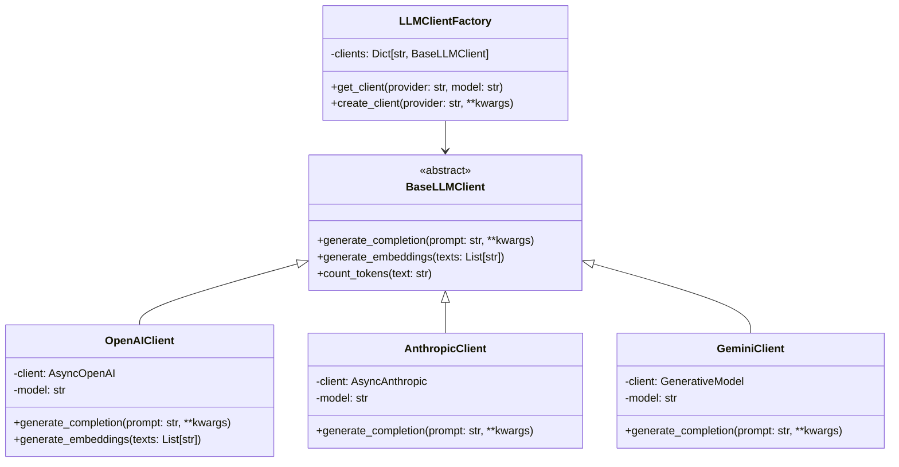

# LLM Client Factory Implementation Guide

## Overview
The LLM Client Factory is a critical component that provides a unified interface for interacting with multiple LLM providers. This implementation guide details how to build a robust, extensible, and performant LLM client system.

## Architecture



## Implementation Details

### 1. Base LLM Client Abstract Class

```python
from abc import ABC, abstractmethod
from typing import List, Dict, Any, Optional
import asyncio
from tenacity import retry, stop_after_attempt, wait_exponential

class BaseLLMClient(ABC):
    """Abstract base class for LLM clients"""
    
    def __init__(self, api_key: str, model: str, **kwargs):
        self.api_key = api_key
        self.model = model
        self.max_retries = kwargs.get('max_retries', 3)
        self.timeout = kwargs.get('timeout', 30)
    
    @abstractmethod
    async def generate_completion(
        self, 
        prompt: str, 
        temperature: float = 0.7,
        max_tokens: Optional[int] = None,
        **kwargs
    ) -> str:
        """Generate text completion"""
        pass
    
    @abstractmethod
    async def generate_embeddings(self, texts: List[str]) -> List[List[float]]:
        """Generate embeddings for texts"""
        pass
    
    @abstractmethod
    def count_tokens(self, text: str) -> int:
        """Count tokens in text"""
        pass
    
    @retry(
        stop=stop_after_attempt(3),
        wait=wait_exponential(multiplier=1, min=4, max=10)
    )
    async def _make_request_with_retry(self, request_func, *args, **kwargs):
        """Make request with exponential backoff retry"""
        try:
            return await request_func(*args, **kwargs)
        except Exception as e:
            logger.error(f"Request failed: {e}")
            raise
```

### 2. OpenAI Client Implementation

```python
from openai import AsyncOpenAI
import tiktoken

class OpenAIClient(BaseLLMClient):
    """OpenAI API client implementation"""
    
    def __init__(self, api_key: str, model: str = "gpt-4o-mini", **kwargs):
        super().__init__(api_key, model, **kwargs)
        self.client = AsyncOpenAI(api_key=api_key)
        self.embedding_model = kwargs.get('embedding_model', 'text-embedding-ada-002')
        self._encoder = None
    
    async def generate_completion(
        self, 
        prompt: str, 
        temperature: float = 0.7,
        max_tokens: Optional[int] = None,
        **kwargs
    ) -> str:
        """Generate completion using OpenAI API"""
        
        async def _request():
            response = await self.client.chat.completions.create(
                model=self.model,
                messages=[{"role": "user", "content": prompt}],
                temperature=temperature,
                max_tokens=max_tokens,
                **kwargs
            )
            return response.choices[0].message.content
        
        return await self._make_request_with_retry(_request)
    
    async def generate_embeddings(self, texts: List[str]) -> List[List[float]]:
        """Generate embeddings using OpenAI API"""
        
        async def _request():
            # Batch texts if needed
            batch_size = 100
            embeddings = []
            
            for i in range(0, len(texts), batch_size):
                batch = texts[i:i + batch_size]
                response = await self.client.embeddings.create(
                    model=self.embedding_model,
                    input=batch
                )
                embeddings.extend([e.embedding for e in response.data])
            
            return embeddings
        
        return await self._make_request_with_retry(_request)
    
    def count_tokens(self, text: str) -> int:
        """Count tokens using tiktoken"""
        if self._encoder is None:
            self._encoder = tiktoken.encoding_for_model(self.model)
        return len(self._encoder.encode(text))
```

### 3. Anthropic Client Implementation

```python
from anthropic import AsyncAnthropic

class AnthropicClient(BaseLLMClient):
    """Anthropic API client implementation"""
    
    def __init__(self, api_key: str, model: str = "claude-3-sonnet-20240229", **kwargs):
        super().__init__(api_key, model, **kwargs)
        self.client = AsyncAnthropic(api_key=api_key)
    
    async def generate_completion(
        self, 
        prompt: str, 
        temperature: float = 0.7,
        max_tokens: Optional[int] = None,
        **kwargs
    ) -> str:
        """Generate completion using Anthropic API"""
        
        async def _request():
            response = await self.client.messages.create(
                model=self.model,
                messages=[{"role": "user", "content": prompt}],
                temperature=temperature,
                max_tokens=max_tokens or 4096,
                **kwargs
            )
            return response.content[0].text
        
        return await self._make_request_with_retry(_request)
    
    async def generate_embeddings(self, texts: List[str]) -> List[List[float]]:
        """Anthropic doesn't provide embeddings - use sentence transformers"""
        raise NotImplementedError(
            "Anthropic doesn't provide embeddings. Use OpenAI or local embeddings."
        )
    
    def count_tokens(self, text: str) -> int:
        """Approximate token count for Anthropic"""
        # Rough approximation: 1 token ≈ 4 characters
        return len(text) // 4
```

### 4. LLM Client Factory

```python
from typing import Dict, Optional, Type
from enum import Enum

class LLMProvider(str, Enum):
    OPENAI = "openai"
    ANTHROPIC = "anthropic"
    GEMINI = "gemini"
    AZURE = "azure"
    BEDROCK = "bedrock"
    OLLAMA = "ollama"

class LLMClientFactory:
    """Factory for creating LLM clients"""
    
    _clients: Dict[str, BaseLLMClient] = {}
    _client_classes: Dict[LLMProvider, Type[BaseLLMClient]] = {
        LLMProvider.OPENAI: OpenAIClient,
        LLMProvider.ANTHROPIC: AnthropicClient,
        LLMProvider.GEMINI: GeminiClient,
        # Add more providers
    }
    
    @classmethod
    def get_client(
        cls, 
        provider: str, 
        model: Optional[str] = None,
        **kwargs
    ) -> BaseLLMClient:
        """Get or create an LLM client"""
        
        # Normalize provider
        provider_enum = LLMProvider(provider.lower())
        
        # Create cache key
        cache_key = f"{provider}:{model or 'default'}"
        
        # Return cached client if exists
        if cache_key in cls._clients:
            return cls._clients[cache_key]
        
        # Create new client
        client = cls.create_client(provider_enum, model, **kwargs)
        cls._clients[cache_key] = client
        
        return client
    
    @classmethod
    def create_client(
        cls,
        provider: LLMProvider,
        model: Optional[str] = None,
        **kwargs
    ) -> BaseLLMClient:
        """Create a new LLM client"""
        
        settings = get_settings()
        
        # Get API key
        api_key = cls._get_api_key(provider, settings)
        if not api_key:
            raise ValueError(f"No API key found for provider: {provider}")
        
        # Get client class
        client_class = cls._client_classes.get(provider)
        if not client_class:
            raise ValueError(f"Unsupported provider: {provider}")
        
        # Get default model if not specified
        if not model:
            model = cls._get_default_model(provider)
        
        # Create client instance
        return client_class(api_key=api_key, model=model, **kwargs)
    
    @staticmethod
    def _get_api_key(provider: LLMProvider, settings) -> Optional[str]:
        """Get API key for provider"""
        key_mapping = {
            LLMProvider.OPENAI: settings.openai_api_key,
            LLMProvider.ANTHROPIC: settings.anthropic_api_key,
            LLMProvider.GEMINI: settings.gemini_api_key,
            # Add more mappings
        }
        return key_mapping.get(provider)
    
    @staticmethod
    def _get_default_model(provider: LLMProvider) -> str:
        """Get default model for provider"""
        model_mapping = {
            LLMProvider.OPENAI: "gpt-4o-mini",
            LLMProvider.ANTHROPIC: "claude-3-sonnet-20240229",
            LLMProvider.GEMINI: "gemini-1.5-flash",
            # Add more defaults
        }
        return model_mapping.get(provider, "default")
```

## Usage Examples

### Basic Usage

```python
# Get a client
llm = LLMClientFactory.get_client("openai", "gpt-4o")

# Generate completion
response = await llm.generate_completion(
    "Explain quantum computing in simple terms",
    temperature=0.7,
    max_tokens=500
)

# Generate embeddings
embeddings = await llm.generate_embeddings([
    "First document",
    "Second document"
])
```

### Advanced Usage with Custom Configuration

```python
# Create client with custom settings
llm = LLMClientFactory.create_client(
    provider="openai",
    model="gpt-4",
    max_retries=5,
    timeout=60,
    embedding_model="text-embedding-3-large"
)

# Use in extraction service
class ExtractionService:
    def __init__(self, neo4j_client: Neo4jClient):
        self.neo4j = neo4j_client
        self.llm_factory = LLMClientFactory()
    
    async def extract_entities(self, text: str, model: str):
        llm = self.llm_factory.get_client(
            provider=self._get_provider_from_model(model),
            model=model
        )
        
        prompt = self._build_extraction_prompt(text)
        response = await llm.generate_completion(prompt)
        
        return self._parse_extraction_response(response)
```

## Error Handling

```python
class LLMError(Exception):
    """Base exception for LLM errors"""
    pass

class LLMRateLimitError(LLMError):
    """Rate limit exceeded"""
    pass

class LLMAuthenticationError(LLMError):
    """Authentication failed"""
    pass

class LLMTimeoutError(LLMError):
    """Request timeout"""
    pass

# In client implementation
async def generate_completion(self, prompt: str, **kwargs) -> str:
    try:
        return await self._make_request_with_retry(...)
    except RateLimitError as e:
        raise LLMRateLimitError(f"Rate limit exceeded: {e}")
    except AuthenticationError as e:
        raise LLMAuthenticationError(f"Authentication failed: {e}")
    except TimeoutError as e:
        raise LLMTimeoutError(f"Request timed out: {e}")
    except Exception as e:
        raise LLMError(f"LLM request failed: {e}")
```

## Performance Optimizations

### 1. Connection Pooling

```python
class OpenAIClient(BaseLLMClient):
    def __init__(self, api_key: str, model: str, **kwargs):
        super().__init__(api_key, model, **kwargs)
        # Use connection pooling
        self.client = AsyncOpenAI(
            api_key=api_key,
            http_client=httpx.AsyncClient(
                limits=httpx.Limits(
                    max_keepalive_connections=10,
                    max_connections=100,
                )
            )
        )
```

### 2. Request Batching

```python
async def generate_embeddings_batch(
    self, 
    texts: List[str], 
    batch_size: int = 100
) -> List[List[float]]:
    """Generate embeddings with batching"""
    
    tasks = []
    for i in range(0, len(texts), batch_size):
        batch = texts[i:i + batch_size]
        task = self._generate_batch_embeddings(batch)
        tasks.append(task)
    
    results = await asyncio.gather(*tasks)
    
    # Flatten results
    embeddings = []
    for batch_result in results:
        embeddings.extend(batch_result)
    
    return embeddings
```

### 3. Caching

```python
from functools import lru_cache
import hashlib

class CachedLLMClient(BaseLLMClient):
    def __init__(self, base_client: BaseLLMClient, cache_size: int = 1000):
        self.client = base_client
        self.cache_size = cache_size
        self._cache = {}
    
    async def generate_completion(self, prompt: str, **kwargs) -> str:
        # Create cache key
        cache_key = self._create_cache_key(prompt, **kwargs)
        
        # Check cache
        if cache_key in self._cache:
            return self._cache[cache_key]
        
        # Generate and cache
        result = await self.client.generate_completion(prompt, **kwargs)
        
        # Manage cache size
        if len(self._cache) >= self.cache_size:
            # Remove oldest entry
            oldest = next(iter(self._cache))
            del self._cache[oldest]
        
        self._cache[cache_key] = result
        return result
    
    def _create_cache_key(self, prompt: str, **kwargs) -> str:
        """Create cache key from prompt and parameters"""
        key_data = f"{prompt}:{sorted(kwargs.items())}"
        return hashlib.md5(key_data.encode()).hexdigest()
```

## Testing Strategy

```python
import pytest
from unittest.mock import AsyncMock, patch

class TestLLMClientFactory:
    @pytest.mark.asyncio
    async def test_openai_client_creation(self):
        """Test OpenAI client creation"""
        with patch.dict(os.environ, {"OPENAI_API_KEY": "test-key"}):
            client = LLMClientFactory.get_client("openai", "gpt-4")
            assert isinstance(client, OpenAIClient)
            assert client.model == "gpt-4"
    
    @pytest.mark.asyncio
    async def test_completion_generation(self):
        """Test completion generation"""
        mock_client = AsyncMock()
        mock_client.generate_completion.return_value = "Test response"
        
        with patch.object(LLMClientFactory, 'get_client', return_value=mock_client):
            client = LLMClientFactory.get_client("openai")
            response = await client.generate_completion("Test prompt")
            
            assert response == "Test response"
            mock_client.generate_completion.assert_called_once()
```

## Monitoring and Metrics

```python
from prometheus_client import Counter, Histogram, Gauge

# Define metrics
llm_requests_total = Counter(
    'llm_requests_total',
    'Total LLM requests',
    ['provider', 'model', 'operation']
)

llm_request_duration = Histogram(
    'llm_request_duration_seconds',
    'LLM request duration',
    ['provider', 'model', 'operation']
)

llm_tokens_used = Counter(
    'llm_tokens_used_total',
    'Total tokens used',
    ['provider', 'model']
)

# Instrument client
class MonitoredLLMClient(BaseLLMClient):
    async def generate_completion(self, prompt: str, **kwargs) -> str:
        # Record metrics
        with llm_request_duration.labels(
            provider=self.provider,
            model=self.model,
            operation='completion'
        ).time():
            llm_requests_total.labels(
                provider=self.provider,
                model=self.model,
                operation='completion'
            ).inc()
            
            result = await super().generate_completion(prompt, **kwargs)
            
            # Record token usage
            tokens = self.count_tokens(prompt) + self.count_tokens(result)
            llm_tokens_used.labels(
                provider=self.provider,
                model=self.model
            ).inc(tokens)
            
            return result
```

## Best Practices

1. **Always use environment variables for API keys**
2. **Implement proper retry logic with exponential backoff**
3. **Set reasonable timeouts for all requests**
4. **Use connection pooling for better performance**
5. **Implement caching where appropriate**
6. **Monitor token usage and costs**
7. **Handle rate limits gracefully**
8. **Log all errors with context**
9. **Use async/await throughout**
10. **Test with mocked responses**