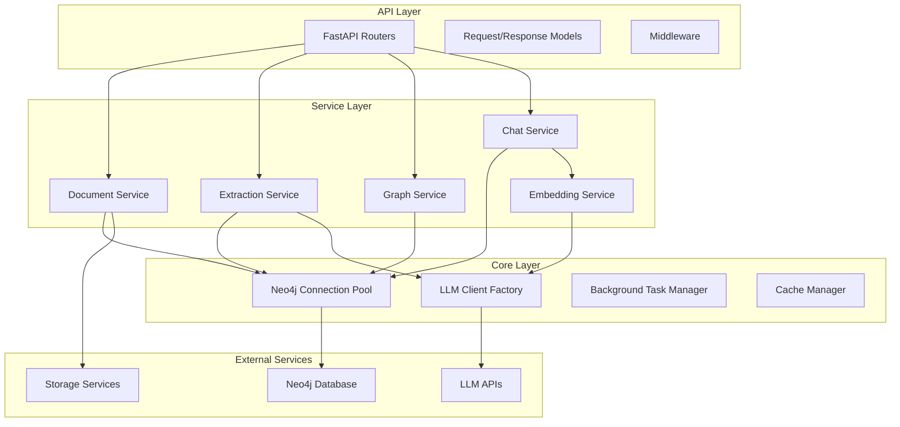

# Neo4j LLM Graph Builder - Improvement Plan

## Executive Summary
This document outlines a comprehensive improvement plan for the FastAPI implementation of the Neo4j LLM Graph Builder. The current implementation has several critical gaps and architectural issues that need to be addressed.

## Critical Issues to Address

### 1. Missing Core Implementations
- **LLM Client Factory** (`llm_clients.py`): Completely empty, needs full implementation
- **Embedding Service** (`embedding_service.py`): Empty, critical for vector search
- **Chat Service** (`chat_service.py`): Empty, core functionality missing
- **Graph Service** (`graph_service.py`): Not visible, likely missing or incomplete

### 2. Database Connection Management
- Current implementation creates new connections per request
- No connection pooling
- Synchronous driver in async context
- No proper transaction management

### 3. Architectural Issues
- Business logic mixed with API endpoints
- No proper service layer abstraction
- Missing dependency injection patterns
- No background task processing

## Proposed Architecture



## Implementation Priorities

### Phase 1: Critical Infrastructure (Week 1)
1. **Async Neo4j Connection Pool**
   - Implement proper connection pooling
   - Add transaction management
   - Create async context managers

2. **LLM Client Factory**
   - Support multiple providers (OpenAI, Anthropic, etc.)
   - Implement retry logic and rate limiting
   - Add proper error handling

3. **Embedding Service**
   - Support multiple embedding models
   - Batch processing for efficiency
   - Caching for repeated texts

### Phase 2: Core Services (Week 2)
1. **Graph Service Implementation**
   - Graph querying and visualization
   - Schema management
   - Duplicate detection and merging

2. **Chat Service**
   - Multiple retrieval strategies
   - Context management
   - Response streaming

3. **Background Task Processing**
   - Celery or similar for long-running tasks
   - Progress tracking
   - Task cancellation

### Phase 3: Quality & Performance (Week 3)
1. **Error Handling & Validation**
   - Custom exception hierarchy
   - Request validation middleware
   - Structured error responses

2. **Performance Optimizations**
   - Query optimization
   - Caching layer (Redis)
   - Batch processing improvements

3. **Monitoring & Observability**
   - Structured logging
   - Metrics collection
   - Health checks and readiness probes

### Phase 4: Testing & Documentation (Week 4)
1. **Comprehensive Testing**
   - Unit tests for services
   - Integration tests
   - Performance benchmarks

2. **Documentation**
   - API documentation
   - Architecture diagrams
   - Deployment guides

## Key Design Patterns to Implement

### 1. Repository Pattern
```python
class DocumentRepository:
    def __init__(self, neo4j_pool: Neo4jPool):
        self.pool = neo4j_pool
    
    async def create(self, document: Document) -> Document:
        async with self.pool.acquire() as session:
            # Implementation
```

### 2. Factory Pattern for LLMs
```python
class LLMClientFactory:
    @staticmethod
    def create_client(provider: str, **kwargs) -> BaseLLMClient:
        if provider == "openai":
            return OpenAIClient(**kwargs)
        elif provider == "anthropic":
            return AnthropicClient(**kwargs)
        # etc.
```

### 3. Strategy Pattern for Chat Modes
```python
class ChatStrategy(ABC):
    @abstractmethod
    async def retrieve(self, query: str) -> List[Document]:
        pass

class VectorChatStrategy(ChatStrategy):
    async def retrieve(self, query: str) -> List[Document]:
        # Vector search implementation
```

### 4. Circuit Breaker for External Services
```python
class CircuitBreaker:
    def __init__(self, failure_threshold: int = 5):
        self.failure_count = 0
        self.failure_threshold = failure_threshold
        self.is_open = False
```

## Performance Optimizations

1. **Connection Pooling**
   - Min/max pool size configuration
   - Connection health checks
   - Automatic reconnection

2. **Caching Strategy**
   - Redis for embeddings cache
   - In-memory cache for frequent queries
   - Cache invalidation policies

3. **Batch Processing**
   - Batch embedding generation
   - Bulk Neo4j operations
   - Parallel document processing

4. **Query Optimization**
   - Indexed properties
   - Query profiling
   - Parameterized queries

## Security Enhancements

1. **API Security**
   - Rate limiting per endpoint
   - API key authentication
   - Request size limits

2. **Data Security**
   - Input sanitization
   - SQL injection prevention
   - Secure credential storage

3. **Network Security**
   - HTTPS enforcement
   - CORS configuration
   - Request validation

## Monitoring & Observability

1. **Logging**
   - Structured JSON logging
   - Correlation IDs
   - Log aggregation

2. **Metrics**
   - Request latency
   - Error rates
   - Resource utilization

3. **Tracing**
   - Distributed tracing
   - Performance profiling
   - Bottleneck identification

## Testing Strategy

1. **Unit Tests**
   - Service layer tests
   - Utility function tests
   - Model validation tests

2. **Integration Tests**
   - API endpoint tests
   - Database integration tests
   - External service mocking

3. **Performance Tests**
   - Load testing
   - Stress testing
   - Benchmark comparisons

## Deployment Considerations

1. **Container Optimization**
   - Multi-stage builds
   - Layer caching
   - Security scanning

2. **Kubernetes Ready**
   - Health checks
   - Resource limits
   - Horizontal scaling

3. **Configuration Management**
   - Environment-based configs
   - Secret management
   - Feature flags

## Next Steps

1. Review and approve this plan
2. Set up development environment
3. Create feature branches for each phase
4. Implement critical infrastructure first
5. Regular code reviews and testing
6. Progressive deployment strategy

## Success Metrics

- 90% test coverage
- < 200ms average response time
- 99.9% uptime
- Zero critical security vulnerabilities
- Complete API documentation